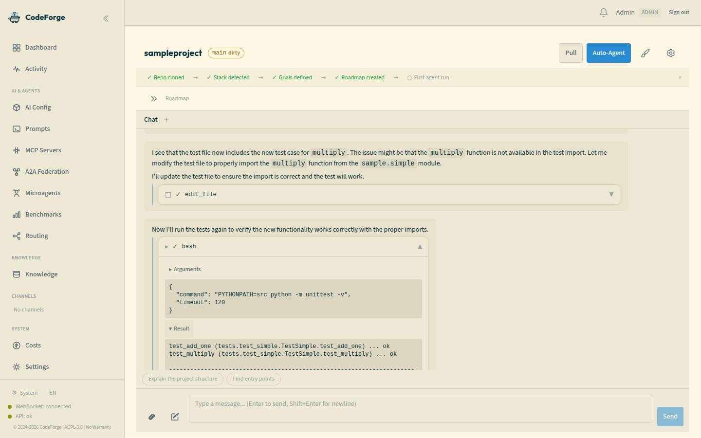
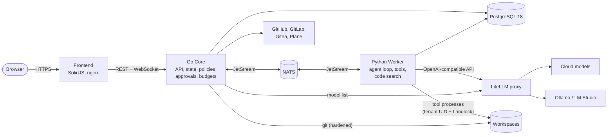
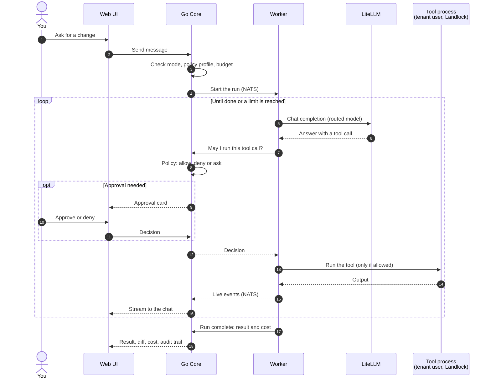
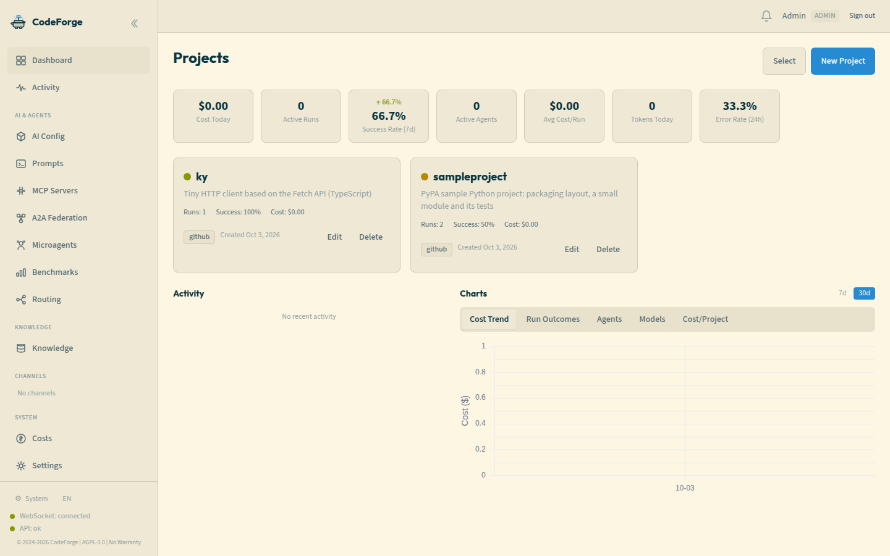
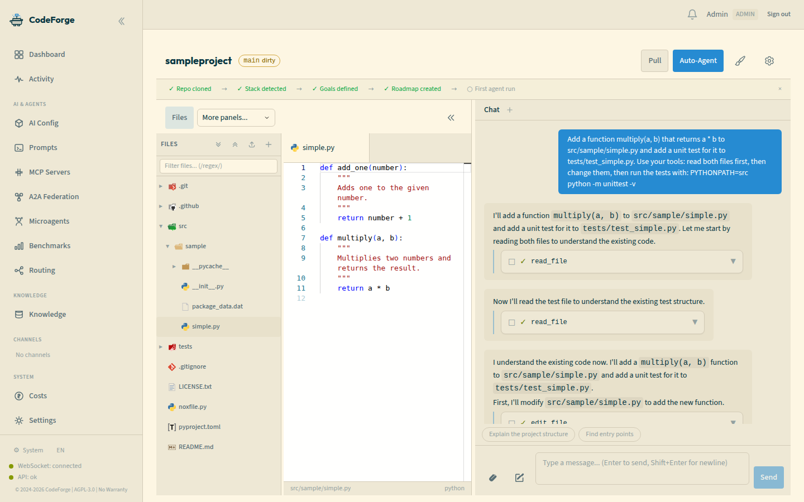
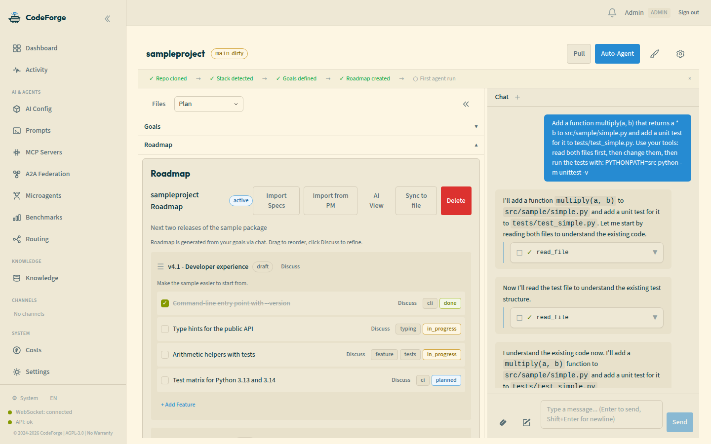
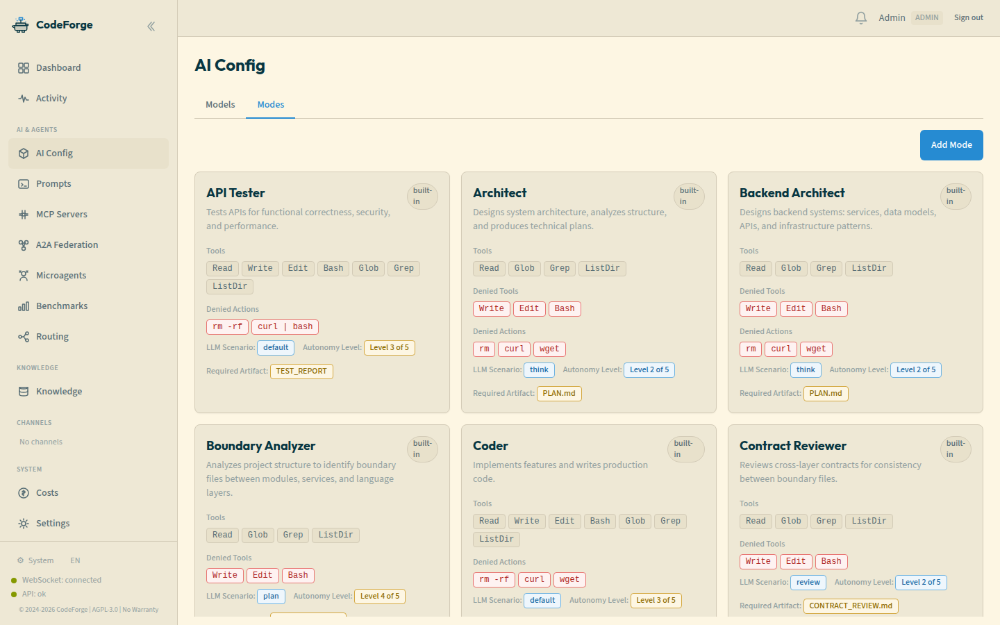
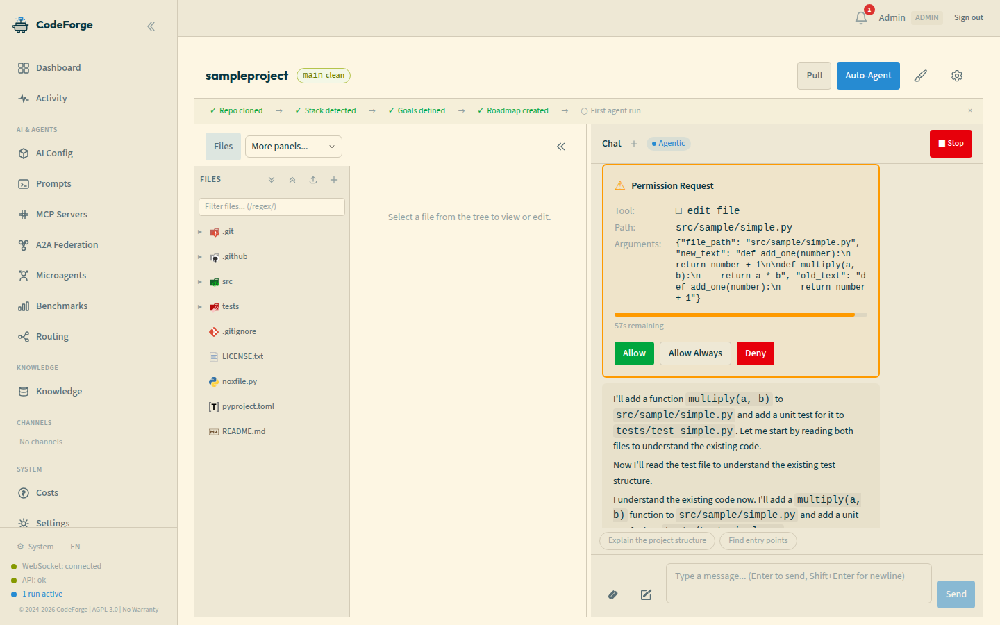
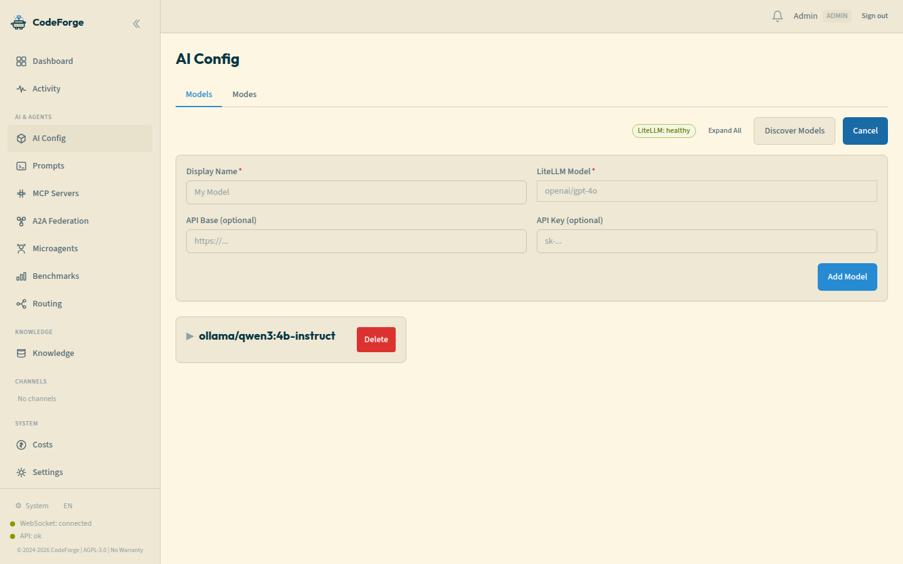

<div align="center">

# CodeForge

**A self-hosted control plane for AI coding agents: any agent, any model, one set of rules.**

Run cloud models (Claude, GPT, Gemini, ...) or local ones (Ollama, LM Studio) on your own server, across all your repositories.<br>
Every tool call an agent makes is checked against your policy, can wait for your approval, counts against a budget and is recorded.

[](https://github.com/Strob0t/CodeForge/actions/workflows/ci.yml)
[](LICENSE)
[](VERSION)

[**Quick Start**](#quick-start) | [**Architecture**](#architecture) | [**Features**](#features) | [**FAQ**](#faq) | [**Documentation**](docs/README.md) | [**Known Issues**](docs/todo.md#known-issues)



</div>

---

## What is CodeForge?

AI coding agents are good at writing code and bad at knowing when to stop. CodeForge puts a control plane between the agent and your code:

- **Policy on every tool call.** The agent proposes `bash`, `edit_file` or an MCP tool; the Go Core decides allow, deny or ask, from declarative YAML profiles (deny lists, path rules, shell commands parsed per simple command, unknown cases fail closed).
- **You approve what matters.** Five autonomy levels per mode, from "ask for everything" to headless. Approval cards appear live in the chat, with approve, deny and allow-always.
- **Limits that hold.** Budgets per run, maximum steps, stall detection, test and lint gates with rollback, path blocklists and branch isolation.
- **Everything is recorded.** Trajectories, costs per run and project, an audit trail with replay.
- **Agents stay apart.** Every tenant's tool processes run under their own Linux user and under Landlock; agents only touch their own workspace.

Around that core, CodeForge brings four things together in one self-hosted Docker stack:

| Pillar | What you get |
|---|---|
| **Projects** | Many repositories in one dashboard: any git URL (GitHub, GitLab, Gitea/Forgejo, self-hosted), SVN and local folders; auto-indexing for code search. |
| **Roadmap** | Milestones and features per project, imported from OpenSpec, Spec Kit, Autospec or Markdown specs, synced back to spec files; issues from GitHub, GitLab, Plane and Gitea/Forgejo. |
| **Models** | Any model LiteLLM can reach: 11 provider families configured (OpenAI, Anthropic, Gemini, Groq, Mistral, OpenRouter, Cerebras, ... and local Ollama / LM Studio), picked per task by a routing cascade. |
| **Agents** | A built-in agent loop with 10 tools plus MCP servers, 24 built-in modes (architect, coder, reviewer, debugger, tester, ...), and adapters for Aider, OpenHands, Goose, OpenCode and Plandex. |

---

## Architecture



- **Go Core** owns all state and every decision: projects, runs, conversations, policies, approvals, budgets, users and tenants. It never runs code from a workspace.
- **Python Worker** owns the AI work: LLM calls, the agent loop, tools, code search (BM25, embeddings, GraphRAG). It asks the Core before every tool call.
- **NATS JetStream** carries every message between the two, with defined delivery rules: work that changes a workspace runs at most once, everything else is idempotent, failed messages land in dead-letter queues.
- **LiteLLM** is the only way out to model providers. In production the worker has no internet access of its own.

### What happens when an agent works



| Component | Stack | Port |
|---|---|---|
| Frontend | TypeScript, SolidJS, Tailwind CSS (nginx in production) | 80 (production), 3000 (development) |
| Go Core | Go 1.25, chi, pgx, coder/websocket | 8080 |
| Python Worker | Python 3.12, LiteLLM client, tree-sitter | 8081 (health, internal) |
| Messaging | NATS JetStream 2.15 | 4222 (internal) |
| Database | PostgreSQL 18 | 5432 (internal) |
| Model proxy | LiteLLM | 4000 (internal) |

More: [Architecture](docs/architecture.md) | [Architecture decisions (ADRs)](docs/architecture/adr/) | [Security model](docs/SECURITY.md)

---

## Quick Start

### Requirements

| | |
|---|---|
| **Linux kernel** | 5.19 or newer with Landlock enabled (Debian 12, Ubuntu 24.04; Ubuntu 22.04 with the HWE kernel). Every tool call runs under Landlock; production refuses to start tool processes without it. |
| **Docker** | Engine 23.0 or newer, Compose v2 |
| **File system** | POSIX ACLs on the Docker volumes (ext4 and xfs have them) |
| **Resources** | The compose file caps the services at about 10 GiB RAM in total; a small setup needs much less. Local models need their own RAM or GPU. |

### Run it with Docker Compose

```bash
git clone https://github.com/Strob0t/CodeForge.git && cd CodeForge
cp .env.example .env                                   # optional: provider API keys, OLLAMA_BASE_URL, LM_STUDIO_API_BASE
./scripts/generate-secrets.sh                          # database, NATS, JWT and encryption secrets in ./secrets
./scripts/validate-env.sh
docker compose -f docker-compose.prod.yml build        # no published release images yet
./scripts/check-host.sh                                # checks Landlock, ACLs and /tmp on this host
docker compose -f docker-compose.prod.yml up -d
```

Then open `http://<your-host>/setup` and create the first admin.

> [!IMPORTANT]
> The setup page is open until the first user exists, so whoever reaches it first becomes admin. Create the admin before you expose the host to a network you do not trust ([KI-119](docs/todo.md#known-issues)).

**Local models:** run Ollama or LM Studio on the host and set `OLLAMA_BASE_URL` (default `http://host.docker.internal:11434`) or `LM_STUDIO_API_BASE` in `.env`. Their models show up in the model list; no API key is needed. For agent tool calls with Ollama see the [FAQ](#faq).

Upgrading an existing installation, backups and the full list of settings: [Dev Setup](docs/dev-setup.md), [Disaster Recovery](docs/disaster-recovery.md).

### Development setup

```bash
docker compose up -d postgres nats litellm
export CODEFORGE_INTERNAL_KEY=$(openssl rand -hex 32)      # the Core and the worker need the same key

# terminal 1: the Go Core, API on :8080
APP_ENV=development CODEFORGE_AUTH_ADMIN_PASS=<a-strong-password> go run ./cmd/codeforge/
# terminal 2 (same CODEFORGE_INTERNAL_KEY): the worker, started after the Core
cd workers && poetry install && poetry run python -m codeforge.consumer
# terminal 3: the UI on :3000
cd frontend && npm install && npm run dev
```

The order matters: the Core creates the NATS stream the worker waits for. Log in as `admin@localhost` with the password you set. Details, tests and the dev container: [Dev Setup](docs/dev-setup.md).

---

## Features

### Projects and code





- Add repositories by URL or adopt a local folder; branches, status and stack detection per project.
- Code search for agents and for you: BM25 and embeddings, a GraphRAG code graph and a repo map, built automatically when a project is added.
- A finished run's changes are delivered as you choose: left in the workspace, as a patch, a local commit, a pushed branch or a pull request.

### Roadmap and specs



- Milestones and features per project, reorderable by drag and drop.
- Import from spec files (OpenSpec, Spec Kit, Autospec, Markdown) and write back to them; import issues from GitHub, GitLab, Plane, Gitea/Forgejo; per-project webhooks for updates.
- Goal discovery proposes project goals from the files in the repository.

### Agents, modes and tools



- Chat with an agent inside a project: streaming answers, tool calls with their output, diffs to review, slash commands (`/mode`, `/model`, `/cost`, `/diff`, `/rewind`, ...).
- **24 built-in modes** with their own prompt, tools and autonomy, plus custom modes per project (`.codeforge/modes/`).
- **10 built-in tools** (read, write and edit files, bash, search, glob, list, conversation and skill search, skill creation) plus every tool of the MCP servers you assign.
- Agent backends: Aider, OpenHands, Goose, OpenCode and Plandex through adapters (their CLIs or services must be available to the worker, see the [FAQ](#faq)); Claude Code as a conversation model when the `claude` CLI is installed and enabled.
- Live multi-agent view (War Room), handoffs between agents, channels with threads.

### Approvals, safety and isolation



- Policy profiles in YAML: five presets and your own, per tenant; per-mode tool lists; deny lists that always win.
- Approval cards with approve, deny and allow-always; the same approvals can be answered from a link in Slack or email.
- Safety controls: budget limits with alerts at 80 % and 90 %, maximum steps, stall detection, test and lint gates with rollback, path blocklists (`.env`, `secrets/**`, ...), branch isolation.
- Isolation: each tenant's tool processes run as their own Linux user with POSIX ACLs on its directories and under Landlock; secrets are never passed on a command line ([ADR-018](docs/architecture/adr/018-per-tenant-tool-identities-and-landlock.md)).

### Models, routing and costs



- One model list for everything LiteLLM can reach, including local models; per-user provider keys.
- Routing picks the model per task: a rule-based complexity analysis, then a bandit that learns from results (UCB1), then an LLM meta-router for cold starts.
- Cost dashboard per project and run, with a token breakdown per tool.

### More

- Audit trail with trajectory replay, checkpoints, fork and rewind of runs.
- Knowledge bases and prompt templates per scope; MCP server management per tenant (stdio, SSE and streamable HTTP).
- Optional, off by default: an MCP server of CodeForge itself, A2A agent federation, LSP code intelligence, OpenTelemetry tracing.
- In development mode: a benchmark system (LLM judge, functional tests, SWE-bench, HumanEval and more) with DPO and RLVR export.

---

## How CodeForge relates to other tools

Aider, OpenHands, Goose and Claude Code are **agents**: they read code, call a model and edit files. CodeForge is the **platform around agents**: it has its own agent loop, can drive several of those agents as backends, and adds what a team needs to let agents work on shared repositories: one place for all projects and roadmaps, one model gateway, and one set of rules, approvals, budgets and records for every agent and every model.

---

## FAQ

**Can I run CodeForge without any cloud model?**
Yes. Point it at Ollama or LM Studio and use only local models; in production the worker has no internet access of its own and reaches models only through the LiteLLM container. One caveat today: for agent tool calls, Ollama has to be reached through its OpenAI-compatible endpoint, and the model must be one CodeForge recognises as tool-capable ([KI-125](docs/todo.md#known-issues)). The screenshots in this README were made that way, with `qwen3:4b-instruct` on four CPU cores and no API key; larger models are faster and better at multi-step work.

**What does it cost?**
CodeForge is free software (AGPL-3.0). You pay only your model providers; local models cost nothing. Every run's cost is tracked, and budgets in the policy profile stop a run that would exceed them.

**How safe is it to let agents run commands?**
Every tool call needs a policy decision from the Go Core, and destructive calls can require your approval. Tool processes run as a per-tenant Linux user under Landlock, cannot see other processes and never get secrets on their command line. Not yet isolated: network traffic between tool processes of different tenants ([KI-110](docs/todo.md#known-issues)). Details: [Security](docs/SECURITY.md).

**Can I use Claude Code, Aider or OpenHands?**
Claude Code runs as a conversation model (`claudecode/default`) when the `claude` CLI is installed in the worker and `CODEFORGE_CLAUDECODE_ENABLED=true`; its tool calls go through the same policy check. Aider, Goose, OpenCode and Plandex need their CLIs in the worker image, OpenHands its service; the standard image does not include them yet ([KI-118](docs/todo.md#known-issues)). The built-in agent loop works out of the box.

**Can several teams share one installation?**
The backend separates tenants (data, tool processes, MCP servers, policies). The web UI currently works with the default tenant only ([KI-120](docs/todo.md#known-issues)).

**Where is my data?**
In PostgreSQL and the Docker volumes on your server. Users can export and erase their data through the API (GDPR), and a retention job removes old data on a schedule ([Data retention](docs/data-retention.md)).

**Why Go and Python?**
Go for the control plane (concurrency, state, policies, a single binary), Python for the AI work, where the libraries are ([ADR-006](docs/architecture/adr/006-agent-execution-approach-c.md)).

---

## Status and roadmap

CodeForge is under active development; version 0.8.0 is on the `staging` branch. Known gaps, with their severity and status, are tracked as Known Issues in [docs/todo.md](docs/todo.md#known-issues), and the plan for fixing them in [docs/known-issues-fix-plan.md](docs/known-issues-fix-plan.md). Next on the roadmap: sub-agents like Claude Code's ([KI-25](docs/plans/ki25-subagents-plan.md)), read-only submodules ([KI-88](docs/plans/ki88-opaque-submodules-plan.md)) and network isolation between tenants ([KI-110](docs/todo.md#known-issues)). Phase history: [Project Status](docs/project-status.md).

---

## Documentation

| | |
|---|---|
| [Architecture](docs/architecture.md) | Components, data flow, patterns |
| [Security](docs/SECURITY.md) | Threat model, tool isolation, secrets |
| [Dev Setup](docs/dev-setup.md) | Configuration, ports, environment variables, tests, upgrading |
| [Feature specs](docs/features/) | One document per pillar |
| [API](docs/api/openapi.yaml) | OpenAPI specification |
| [Disaster Recovery](docs/disaster-recovery.md) | Backups and restore |
| [All docs](docs/README.md) | Index |

## Contributing

1. Fork the repository and branch from `staging`.
2. Follow [AGENTS.md](AGENTS.md) (the rules for humans and coding agents) and write tests first.
3. Run `pre-commit run --all-files` and the test suites listed there.
4. Open a pull request against `staging`.

See [CONTRIBUTING.md](CONTRIBUTING.md) for details.

## License

[GNU Affero General Public License v3.0](LICENSE)
