# CodeForge -- Architecture

### Purpose

CodeForge is a containerized service for orchestrating AI coding agents. The architecture follows a three-layer model with strict language separation by responsibility.

### System Architecture

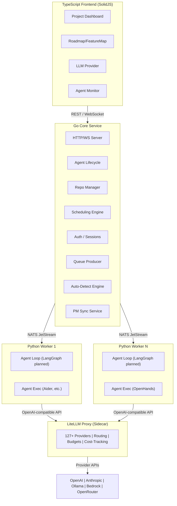
```mermaid
flowchart TD
    subgraph FE["TypeScript Frontend (SolidJS)"]
        PD["Project Dashboard"]
        RM["Roadmap/FeatureMap"]
        LP["LLM Provider"]
        AM["Agent Monitor"]
    end

    subgraph GO["Go Core Service"]
        HTTP["HTTP/WS Server"]
        AL["Agent Lifecycle"]
        REPO["Repo Manager"]
        SCHED["Scheduling Engine"]
        AUTH["Auth / Sessions"]
        QP["Queue Producer"]
        AD["Auto-Detect Engine"]
        PMS["PM Sync Service"]
    end

    subgraph W1["Python Worker 1"]
        LG1["Agent Loop (LangGraph planned)"]
        AE1["Agent Exec (Aider, etc.)"]
    end

    subgraph WN["Python Worker N"]
        LGN["Agent Loop (LangGraph planned)"]
        AEN["Agent Exec (OpenHands)"]
    end

    subgraph LITE["LiteLLM Proxy (Sidecar)"]
        LCORE["127+ Providers | Routing | Budgets | Cost-Tracking"]
    end

    PROVIDERS["OpenAI | Anthropic | Ollama | Bedrock | OpenRouter"]

    FE -- "REST / WebSocket" --> GO
    GO -- "NATS JetStream" --> W1
    GO -- "NATS JetStream" --> WN
    W1 -- "OpenAI-compatible API" --> LITE
    WN -- "OpenAI-compatible API" --> LITE
    LITE -- "Provider APIs" --> PROVIDERS
```

### Layers in Detail

#### Frontend (TypeScript)

The frontend serves as the web GUI for all user interactions. It communicates with the Go Core via REST API for CRUD and WebSocket for real-time updates (agent logs, status).

**Core modules** include Project Dashboard (manage repos, status overview), Roadmap/Feature-Map Editor (visual, OpenSpec-compatible), LLM Provider Management (configuration, cost tracking), and Agent Monitor (live logs, task status, results).

#### Core Service (Go)

The core service provides a performant backend for HTTP, WebSocket, scheduling, and coordination. Go was chosen for native concurrency (goroutines), minimal RAM (~10-20MB), fast startup times, and excellent performance for thousands of simultaneous connections.

**Core modules** include HTTP/WebSocket Server, Agent Lifecycle Management (Start, Stop, Status, Restart), Repo Manager (Git, GitHub, GitLab, SVN Integration), Scheduling Engine (task queue, prioritization), Auth / Sessions / Multi-Tenancy, and Queue Producer (dispatch jobs to Python Workers).

#### AI Workers (Python)

The AI workers handle LLM interaction and agent execution. Python was chosen for native access to the AI ecosystem (LiteLLM, LangGraph, all LLM SDKs). Workers scale horizontally via Message Queue, supporting any number of worker instances.

**Core modules** include LiteLLM Integration (multi-provider routing: OpenAI, Claude, Ollama, etc.), Agent Execution (Aider, OpenHands, SWE-agent, Goose, OpenCode, Plandex as swappable backends), and LangGraph Orchestration (for complex multi-agent workflows).

> **Implementation status (2026-09-29):** The worker runs its own agentic tool loop (`workers/codeforge/agent_loop.py`); LangGraph is not a dependency yet (planned). Multi-agent orchestration (execution plans, pipelines, debate) currently runs in the Go Core (`internal/service/orchestrator*.go`, `internal/domain/plan/`, `internal/domain/pipeline/`).

### Communication Between Layers

| From -> To | Protocol | Purpose |
|---|---|---|
| Frontend -> Go | REST (HTTP/2) | CRUD Operations |
| Frontend -> Go | WebSocket | Real-time updates, logs |
| Go -> Python Workers | NATS JetStream | Job dispatch (subject-based routing) |
| Python Workers -> Go | NATS JetStream | Results, status updates |
| Go -> LiteLLM Proxy | HTTP (OpenAI format) | Config management, health checks, model discovery; a few direct completions (e.g. feature decomposition, review router) |
| Python Workers -> LiteLLM Proxy | HTTP (OpenAI format) | LLM calls via `httpx` against `/v1/chat/completions` (`LiteLLMClient` in `workers/codeforge/llm.py`; no LiteLLM SDK) |
| LiteLLM Proxy -> LLM APIs | HTTPS | Provider-specific API calls |
| Go -> SCM (Git/SVN) | CLI / REST API | Repo operations |
| Go -> Ollama/LM Studio | HTTP | Local Model Auto-Discovery (today: Ollama `/api/tags` plus LiteLLM `/model/info`; direct LM Studio discovery planned) |
| Go -> PM Platforms | REST API / Webhooks | Bidirectional PM sync (Plane, GitHub, GitLab, Gitea/Forgejo; OpenProject planned) |
| Go -> Repo Specs | Filesystem | Spec detection and sync (OpenSpec, Spec Kit, Autospec, Markdown roadmaps) |
| Go <-> Tools/Agents | MCP (JSON-RPC) | Tool integration (server: expose tools, client: connect external) |
| Go -> LSP Servers | LSP (JSON-RPC) | Code intelligence per project language |
| Go -> OTEL Collector | OTLP (gRPC/HTTP) | Agent lifecycle traces, metrics |
| Python -> OTEL Collector | OTLP (gRPC/HTTP) | LLM call traces, token metrics |
| Frontend <- Go | AG-UI events (Phase 2-3) | Standardized agent output streaming |
| External Agents <-> Go | A2A v0.3.0 (Phase 27) | Agent discovery via AgentCards, bidirectional task delegation via `a2a-go` SDK |

### Protocol Support

CodeForge integrates with standardized protocols for tool integration, agent coordination, frontend streaming, code intelligence, and observability.

#### Tier 1: Essential (Phase 1-2)

| Protocol | Purpose | Standard | Integration Point |
|---|---|---|---|
| MCP (Model Context Protocol) | Agent <-> Tool communication | JSON-RPC 2.0 over stdio/SSE/HTTP (Anthropic) | **Implemented (Phase 15).** Go Core: MCP server via mcp-go SDK (4 tools, 2 resources, auth middleware, Streamable HTTP transport on port 3001). MCP server registry with PostgreSQL persistence, project-level assignment, 11 HTTP endpoints (8 server CRUD/test/tools + 3 project assignment). The MCP server runs only with `mcp.enabled: true` (default false). Python Workers: McpWorkbench (multi-server container, BM25 tool recommendation), tools named `mcp__{server}__{tool}`. Frontend: MCPServersPage. Policy: `mcp:server:tool` glob matching exists in the domain evaluator (`internal/domain/policy/evaluation.go`) but is not used at runtime yet; the runtime compares tool names exactly (see [Known Issues](todo.md#known-issues) KI-4) |
| LSP (Language Server Protocol) | Code intelligence for agents | JSON-RPC over stdio/TCP (Microsoft) | **Implemented (Phase 15D).** Go Core: LSP client with JSON-RPC transport over stdio. Per-project language server lifecycle management. 8 HTTP endpoints under `/projects/{id}/lsp/`. Context enrichment with diagnostics. Frontend: LSPPanel |
| OpenTelemetry GenAI | Standardized LLM/agent observability | OTEL Semantic Conventions (CNCF) | LiteLLM can export OTEL traces natively (not enabled yet: no `otel` callback in `litellm/config.yaml`). Go Core emits run/tool-call/delivery spans (`internal/telemetry/spans.go`), exported only with `otel.enabled: true` (default false); the worker exports spans and metrics and propagates `traceparent` on its publishes. Feeds Cost Dashboard + audit trails |

#### Tier 2: Important (Phase 2-3)

| Protocol | Purpose | Standard | Integration Point |
|---|---|---|---|
| A2A (Agent-to-Agent Protocol v0.3.0) | Peer-to-peer agent coordination | JSON-RPC 2.0 over HTTPS, `a2a-go` SDK (Linux Foundation) | **Server:** AgentExecutor + TaskStore backed by PostgreSQL, dynamic AgentCard from modes. **Client:** A2AService for remote agent discovery, registration, task delegation. Handoff integration via `a2a://` prefix. Auth middleware (`middleware.A2AAuth`) with Bearer tokens against `a2a.api_keys`: `/a2a` and the AgentCard are outside the JWT middleware, each key maps to a tenant (`<tenant-uuid>:<key>`, plain keys are the default tenant's) and has the stable ID `key-` plus 16 hex characters of its SHA-256; a caller sees only the inbound tasks its own key created, never outbound ones; inbound prompts pass the quarantine (see [Message Quarantine System](#message-quarantine-system)). 3 DB tables, 12 REST endpoints under `/api/v1/a2a` (incl. push-notification configs and SSE subscribe) |
| AG-UI (Agent-User Interaction Protocol) | Bi-directional agent <-> frontend streaming | JSON events over HTTP (CopilotKit) | Frontend WebSocket protocol follows AG-UI event format. Lifecycle events: TEXT_MESSAGE, TOOL_CALL, STATE_DELTA. Human-in-the-loop built in |

#### Tier 3: Future / Watch

| Protocol | Purpose | Notes |
|---|---|---|
| ANP (Agent Network Protocol) | Decentralized agent communication over internet | Early stage, W3C DIDs. Relevant when agents talk to external agent networks |
| LSAP (Language Server Agent Protocol) | LSP extension for AI agents | Emerging proposal, extends LSP with AI-specific capabilities |

#### Protocol Architecture

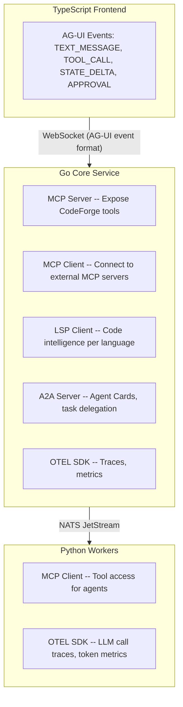
```mermaid
flowchart TD
    subgraph FE["TypeScript Frontend"]
        AGUI["AG-UI Events: TEXT_MESSAGE, TOOL_CALL, STATE_DELTA, APPROVAL"]
    end

    subgraph GO["Go Core Service"]
        MCPS["MCP Server -- Expose CodeForge tools"]
        MCPC["MCP Client -- Connect to external MCP servers"]
        LSPC["LSP Client -- Code intelligence per language"]
        A2AS["A2A Server -- Agent Cards, task delegation"]
        OTELG["OTEL SDK -- Traces, metrics"]
    end

    subgraph PY["Python Workers"]
        MCPW["MCP Client -- Tool access for agents"]
        OTELP["OTEL SDK -- LLM call traces, token metrics"]
    end

    FE -- "WebSocket (AG-UI event format)" --> GO
    GO -- "NATS JetStream" --> PY
```

### Design Decisions

#### Why not everything in Python?

Go handles a fraction of the resources under the same load. A Go HTTP server scales effortlessly to tens of thousands of simultaneous connections. In Python you need significantly more tuning and instances for that.

#### Why not everything in Go?

The entire AI/agent ecosystem (LiteLLM, LangGraph, Aider, OpenHands, SWE-agent, all LLM SDKs) is Python. Connecting everything via bridges would be more overhead than dedicated Python workers.

#### Why Message Queue instead of direct calls?

Decoupling means the Go service does not have to wait for slow LLM calls. Workers are horizontally scalable. Jobs are not lost when a worker crashes (resilience). The queue buffers during load spikes (backpressure).

#### Why YAML as the uniform configuration format?

All configuration files in CodeForge use YAML with no exceptions. This applies to agent modes and specializations, tool bundles and tool definitions, project settings and safety rules, autonomy configuration, LiteLLM config (natively YAML), and prompt metadata (Jinja2 templates themselves remain `.jinja2`).

**YAML supports comments**, which is critical for documentation directly in the config (`# Why this budget limit?`), temporarily disabling settings (`# tools: [terminal]`), onboarding (contributors understand configs without external documentation), and versioning (comments explain changes in the Git diff).

JSON is not used for configuration files. JSON remains for API responses, event serialization, and internal data exchange.

### Software Architecture: Hexagonal + Provider Registry

#### Core Principle: Hexagonal Architecture (Ports and Adapters)

The core logic (domain + services) is completely isolated from external systems. All dependencies point inward, never outward.

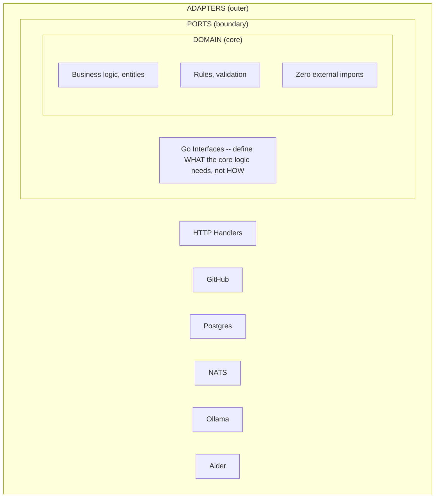
```mermaid
flowchart LR
    subgraph ADAPTERS["ADAPTERS (outer)"]
        direction LR
        A1["HTTP Handlers"]
        A2["GitHub"]
        A3["Postgres"]
        A4["NATS"]
        A5["Ollama"]
        A6["Aider"]

        subgraph PORTS["PORTS (boundary)"]
            direction LR
            P["Go Interfaces -- define WHAT the core logic needs, not HOW"]

            subgraph DOMAIN["DOMAIN (core)"]
                D1["Business logic, entities"]
                D2["Rules, validation"]
                D3["Zero external imports"]
            end
        end
    end
```

#### Provider Registry Pattern

For open-source extensibility, CodeForge uses a self-registering provider pattern. New implementations (e.g., a Gitea adapter) require a Go package that satisfies the corresponding interface, a blank import in `cmd/codeforge/providers.go`, and no changes to the core logic.

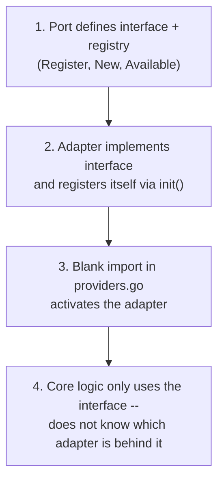
```mermaid
flowchart TD
    S1["1. Port defines interface + registry\n(Register, New, Available)"]
    S2["2. Adapter implements interface\nand registers itself via init()"]
    S3["3. Blank import in providers.go\nactivates the adapter"]
    S4["4. Core logic only uses the interface --\ndoes not know which adapter is behind it"]

    S1 --> S2 --> S3 --> S4
```

This pattern follows the Go standard pattern (`database/sql` + `_ "github.com/lib/pq"`).

Agent backend adapters are the exception: they need the message queue and are registered explicitly in `cmd/codeforge/main.go` (`aider.Register(queue)`, ...), not via a blank import.

#### Provider Types

| Port | Interface | Example Adapters |
|---|---|---|
| `gitprovider` | `Provider` | github, gitlab, gitlocal, svn, gitea |
| `agentbackend` | `Backend` | aider, openhands, goose, opencode, plandex (sweagent: worker executor only, no Go adapter yet) |
| `specprovider` | `Provider` | openspec, speckit, autospec, markdownspec |
| `pmprovider` | `Provider` | plane, githubpm, gitlab, gitea (also forgejo, codeberg); openproject planned |
| `database` | `Store` | postgres |
| `messagequeue` | `Queue` | nats |

#### Capabilities

Not every provider supports all operations. Instead of empty implementations, each provider declares its capabilities.

```go
// Each port declares its own capability struct, returned by Provider.Capabilities()
// (example: internal/port/gitprovider/provider.go)
type Capabilities struct {
    Clone       bool `json:"clone"`
    Push        bool `json:"push"`
    PullRequest bool `json:"pull_request"`
    Webhook     bool `json:"webhook"`
    Issues      bool `json:"issues"`
}
```

The core logic and the frontend check capabilities and adapt their behavior accordingly. SVN does not support webhooks, for example. That is not an error but declared behavior.

#### Compliance Tests

Each provider type ships a reusable test suite (`RunComplianceTests`). A new adapter calls this function and automatically receives all interface tests. Contributors write minimal test code and get maximum coverage.

> **Implementation status (2026-09-29):** Target design. Only the cache port has a suite today (`RunComplianceTests` in `internal/port/cache/cache_test.go`, not called by any adapter test yet); `gitprovider`, `agentbackend`, `specprovider` and `pmprovider` only have registry tests.

#### Go Core Directory Structure

```text
cmd/
  codeforge/
    main.go              # Entry point, dependency injection
    providers.go         # Blank imports of self-registering adapters (git, spec, PM, notifier)
    admin.go             # Admin CLI subcommands
internal/
  domain/                # Core: Entities, business rules (no adapter imports; stdlib + gopkg.in/yaml.v3 for the policy/pipeline/prompt loaders)
    project/
    agent/
    roadmap/
    ...                  # policy, mode, plan, pipeline, event, trust, quarantine, run, task, ...
  port/                  # Interfaces + registries
    gitprovider/
      provider.go        # Interface + capability definitions
      registry.go        # Register(), New(), Available()
    agentbackend/
    codeintel/
      provider.go        # Code intelligence interface (LSP abstraction)
    specprovider/
      provider.go        # Provider interface (Detect, ListSpecs, ReadSpec; optional ItemParser/ItemWriter)
      registry.go        # Register(), New(), Available()
    pmprovider/
      provider.go        # Provider interface (ListItems, GetItem, CreateItem, UpdateItem)
      registry.go        # Register(), New(), Available()
    tokenexchange/
      exchanger.go       # Token exchange interface (Copilot abstraction)
    metrics/
      recorder.go        # Metrics recorder interface (OTEL abstraction)
    database/
    messagequeue/
    ...                  # also: benchprovider, broadcast, cache, eventstore, feedback, llm, lsp, notifier, shell, subscription, wsticket
  adapter/               # Concrete implementations
    github/
    gitlab/
    gitlocal/
    svn/
    litellm/             # LiteLLM config management adapter
    aider/
    openhands/
    goose/               # Goose agent backend (Priority 1)
    opencode/            # OpenCode agent backend (Priority 1)
    plandex/             # Plandex agent backend (Priority 1)
    openspec/            # OpenSpec spec adapter
    speckit/             # GitHub Spec Kit adapter
    autospec/            # Autospec adapter
    plane/               # Plane.so PM adapter
    openproject/         # OpenProject PM adapter (planned)
    githubpm/            # GitHub Issues/Projects PM adapter
    postgres/
    nats/
    ...                  # also: a2a, auth, copilot, discord, email, execshell, gitea, http, lsp, markdownspec, mcp, otel, slack, svn, ws
  telemetry/             # OTEL span helpers (API-only, no SDK dependency)
  service/               # Use cases (connects domain with ports)
  ...                    # also: config, crypto, git, logger, middleware, netutil, proctemp, resilience, secrets, tenantctx, version, workspacefs
```

### Infrastructure Patterns (Implemented)

#### Reliability

**Circuit Breaker** (`internal/resilience/breaker.go`) provides a zero-dependency circuit breaker for external service calls (NATS Publish, LiteLLM API).

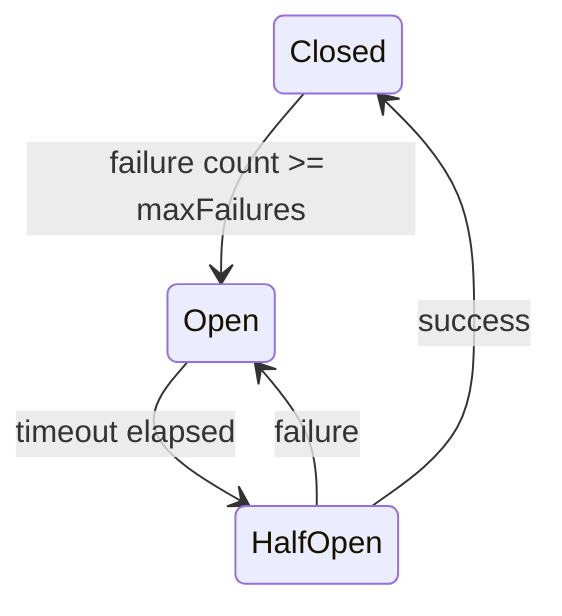
```mermaid
stateDiagram-v2
    Closed --> Open : failure count >= maxFailures
    Open --> HalfOpen : timeout elapsed
    HalfOpen --> Closed : success
    HalfOpen --> Open : failure
```

The breaker has configurable `maxFailures` and `timeout` from `config.Breaker`. It is injected via `SetBreaker()` on NATS and LiteLLM adapters. This prevents cascading failures when downstream services are unavailable.

**Idempotency Middleware** (`internal/middleware/idempotency.go`) deduplicates mutating HTTP requests (POST/PUT/DELETE). The client sends an `Idempotency-Key` header. The first request executes, captures the response (status + headers + body), and stores it in NATS JetStream KV (24h TTL). Subsequent requests with the same key replay the cached response without re-executing.

Response body is capped at 1 MB with best-effort storage (failures don't error the response). GET/HEAD/OPTIONS bypass the middleware entirely.

**Delivery and Dead Letter Queue** ([ADR-016](architecture/adr/016-nats-delivery-semantics.md)): Go and the worker each bind one shared durable pull consumer per subject (`codeforge-go-*` / `codeforge-py-*`, deliver policy `new` on creation, no inactivity threshold, `AckWait` 90 s, `MaxDeliver` 4), so restarts and recreations never replay the stream and each message is handled by one instance. Handlers send in-progress acks every `AckWait/3`. Workspace-changing work (`runs.start`, `conversation.run.start`, `tasks.agent.*`, `benchmark.run.request`) is acked on accept with a confirmed double ack and reports failures as completions instead of being redelivered. Other failures are NAK'd with a 2 s delay; on the last delivery (JetStream `NumDelivered` / `num_delivered`) the message is published to `{subject}.dlq` and acked. Invalid payloads (Go validator, worker schema errors) go to the DLQ at once and are terminated. The Go DLQ monitor (`codeforge-go-dlq-monitor`) logs dead letters and forwards them to the notifier. Work whose heartbeats stop, and work that was dead-lettered, is ended by the Go Core (stuck-work watchdog and DLQ subscribers, see Control plane details below; KI-65 to KI-67 are fixed).

**Graceful Shutdown** follows a 4-phase ordered sequence: HTTP server, cancel NATS subscribers, NATS Drain, PostgreSQL pool close.

#### Performance

**Rate Limiting** (`internal/middleware/ratelimit.go`) implements a token bucket rate limiter per client IP (IPv6 grouped by /64; authenticated requests keyed `userID:IP`). It has configurable `requests_per_second` and `burst` from config. Response headers follow GitHub-style conventions: `X-RateLimit-Remaining`, `X-RateLimit-Reset`. It returns 429 with `Retry-After` header when the limit is exceeded. The client IP comes from `middleware.ClientIP` (`internal/middleware/clientip.go`), which honours `X-Forwarded-For` / `X-Real-IP` only from `server.trusted_proxies` (since 2026-09-29, KI-11; chi's deprecated `RealIP` let any client pick its bucket).

#### Agent Execution

**Policy Layer** (`internal/service/policy.go`) evaluates first-match-wins permission rules per tool call. It ships with 5 built-in presets: `plan-readonly`, `headless-safe-sandbox` (default), `headless-permissive-sandbox`, `trusted-mount-autonomous`, and `supervised-ask-all`. Custom YAML policies load from a configurable directory. Evaluation follows this order: tool specifier matching, path constraints (glob), command constraints (prefix), mode fallback.

Quality gates require tests/lint pass with rollback on failure. Termination conditions include max steps, timeout, max cost, and stall detection. ADR: [007-policy-layer](architecture/adr/007-policy-layer.md).

> **Implementation status (2026-09-30):** Policy evaluation follows [ADR-015](architecture/adr/015-policy-deny-lists-and-tool-names.md): tool names are canonicalized in the Go policy domain, any matching deny list denies regardless of rule order, then the first matching rule decides, then the mode default; paths are normalized against the workspace (escapes denied); shell commands are parsed into simple commands matched by executable basename, and constructs that cannot be analysed fail closed; unknown profiles or modes deny on both the run and the conversation path; mode `Tools`/`DeniedTools` are enforced; built-in presets cannot be overwritten; the profile map is locked. Allow-Always writes to a per-project clone of the deciding profile, persisted in `policy.custom_dir` (default `data/policies`). Since S6 (KI-68, KI-69): custom profiles are tenant-scoped (`<policy.custom_dir>/<tenant_id>/`; the 5 presets are global and read-only); runs resolve the profile request > project (`policy_profile`, then config `policy_preset`) > default, conversations project > the preset of the mode's autonomy > default; the worker offers the LLM only the tools its mode allows; Bash redirection targets are checked against `path_deny` (unknown targets fail closed). Quality gates: KI-26, KI-28, KI-29 are fixed (see below and [Known Issues](todo.md#known-issues)).

**Runtime API** (`internal/service/runtime.go`) provides a step-by-step execution protocol between Go Control Plane and Python Workers. NATS subjects include `runs.start`, `runs.toolcall.{request,response,result}`, `runs.complete`, `runs.cancel`, and `runs.output`. The protocol enforces per-tool-call policy: Python requests permission, Go evaluates policy, Go responds allow/deny/ask.

Termination enforcement checks max steps, max cost, timeout, and stall detection per tool call. Quality gate orchestration works as follows: Go triggers gate request, Python runs test/lint, Go processes result. Five deliver modes are supported: none, patch, commit-local, branch, and PR. ADR: [006-agent-execution-approach-c](architecture/adr/006-agent-execution-approach-c.md).

> **Implementation status (2026-09-30):** `runs.start` carries `workspace_path`, `backend` and `approval_timeout_seconds`; the worker runs the agent loop (`AgentLoopExecutor`, the same loop setup as conversations via `build_loop_config` and `resolve_model_and_fallbacks` in `workers/codeforge/loop_config.py`, without skill tools and without Claude Code models) in that workspace, sends heartbeats and asks Go for a decision on every LLM and tool call. It waits for a decision as long as Go waits for an approval plus 15 s. `POST /runs` and agent dispatch are rejected (400) for a project without a workspace or a task/agent of another project. Backend tasks (`tasks.agent.*`) carry `TaskAgentPayload` (task, project, tenant, agent, backend, workspace); `tasks.cancel` stops the backend's whole process group and reports `cancelled`. Quality gates and delivery (KI-26 to KI-29, 2026-09-30): delivery runs in `endRun` for every run stored `completed` (with or without gates), before checkpoint cleanup; a failed gate always fails the run, and only a check that ran and failed rolls the workspace back (with `rollback_on_gate_fail`) and counts against the agent; gate errors, timeouts, a missing command or project, an unpublished request or the watchdog fail the run without rollback. Gate commands come from the project config keys `test_command` / `lint_command` (validated on create/update: shlex-parseable, executable on the worker's allowlist, else 400), then from the language whose test runner is set up at the workspace root (go.mod, Cargo.toml, a real package.json test script, a pytest config), then from `runtime.default_test_command` / `default_lint_command` (default empty); a required check without a command or result fails the gate. The worker runs each command in its own process group with the request's `timeout_seconds` and reports a check that could not run as a null verdict with an `error`. While a gate runs the worker sends `runs.heartbeat` (phase `quality_gate`) every `heartbeat_seconds`; the stuck-work watchdog fails a gated run that stayed silent for 2 min when nothing is queued (NATS backlog probe), otherwise after a bounded cap.

**Checkpoint System** (`internal/service/checkpoint.go`, `git_worktree.go`) records checkpoints as commits of the whole working tree built from a private index (`GIT_INDEX_FILE`, one per run, kept across its checkpoints) with `commit-tree`, chained under `refs/codeforge/checkpoints/<run>`; HEAD, branches and the user's index are never touched. A checkpoint is taken before each policy-allowed file-modifying tool call. The first (base) checkpoint also records the user's index (as a tree) and the pre-run HEAD (branch, detached commit or unborn branch); later checkpoints compare-and-swap on the chain tip. The ref chain is the durable record, so rollback and cleanup work after a Go Core restart and on another replica. `RewindToFirst` restores the base tree, the user's index and HEAD (files the run added are removed, the user's pre-run uncommitted and untracked files come back); `RewindToLast` undoes the last change; `CleanupCheckpoints` deletes the ref. Patch delivery diffs the base checkpoint against the working tree and writes `.git/codeforge/patches/<run>.patch` (no symlinks followed).

**Git in workspaces** (`internal/git/workspace.go`, KI-77): every Go git call in an agent-writable workspace (checkpoints, delivery incl. `gh`, gitlocal and GitHub providers, workspace init, ls-remote) goes through one hardened entry point: a sanitised environment (no global/system config or attributes, inherited `GIT_*` dropped, no prompts, pager or editor), `GIT_CONFIG_COUNT` overrides (hooks, fsmonitor, credential helpers, signing, gc/maintenance and submodule recursion off; filter drivers neutralised; only https/http/ssh/git transports), and pre-checks that execute nothing (`.git` must be a real directory without `commondir`/alternates or symlinked config, refs, logs or objects; repository config keys must be on an allowlist, `internal/git/config_keys.go`, fail closed). The worker's file tools refuse `.git` path components and the presets deny Write/Edit on `**/.git/**`. A process of the agent that keeps running could still rewrite `.git/config` between the check and git's read: since KI-96 a tool reaches only its own tenant's trees and, under Landlock, only its work item's workspace; the window stays open within that workspace ([Process and UID model](#process-and-uid-model)).

The pre-checks go further (S3-F, KI-82, KI-88). Refused in every repository: `core.sshCommand`, `core.gitProxy`, `remote.<name>.uploadpack` / `receivepack` / `vcs` / `promisor` / `partialCloneFilter` and `extensions.partialClone` (they name a program git runs for a transport or make a remote lazy-fetching; operators configure ssh with `GIT_SSH_COMMAND`); the environment sets `GIT_NO_LAZY_FETCH=1`, and every push runs with `push.recurseSubmodules=no` and `--no-recurse-submodules`. The `push`, `fetch`, `pull` and `checkout` sections are allowlisted key by key, the network-only sections (`http`, `protocol`, `url`) are refused only for fetch, pull and push, and a refusal names the key. **Nested repositories** (`internal/git/nested.go`): a workspace whose index or HEAD holds a gitlink (the mode is parsed, any mode with the type bits `0160000`), that has a nested `.git` (directory or file) outside ignored directories, or whose index has a path with a `.git` component is refused for every Go git operation (checkpoints, rewind, delivery, review baseline, providers), because `git add` and `git status` would run git inside the nested repository with its own configuration; the private index is checked before and after `add -A` and the walk is bounded (200,000 entries, depth 64; reaching a bound refuses the workspace). Submodules and linked worktrees are therefore not supported (KI-88). Files behind a filter driver (git-lfs, git-crypt) keep their content in checkpoints (renormalised after `add -A`) and commit delivery refuses changes to filtered paths. Commit delivery commits only the run's own change (three-way merge of the base checkpoint, HEAD and the working tree), so the user's uncommitted pre-run work stays uncommitted and pre-run staged changes stay staged. Short-lived files (per-run checkpoint indexes, the SVN client configuration) live in one per-process directory (`internal/proctemp`), stale ones are removed at startup. The SVN provider runs non-interactively without credential cache, with a private empty configuration directory and `--ignore-externals`, and contacts only URLs within the project's repository URL whose host passes the outbound policy (`file://` only with the operator setting `svn.allow_file_urls`; private and loopback hosts only via `svn.allowed_private_hosts`; KI-189). **Deadlines and pushes (KI-187, KI-188):** every Go Core git process has a deadline (`git.command_timeout`, `git.network_timeout` for network commands) and runs in its own process group, which is killed as a whole; `OpenRepo` refuses a FIFO, socket or device where git opens a file by name (ignore and attributes files, refs, `objects/info`, `core.excludesFile`), pre-scans the working tree for such `.gitignore` files and bounds its own checks to 20 s; agent-written sizing keys (`checkout.workers`, `index.threads`, `pack.*`, `core.packedGit*`) are overridden on the command line. Branch delivery pushes `refs/heads/<b>:refs/heads/<b>` without force to the project's `repo_url` from a private bare repository in the Core's temp directory (alternates to the workspace objects, `--no-follow-tags`, push options cleared), so the workspace's remote and push configuration is never read; a failed push is a failed delivery, a pushed branch without its pull request a `partial` one. One tenant holds at most `git.max_concurrent - 1` git pool slots. Adopting a directory or cloning from a local path is allowed inside the caller's tenant directory of the workspace root; platform admins may also use directories under `workspace.adopt_roots`. Tests of the auto-agent run in the worker (`conversation.test.request` / `conversation.test.result`), never in the Go Core (KI-81).

**Control plane details** (S6): the stuck-work watchdog (`internal/service/stuck_work_watchdog.go`) runs seven checks every `runtime.stale_check_interval`: lost tasks, tasks never accepted (`runtime.task_accept_timeout`), quality gates, lost runs, lost conversation runs, ended teams and undecided review refactorings (the last two also once at startup). `RuntimeService` remembers the runs the control plane ended whose worker has not confirmed the stop (`WorkerMayStillWrite`, `WorkerStopGrace`; the confirming completion calls the callback set with `SetOnWorkerStopped`), because such a worker may still change the workspace until it stops. `OrchestratorService` runs the plan-end callbacks (team cleanup, review pipeline) after the scheduling lock is released, prepares steps through a `StepPreparer` before their run starts (the review pipeline records the refactorer's baseline there, outside the lock), re-plans a step whose run stalled up to `runtime.stall_max_retries` times, and ends a team with its plan (also on cancel).

**Review pipeline** (Phase 31, KI-17; `internal/service/review_pipeline.go`): `POST /projects/{id}/review-refactor` creates and starts a plan (boundary analysis, contract review, review, refactoring) with one active pipeline per project. The Go record `review_pipelines` (migration 100; state `pending`, `refactoring`, `awaiting_decision`, `done`) holds the baseline commit, the result commit and the measured impact; the refs `refs/codeforge/review/<plan>` and `refs/codeforge/review-result/<plan>` only keep those commits alive and are never trusted. After the refactorer ends, `DiffImpactScorer` measures the change against the baseline (the gate fails closed on a tampered ref, a missing record, a boundary lookup error or an unmeasurable change); a low impact is applied, a medium one is applied with a notification and a high one waits for a decision (`review.approval_required` WebSocket event, `GET /projects/{id}/review/pending` after a reload). Keep and undo are `POST /runs/{id}/approve` and `/reject`; the undo is path-scoped (three-way merge) and moves HEAD back only by compare-and-swap. A stopped refactoring is measured once its worker confirmed the stop or the lost-worker deadline passed.

**Docker Sandbox** (`internal/service/sandbox.go`) manages container lifecycle for isolated agent execution. It supports a Create, Start, Exec, Stop, Remove lifecycle via Docker CLI (`os/exec`). Resource limits include memory, CPU quota, PID limit, and network mode (default: `none`). A three-layer limit hierarchy applies: config defaults, then policy limits, then agent limits, capped at ceiling. The root filesystem is read-only with tmpfs `/tmp`.

> **Implementation status (2026-09-30):** `SandboxService` can create and start per-run containers with resource limits (`--cpus` formatted as a decimal, non-positive quotas rejected), but `SandboxService.Exec` has no callers and the worker runs tools locally, so runs, agentic conversations and benchmark runs in `sandbox`/`hybrid` exec mode are rejected with HTTP 400 (`run.ExecMode.CheckAvailable`, fail closed since 2026-09-30, KI-13) until tools execute inside the container; the worker also refuses non-`mount` `runs.start`. See [Known Issues](todo.md#known-issues) KI-13.

#### Process and UID Model

KI-71 ([ADR-017](architecture/adr/017-tool-isolation-and-nats-authentication.md), [SECURITY.md](SECURITY.md#agent-tool-isolation)) separates the processes that run what an agent causes from the processes that hold the secrets; KI-96 ([ADR-018](architecture/adr/018-per-tenant-tool-identities-and-landlock.md)) separates the tenants' tool processes from each other.

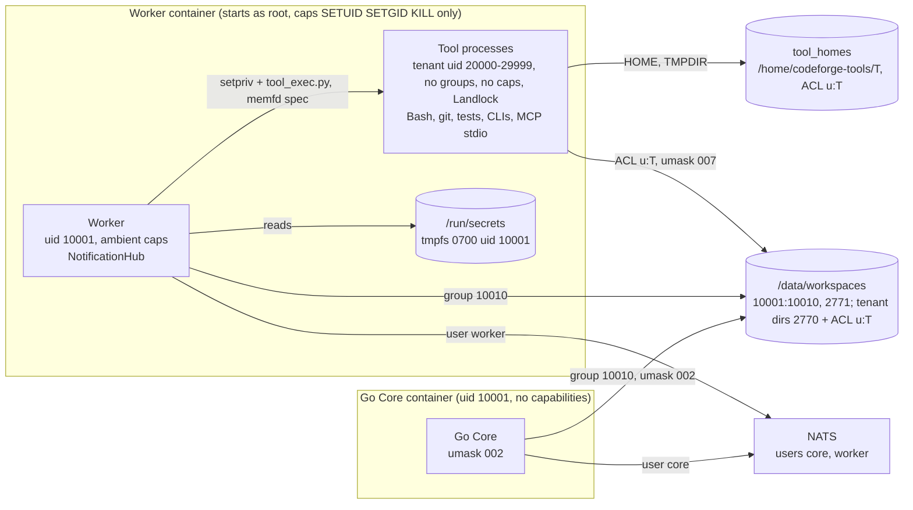
```mermaid
flowchart LR
    subgraph core_c["Go Core container (uid 10001, no capabilities)"]
        core["Go Core<br/>umask 002"]
    end
    subgraph worker_c["Worker container (starts as root, caps SETUID SETGID KILL only)"]
        worker["Worker<br/>uid 10001, ambient caps<br/>NotificationHub"]
        tools["Tool processes<br/>tenant uid 20000-29999, no groups, no caps, Landlock<br/>Bash, git, tests, CLIs, MCP stdio"]
        secrets[("/run/secrets<br/>tmpfs 0700 uid 10001")]
    end
    ws[("/data/workspaces<br/>10001:10010, 2771; tenant dirs 2770 + ACL u:T")]
    homes[("tool_homes<br/>/home/codeforge-tools/T, ACL u:T")]
    nats["NATS<br/>users core, worker"]
    worker -- "setpriv + tool_exec.py, memfd spec" --> tools
    worker -- "reads" --> secrets
    core -- "group 10010, umask 002" --> ws
    worker -- "group 10010" --> ws
    tools -- "ACL u:T, umask 007" --> ws
    tools -- "HOME, TMPDIR" --> homes
    core -- "user core" --> nats
    worker -- "user worker" --> nats
```

- **Users.** The Go Core and the worker run as uid 10001 (`codeforge`), both with supplementary group `codeforge-ws` (10010). The worker container starts as root with `cap_drop: ALL` and only `SETUID`, `SETGID` and `KILL`; `scripts/worker-entrypoint.sh` runs the worker as uid 10001 with those three as ambient capabilities, so it never runs as root. Tool processes (Bash, grep, `git` in the workspace, quality gates and workspace tests, benchmark test commands, backend CLIs, the Claude Code CLI and its hook, MCP stdio servers) run as their tenant's tool UID and GID (20000-29999 from `tenants.tool_uid`, sent as `tool_uid` by the Go Core; tenantless checks as 19999) with no supplementary group, no capabilities, `no_new_privs`, umask 007 and Landlock. They start only through `workers/codeforge/tool_process.py` (`setpriv`, then the launch helper `tool_exec.py` reading its spec from a memfd; `CODEFORGE_TOOL_ISOLATION=required` fails every tool call closed and answers `/health/ready` with 503 when the startup checks fail). The Go Core never starts a stdio MCP server and runs no workspace code (KI-77, KI-81).
- **Secrets.** The worker reads `*_FILE` paths from `/run/secrets`, a tmpfs only uid 10001 can enter (Compose ignores secret `uid`/`gid`/`mode`); it locks the directory after startup. Tool processes cannot read the worker's environment or secrets and never get NATS credentials.
- **Workspace layout.** `/data/workspaces` is `10001:10010` with mode 2771; tenant directories are 2770 with POSIX ACLs for the tenant's tool UID (`u:T:--x`, default `u:T:rwx` and `g:10010:rwx`), set by the Go Core before any clone or init with `workspace.tool_acls: required`. The Core and the worker reach everything through group 10010 and the `g:10010` default entries; the sharing pass runs as the tenant (per tool call for changed entries, in full at the end of each work item). `<root>/.codeforge` holds the worker's state (UID bindings, migration stamps, locks); tenant HOMEs live on the `tool_homes` volume (`/home/codeforge-tools/<uid>`), each work item with its own TMPDIR below HOME; `/tmp` is 1771. Trees from before KI-96 are migrated per tenant at its first work item; project workspaces are deleted by the worker as the tenant (`workspace.delete.request`, `workspace_deletions`).
- **Workspace file access.** In-process readers and writers resolve every path below a descriptor of the workspace (Go `internal/workspacefs` on os.Root, Python `codeforge.workspace_fs` with `O_NOFOLLOW` component walks): relative symlinks inside are followed (8 max), anything leaving the workspace is refused, opens use `O_NONBLOCK` and take regular files only, walks never leave the workspace; only the glob and listing tools enter relative directory symlinks inside it (KI-95). Knowledge-base content (`<knowledge.content_root>/<tenant_id>/`) and benchmark datasets (`benchmark.datasets_dir`) use the same helpers below their operator directories (KI-105, KI-107).
- **NATS authentication.** Production NATS (`configs/nats/nats-server.conf`, `nats:2.15-alpine`) knows two users: `core` publishes every stream subject and owns the stream and KV; `worker` publishes only its results, progress and `.dlq` copies and may use only consumers named in its permissions. Each service has its own inbox prefix (`_INBOX_core`, `_INBOX_worker`). A subject or worker consumer that is not in the config fails the permission tests. `handoff.approved` is carried out only for an approved, unconsumed quarantine release (migration 111).
- **NotificationHub.** Cancels and tool-call decisions (`runs.cancel`, `tasks.cancel`, `conversation.run.cancel`, `runs.toolcall.response`) reach runs and tasks through `workers/codeforge/notifications.py`: one shared named push consumer per subject delivering to `_INBOX_worker.notify.<name>` (fan-out to every worker instance, never deleted by the hub); a listener that starts at a stream sequence reads the subject back with batched direct gets (the stream has `AllowDirect`), and a gap in the consumer sequences or a reconnect triggers a read-back from the last handed-out sequence. `/health/ready` is `503` until the consumers exist and no read-back is pending.
- **MCP.** Stdio servers run in the worker as the tenant's tool user; env and header values are redacted to `***` in every API response; servers and their project links are tenant-scoped (migration 112) and a tenant's admins manage them.

#### Agentic Conversation Loop (Phase 17)

The agentic loop makes CodeForge an autonomous coding agent. When a user sends a message in the Chat UI, the system dispatches to a Python worker that runs a multi-turn tool-use loop: LLM decides which tools to call, tools execute, results feed back, and the loop continues until the task is done.

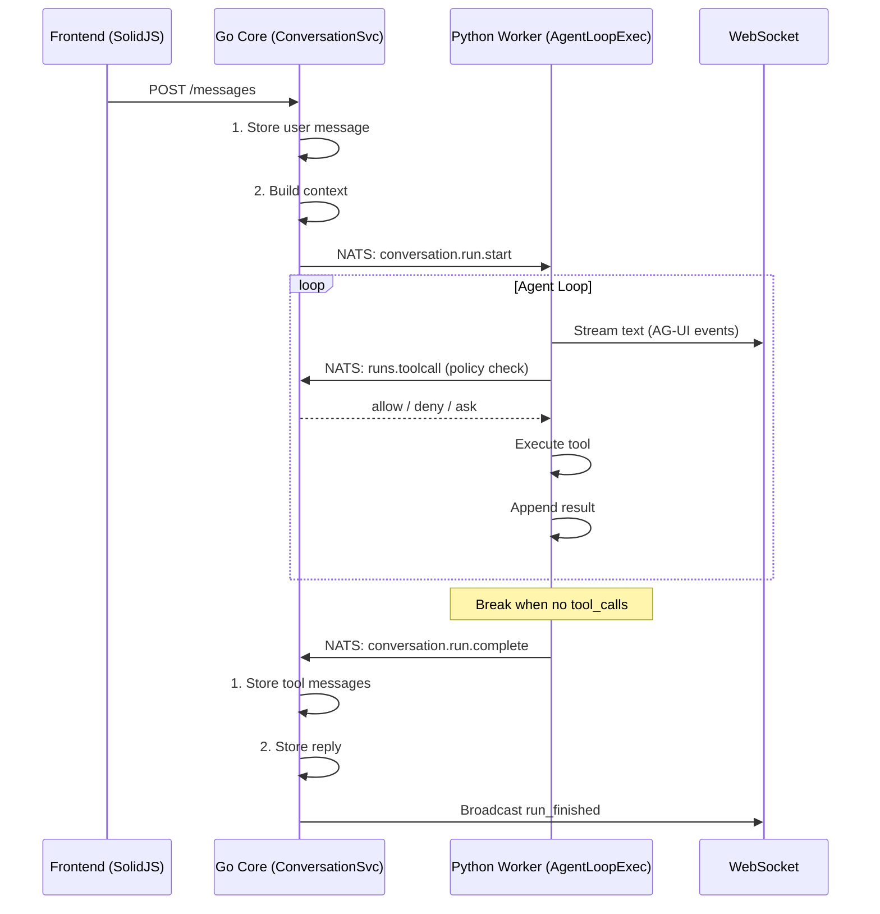
```mermaid
sequenceDiagram
    participant FE as Frontend (SolidJS)
    participant GO as Go Core (ConversationSvc)
    participant PY as Python Worker (AgentLoopExec)
    participant WS as WebSocket

    FE->>GO: POST /messages
    GO->>GO: 1. Store user message
    GO->>GO: 2. Build context
    GO->>PY: NATS: conversation.run.start

    loop Agent Loop
        PY->>WS: Stream text (AG-UI events)
        PY->>GO: NATS: runs.toolcall (policy check)
        GO-->>PY: allow / deny / ask
        PY->>PY: Execute tool
        PY->>PY: Append result
    end
    Note over PY: Break when no tool_calls

    PY->>GO: NATS: conversation.run.complete
    GO->>GO: 1. Store tool messages
    GO->>GO: 2. Store reply
    GO->>WS: Broadcast run_finished
```

**Conversation Service** (`internal/service/conversation*.go`) provides two paths: simple (single LLM call for projects without workspaces) and agentic (multi-turn tool loop); both dispatch via NATS. `IsAgentic()` (`conversation_agent.go`) uses the request override, then the global `agent.agentic_by_default` flag (default true), and requires a queue and a project workspace. `SendMessageAgentic()` (`conversation_dispatch.go`) stores the user message, loads conversation history, builds a context pack (system prompt, tool definitions, MCP servers, policy profile), and publishes a `ConversationRunStartPayload` to NATS.

It returns immediately (HTTP 202). `HandleConversationRunComplete()` receives the result via NATS, batch-inserts tool messages, stores the final assistant message, and broadcasts `agui.run_finished` via WebSocket.

A conversation has at most one active run: a message sent while a run is active is answered with 409 (`ErrConversationRunInProgress`). Every dispatch gets a new `turn_id`, carried on `conversation.run.start`, `runs.toolcall.request` (and `runs.heartbeat`) and `conversation.run.complete`, so tool calls of a stopped turn are denied and a late completion of an older turn is not taken for the active one ([ADR-016](architecture/adr/016-nats-delivery-semantics.md), conversation completions).

**Agent Loop Executor** (`workers/codeforge/agent_loop.py`) implements the core loop. It merges built-in tools (`read_file`, `write_file`, `edit_file`, `bash`, `search_files`, `glob_files`, `list_directory`, `search_conversations`, `search_skills`, `create_skill`, plus per-run `handoff_to` (offered whenever it is registered), `propose_goal`, `propose_roadmap`) with MCP-discovered tools (`mcp__{server}__{tool}`) into a single tools array (`spawn_subagent` is not offered until Go starts sub-agents: [Known Issues](todo.md#known-issues) KI-25). Each iteration calls `chat_completion_stream()`, streams text chunks to the frontend via AG-UI events, and checks for tool_calls. For each tool call, it requests permission from Go via the Runtime API, executes the tool if allowed, and appends the result to the message history. The loop terminates on `finish_reason="stop"`, max steps, max cost, or cancellation.

**Conversation History Manager** (`workers/codeforge/history.py`) assembles the message array within a token budget. It uses a head-and-tail strategy: always include the system prompt and the last N messages, compress older tool results to stay within `MaxContextTokens`. Long tool outputs are truncated to a configurable maximum (default 10,000 chars) with head+tail preservation.

**HITL Approval** (`internal/service/runtime.go`) intercepts `DecisionAsk` from the policy layer. When a tool call requires user approval, the runtime broadcasts an `agui.permission_request` event via WebSocket and blocks on a buffered channel with a configurable timeout (default 60s). The frontend shows an inline approval card with Allow/Deny buttons. The user's decision is sent via `POST /runs/{id}/approve/{callId}`, which resolves the channel and resumes execution. The approval timeout is sent as `approval_timeout_seconds` on `runs.start` and `conversation.run.start`; the worker waits for a decision that long plus 15 s, and the Go Core keeps the tool-call request in progress at least that long (`Queue.SetMaxHandlerDuration`, ADR-016), so a late approval is neither lost nor handled twice (KI-21, fixed).

**Configuration** (`internal/config/config.go`) includes an `Agent` section: `DefaultModel`, `MaxContextTokens` (default 128000), `MaxLoopIterations` (default 50), `AgenticByDefault` (default true), `ToolOutputMaxChars` (default 10000; sent as `tool_output_max_chars` on `runs.start` and `conversation.run.start`, the worker truncates tool output to it), `ContextEnabled` (default true), `ContextBudget` (default 2048, decaying with the history, see [Adaptive Budget](features/04-agent-orchestration.md#proactive-context-injection-for-conversations)) and `ContextPromptReserve` (default 512). `BuiltinTools` was removed (KI-38): the mode's tool lists choose the tools. Scalar fields have env overrides with `CODEFORGE_AGENT_*` prefix (summarize threshold: `CODEFORGE_SUMMARIZE_THRESHOLD`). The `Runtime` section adds `ApprovalTimeoutSeconds` (default 60) with `CODEFORGE_APPROVAL_TIMEOUT_SECONDS`.

#### Observability

**Event Sourcing** (`internal/domain/event/`) provides an append-only event stream for agent trajectory recording plus all broadcast event types and AG-UI event constants (`broadcast.go`, `broadcast_payloads.go`, `agui.go`; event types belong in this domain package, never in the adapter layer) (57 event constants (45 broadcast + 12 AG-UI) + 42 broadcast payload structs and 12 AG-UI event structs, moved from the adapter layer to enforce hexagonal architecture). Events are stored in a PostgreSQL table `agent_events` (indexed by (tenant_id, task_id, version), (tenant_id, agent_id, version), (tenant_id, run_id, version), (tenant_id, project_id, created_at); since migration 091 `agent_id`/`task_id` are nullable, so task-result and plan events are persisted). There are 35 event types covering tool call requested/approved/denied/result, run started/completed, stall detected, quality gate pass/fail, delivery status, plan lifecycle, review lifecycle, and session management. API endpoints include `GET /api/v1/tasks/{id}/events`, `GET /api/v1/runs/{id}/events`, `GET /api/v1/runs/{id}/trajectory` (cursor-paginated, type/time filtering), and `GET /api/v1/runs/{id}/trajectory/export` (JSON download).

Trajectory Stats use SQL aggregates for total events, duration, tool calls, and errors. The frontend provides a TrajectoryPanel with timeline visualization, event filters, stats summary, and export. This enables replay, audit trail, and trajectory inspection (deferred: full replay UI).

**Structured Logging** uses async JSON logging across all services (ADR: [004-async-logging](architecture/adr/004-async-logging.md)). Go uses `slog.JSONHandler` wrapped in `AsyncHandler` (10K buffer, 4 workers, non-blocking drops). Python formats records in the calling thread (one formatter for structlog and stdlib loggers such as httpx and nats) and writes them from a `QueueListener` (10K buffer, background thread). Both use the schema `{time, level, msg, service, logger, ...attributes}` with levels DEBUG/INFO/WARN/ERROR, one JSON object per line (tracebacks go into an `exception` field); the worker redacts URL userinfo across the whole rendered line. Docker-native log management is described in ADR: [005-docker-native-logging](architecture/adr/005-docker-native-logging.md).

**Configuration** follows a hierarchical config system (ADR: [003-config-hierarchy](architecture/adr/003-config-hierarchy.md)). Three tiers apply: defaults < YAML (`codeforge.yaml`) < environment variables. A typed `Config` struct validates on startup. Go Core uses the `CODEFORGE_*` prefix. The Python worker reads the same `codeforge.yaml` and mostly `CODEFORGE_*` or service-specific variables (`NATS_URL`, `LITELLM_BASE_URL`, `LITELLM_MASTER_KEY`); only log level/service and health port use `CODEFORGE_WORKER_*`.

#### Tenant Isolation

Every tenant-scoped row carries `tenant_id`, and the rules below keep each request, message and background job inside its tenant.

- **Store queries.** Every tenant-scoped query filters `AND tenant_id = $N` with the tenant from `tenantFromCtx(ctx)` (`internal/adapter/postgres/helpers.go`); the reference implementation is `store_project.go:GetProject`. `LIMIT` and every other value go in as `$N` placeholders, never through `%d` / `fmt.Sprintf` interpolation. Exceptions: user, token and tenant management, and queries that must span tenants. Each of those is commented `INTENTIONALLY CROSS-TENANT` with the reason and hands every row on in its own tenant's context: system jobs (the GDPR retention sweep in `store_retention.go`, the stuck-work watchdog's `ListStaleRuns` and heartbeat queries, the workspace-deletion retry, the tool-ACL check at startup) and lookups of an unauthenticated inbound request by an unguessable ID that names its tenant (webhook endpoints, OAuth state).
- **NATS messages.** Payloads carry `tenant_id`, and handlers scope their context with it (`tenantctx.WithTenant`, through `withPayloadTenant` in `internal/service/tenant_scope.go`). Every Go publish also carries the tenant as the `X-Tenant-ID` header; precedence is request > payload > header, so the header applies only when neither an explicit request tenant nor the payload names one. Outgoing payloads take their tenant from the context (`outgoingTenant`); a missing tenant is logged as an error and falls back to the default tenant. The worker echoes the tenant on everything it publishes while handling a message (KI-64).
- **WebSocket.** `BroadcastEvent` sends only to the clients of the tenant in ctx and drops events without one (see [Real-time State via WebSocket](#real-time-state-via-websocket)).
- **Inbound webhooks** are registered per project (`/api/v1/webhooks/{vcs|pm}/{provider}/{id}`, own secret); the tenant comes from the webhook's ID, `X-Tenant-ID` is never read there (KI-85). Slack and approval emails go only to the tenants in `notification.approval_tenants`.

### LLM Capability Levels

Not every LLM brings the same capabilities. CodeForge must fill the gaps so that even simple models can be used productively.

#### The Problem

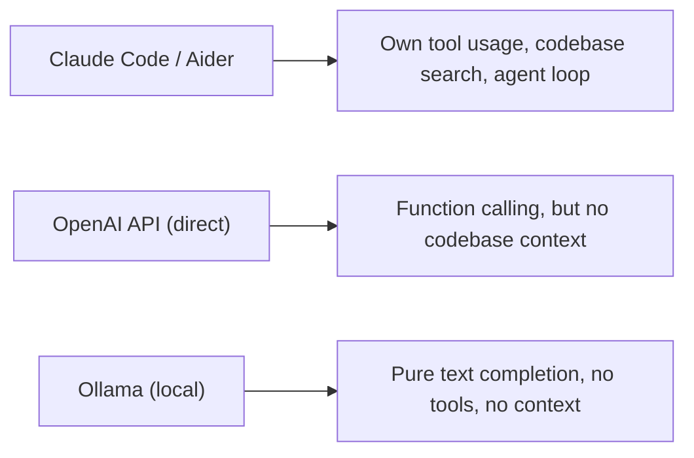
```mermaid
flowchart LR
    CC["Claude Code / Aider"] --> CC_CAP["Own tool usage, codebase search, agent loop"]
    OAI["OpenAI API (direct)"] --> OAI_CAP["Function calling, but no codebase context"]
    OL["Ollama (local)"] --> OL_CAP["Pure text completion, no tools, no context"]
```

A local Ollama model knows nothing about the repo, cannot read files, and has no memory. CodeForge must provide these capabilities.

#### Capability Stacking by Python Workers

The workers supplement missing capabilities depending on the LLM level.

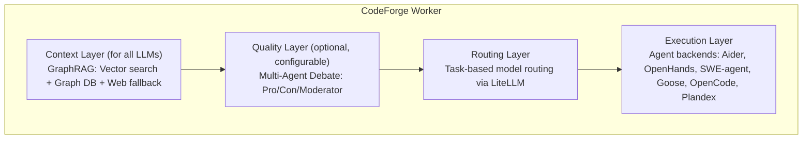
```mermaid
flowchart TD
    subgraph WORKER["CodeForge Worker"]
        CTX["Context Layer (for all LLMs)\nGraphRAG: Vector search + Graph DB + Web fallback"]
        QL["Quality Layer (optional, configurable)\nMulti-Agent Debate: Pro/Con/Moderator"]
        RL["Routing Layer\nTask-based model routing via LiteLLM"]
        EL["Execution Layer\nAgent backends: Aider, OpenHands, SWE-agent, Goose, OpenCode, Plandex"]

        CTX --> QL --> RL --> EL
    end
```

#### Three LLM Integration Levels

| Level | Example | What CodeForge Provides |
|---|---|---|
| Full-featured Agents | Claude Code, Aider, OpenHands | Orchestration only -- agent brings its own tools |
| API with Tool Support | OpenAI, Claude API, Gemini | Context Layer (GraphRAG) + Routing + Tool Definitions |
| Pure Completion | Ollama, LM Studio (local models) | Everything: Context, Tools (text tool protocol, ADR-021), Prompt Engineering, Quality Layer |

The less an LLM can do, the more the CodeForge Worker takes over.

#### Worker Modules in Detail

The worker is organised in modules: Context (GraphRAG), Quality (debate, reviewer, sampler, guardrail), Routing, Safety, Execution, Memory, Skills, History, Events, Orchestration, Hooks, Trajectory and HITL; the [module table](features/04-agent-orchestration.md#worker-modules) gives each one's purpose. This section details the first three; Safety and Execution follow in [Agent Execution: Modes, Safety, Workflow](#agent-execution-modes-safety-workflow), History, Hooks and Trajectory under [History Processors](#history-processors-context-window-management), [Hook System](#hook-system-observer-pattern) and [Trajectory Recording and Replay](#trajectory-recording-and-replay).

**Context Layer -- GraphRAG (4-Tier Retrieval)**

Tier 1 (RepoMap) builds a file-level dependency graph via PageRank (tree-sitter). Tier 2 (Hybrid Retrieval) runs BM25 keyword search + semantic embeddings with RRF fusion. Tier 3 (Sub-Agent) uses LLM-guided multi-query expansion + reranking. Tier 4 (GraphRAG) uses PostgreSQL adjacency lists for import/call graph traversal (BFS with hop-decay scoring). No Neo4j/Qdrant: Tier 4 graph data lives in PostgreSQL, while the Tier 2 BM25/embedding index is held in memory per worker process (`ProjectIndex` in `workers/codeforge/retrieval.py`; rebuilt on restart, not shared between workers). The result is relevant context prepended to the LLM prompt.

**Quality Layer -- Multi-Stage Quality Assurance**

Four strategies are available, graduated by effort and criticality.

> **Implementation status (2026-09-29):** Target design. Implemented today: multi-rollout sampling for conversations (`ConversationRolloutExecutor` in `workers/codeforge/agent_loop.py`, `agent.conversation_rollout_count`) and review-router-triggered multi-agent debate (moderator/proponent modes, `internal/service/orchestrator_consensus.go`). AskColleagues/BinaryComparison, RetryAgent + Reviewer and the LLM Guardrail Agent are planned.

Action Sampling (lightweight) generates multiple independent LLM responses. AskColleagues produces N proposals where an LLM synthesizes the best solution. BinaryComparison runs pairwise comparison and selects the winner. This strategy suits everyday tasks with moderate quality requirements.

RetryAgent + Reviewer (medium) has the agent solve a task multiple times with environment reset between attempts. An LLM-based reviewer evaluates each solution in score mode (numerical evaluation, average across samples) or chooser mode (direct comparison of all solutions). The best solution is selected. This strategy suits important changes with measurable quality.

LLM Guardrail Agent (medium) uses a separate LLM to evaluate the output of the working agent. It validates format compliance, safety, and correctness. It can reject and trigger retry before delivery. This strategy suits automated pipelines where human review is unavailable.

Multi-Agent Debate (heavyweight) has a pro agent argue for a solution, a con agent search for weaknesses, and a moderator synthesize the result. This strategy suits critical architecture decisions and security-relevant changes.

All four strategies are optional and configurable per project/task.

**Routing Layer -- Intelligent Model Routing**

The routing layer handles task classification (architecture, code generation, review, docs, tests), cost optimization (simple tasks to cheap models, complex to powerful ones), latency routing (fast responses for interactive usage), and fallback chains (if a provider fails, automatically use the next one). Routing rules are configurable per project and per user.

Cost management includes budget limits per task/project/user, automatic cost tracking via LiteLLM, warning/stop when budget is exceeded, and API call limits per agent run.

### Agent Execution: Modes, Safety, Workflow

#### Three Execution Modes

Not every use case needs a sandbox. CodeForge supports three modes.

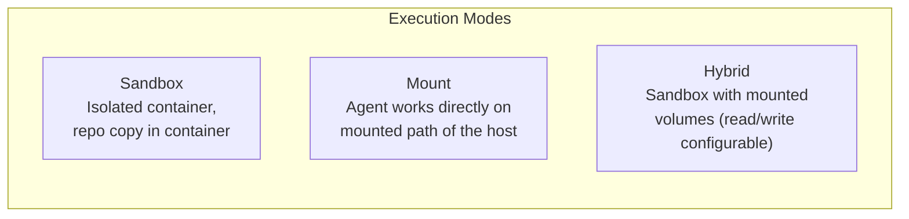
```mermaid
flowchart LR
    subgraph MODES["Execution Modes"]
        SANDBOX["Sandbox\nIsolated container,\nrepo copy in container"]
        MOUNT["Mount\nAgent works directly on\nmounted path of the host"]
        HYBRID["Hybrid\nSandbox with mounted\nvolumes (read/write configurable)"]
    end
```

| Mode | When | Security | Speed |
|---|---|---|---|
| Sandbox | Untrusted agents, foreign models, batch jobs | High -- no access to host | Medium -- container overhead, repo copy |
| Mount | Trusted agents (Claude Code, Aider), local development | Low -- direct file access | High -- no overhead |
| Hybrid | Review workflows, CI-like execution | Medium -- controlled access | Medium |

Mount Mode gives the agent a path to the mounted repo (e.g., `/workspace/my-project`). Changes land directly in the host's filesystem. This mode is ideal for interactive use because the user sees changes immediately in their IDE. No container is needed since the agent runs in the worker process or native tool.

Sandbox Mode runs a Docker container per task (Docker-in-Docker). The repo is copied into the container or mounted as a read-only volume. The agent gets all necessary tools provisioned in the container. The result is extracted as a patch/diff and applied to the original repo.

**Hybrid Mode** runs a container with a mounted volume. Mount permissions are configurable: read-only source + write workspace copy. The agent can read, but changes go into a copy. The user reviews and merges manually.

> **Implementation status (2026-09-30):** Only mount semantics exist today: runs, agentic conversations and benchmark runs in `sandbox`/`hybrid` exec mode are rejected with HTTP 400 (`run.ExecMode.CheckAvailable`, fail closed since 2026-09-30, KI-13) until tools execute inside the container; the worker also refuses non-`mount` `runs.start`.

#### Tool Provisioning for Sandbox Agents

Agents in sandbox containers need the right tools. CodeForge provides these automatically depending on the agent type and execution mode.

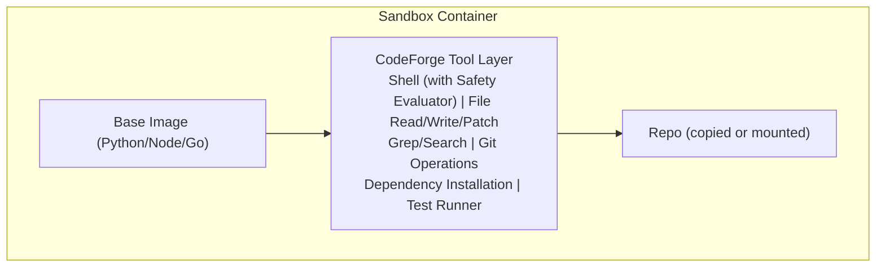
```mermaid
flowchart TD
    subgraph CONTAINER["Sandbox Container"]
        BASE["Base Image (Python/Node/Go)"]
        TOOLS["CodeForge Tool Layer\nShell (with Safety Evaluator) | File Read/Write/Patch\nGrep/Search | Git Operations\nDependency Installation | Test Runner"]
        REPO["Repo (copied or mounted)"]

        BASE --> TOOLS --> REPO
    end
```

Tools are defined as `ToolDefinition` dataclasses with JSON Schema parameters (`workers/codeforge/tools/_base.py`) and passed to the LLM in OpenAI function-calling format. Full-featured agents (Aider, OpenHands) bring their own tools and only need the repo.

#### Command Safety Evaluator

Every shell command from an agent goes through a safety check. The evaluator detects destructive operations (`rm -rf`, `git push --force`, etc.), prompt injection in commands, and assesses risk level (low / medium / high). Tool blocklists cover interactive programs (`vim`, `nano`), standalone interpreters (`python` without script), and dangerous commands, all configurable per project as YAML.

When uncertain, the evaluator blocks the command and asks the user (human-in-the-loop). This is optional for trusted agents in mount mode but mandatory for local models in the sandbox.

> **Implementation status (2026-09-29):** Target design. Today shell commands are gated by the policy engine (`command_allow`/`command_deny` rules matched per simple command after shell parsing, `internal/domain/policy/command.go`, ADR-015) plus a hardcoded defense-in-depth blocklist (`_check_dangerous_command` in `workers/codeforge/tools/bash.py`). Risk scoring, prompt-injection detection and interactive-program blocklists are planned. Command deny lists are a best-effort blocklist: scripts the agent writes and then runs are not analysed; real containment needs the sandbox ([Known Issues](todo.md#known-issues) KI-13).

#### Agent Workflow: Plan -> Execute -> Review

A standardized workflow applies to all agents with configurable autonomy level.

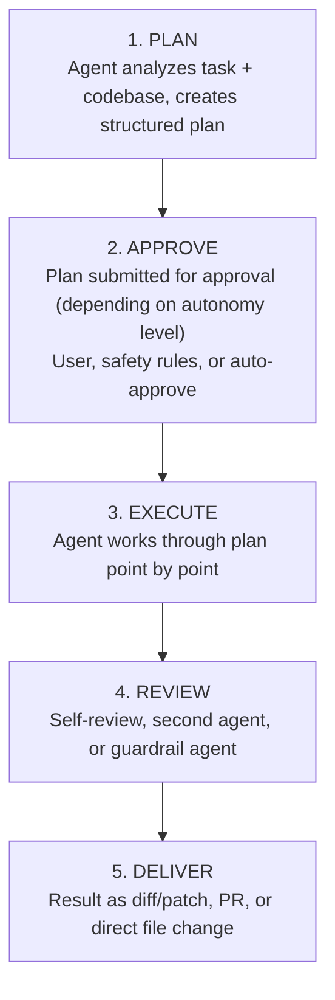
```mermaid
flowchart TD
    PLAN["1. PLAN\nAgent analyzes task + codebase, creates structured plan"]
    APPROVE["2. APPROVE\nPlan submitted for approval (depending on autonomy level)\nUser, safety rules, or auto-approve"]
    EXECUTE["3. EXECUTE\nAgent works through plan point by point"]
    REVIEW["4. REVIEW\nSelf-review, second agent, or guardrail agent"]
    DELIVER["5. DELIVER\nResult as diff/patch, PR, or direct file change"]

    PLAN --> APPROVE --> EXECUTE --> REVIEW --> DELIVER
```

Each step is individually configurable (skip, auto-approve, etc.). The autonomy level determines who may approve (user vs. safety rules). At level 4-5, safety rules replace the human approver.

#### Autonomy Spectrum

CodeForge supports five autonomy levels, from fully supervised operation to completely autonomous execution without user interaction.

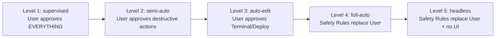
```mermaid
flowchart LR
    L1["Level 1: supervised\nUser approves EVERYTHING"]
    L2["Level 2: semi-auto\nUser approves destructive actions"]
    L3["Level 3: auto-edit\nUser approves Terminal/Deploy"]
    L4["Level 4: full-auto\nSafety Rules replace User"]
    L5["Level 5: headless\nSafety Rules replace User + no UI"]

    L1 --> L2 --> L3 --> L4 --> L5
```

| Level | Name | Who Approves | Use Case |
|---|---|---|---|
| 1 | `supervised` | User at every step | Learning, critical codebases, onboarding |
| 2 | `semi-auto` | User for destructive actions (delete, terminal, deploy) | Everyday development with safety net |
| 3 | `auto-edit` | User only for terminal/deploy, file changes auto-approved | Experienced users, trusted agents |
| 4 | `full-auto` | Safety rules (budget, blocklists, tests) | Batch jobs, trusted agents, delegated tasks |
| 5 | `headless` | Safety rules, no UI needed | CI/CD, cron jobs, API-driven pipelines |

#### Configuration (YAML)

```yaml
# Project level: codeforge-project.yaml
autonomy:
  default_level: semi-auto       # Default for new tasks

  # Safety rules -- replace the user as guardrail at level 4-5
  safety:
    budget_hard_limit: 50.00     # USD -- agent stops when exceeded
    max_steps: 100               # Max actions per task
    max_file_changes: 50         # Max changed files per task
    blocked_paths:               # Files that may never be changed
      - ".env"
      - "secrets/"
      - "**/credentials.*"
      - "production.yml"
    blocked_commands:             # Shell commands that may never be executed
      - "rm -rf /"
      - "DROP TABLE"
      - "git push --force"
      - "chmod 777"
    require_tests_pass: true     # Agent must have green tests before deliver
    require_lint_pass: true      # Linting must pass before deliver
    rollback_on_failure: true    # Auto-rollback on test/lint failure
    branch_isolation: true       # Autonomous agents never work on main/master
    max_cost_per_step: 2.00      # USD -- single LLM call may cost max X
    stall_detection: true        # Detect and abort/re-plan on agent loops
```

> **Implementation status (2026-09-29):** Target design; no project YAML file is read yet. Autonomy is an integer 1-5 per mode (`Mode.Autonomy`); safety limits come from policy profiles (`internal/domain/policy/`: termination `max_steps`/`timeout_seconds`/`max_cost`/`stall_detection`, quality gate with `rollback_on_gate_fail`, `path_deny`/`command_deny` rules). The mode-derived profile is ignored for conversation tool calls; see [Known Issues](todo.md#known-issues) KI-7.

#### Security for Fully Autonomous Execution

At level 4 (`full-auto`) and level 5 (`headless`), the following mechanisms replace the human approver.

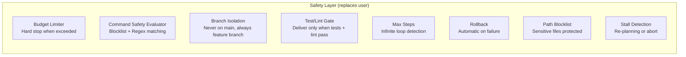
```mermaid
flowchart LR
    subgraph SAFETY["Safety Layer (replaces user)"]
        BL["Budget Limiter\nHard stop when exceeded"]
        CS["Command Safety Evaluator\nBlocklist + Regex matching"]
        BI["Branch Isolation\nNever on main, always feature branch"]
        TL["Test/Lint Gate\nDeliver only when tests + lint pass"]
        MS["Max Steps\nInfinite loop detection"]
        RB["Rollback\nAutomatic on failure"]
        PB["Path Blocklist\nSensitive files protected"]
        SD["Stall Detection\nRe-planning or abort"]
    end
```

> **Implementation status (2026-09-29):** Budget, max steps, timeout, stall detection, test/lint gate with rollback and path/command rules exist in the policy layer (rules fixed in S1, KI-4 to KI-10; gate, delivery and rollback checkpoints fixed in S3, KI-26 to KI-29, KI-77). The dedicated Command Safety Evaluator is planned.

#### Headless Mode (Level 5) -- Use Cases

```yaml
# Nightly code review (cron job)
# codeforge-schedules.yaml
schedules:
  - name: nightly-review
    cron: "0 2 * * *"                  # Every night at 2:00
    mode: reviewer
    autonomy: headless
    targets:
      - repo: "myorg/backend"
        branch: "develop"
    deliver: github-pr-comment         # Result as PR comment

  # Weekly dependency update
  - name: weekly-deps
    cron: "0 8 * * 1"                  # Mondays at 8:00
    mode: dependency-updater
    autonomy: headless
    targets:
      - repo: "myorg/backend"
      - repo: "myorg/frontend"
    deliver: pull-request               # Result as new PR
    safety:
      require_tests_pass: true
      max_file_changes: 5

  # Webhook-triggered: Lint fix on new PR
  - name: auto-lint-fix
    trigger: github-webhook             # On new PR
    event: pull_request.opened
    mode: lint-fixer
    autonomy: full-auto
    deliver: push-to-branch             # Push directly to the PR branch
    safety:
      max_file_changes: 20
      require_lint_pass: true
```

> **Implementation status (2026-09-29):** Target design; no schedules file is read yet. Scheduled reviews exist today as per-project review policies with `commit_count`, `pre_merge` or `cron` triggers (`internal/domain/review/`, `internal/service/review.go`).

#### API-Driven Autonomous Execution

For CI/CD and external systems.

```json
{
  "repo": "myorg/backend",
  "task": "Fix all lint errors in src/",
  "mode": "lint-fixer",
  "autonomy": "full-auto",
  "deliver": "pull-request",
  "safety": {
    "budget_hard_limit": 10.00,
    "require_lint_pass": true
  },
  "callback_url": "https://ci.example.com/webhook"
}
```

The endpoint is `POST /api/v1/tasks`. No UI interaction is needed. The result is retrieved via callback or polling. This approach is ideal for GitHub Actions, GitLab CI, Jenkins, etc.

> **Implementation status (2026-09-29):** Target design. Today: create a task with `POST /api/v1/projects/{id}/tasks` (`{title, prompt}`), start it with `POST /api/v1/runs` (`{task_id, agent_id, project_id, mode_id, policy_profile, exec_mode, deliver_mode}`) and poll `GET /api/v1/runs/{id}` or listen on the WebSocket. `callback_url`, per-request autonomy/safety and the combined endpoint are planned. The run path is still a single LLM completion; see [Known Issues](todo.md#known-issues) KI-21.

#### Prompt Templates

Go Core prompts live in an embedded YAML prompt library (`internal/service/prompts/`, Go template syntax, embedded via `//go:embed` and assembled by the `PromptAssembler`) plus a few `text/template` files in `internal/service/templates/`. Some worker-side prompts (stall escape, skill safety, meta router, review, evaluation) are still inline Python strings; the target is that no prompts live in code.

Prompts are adjustable without code changes. Contributors can improve prompts without knowing Go internals. Different prompt sets for different LLMs are possible. Templates are versionable and comparable (Git diff on prompt changes).

#### Keyword Extraction

For the Context Layer, keyword extraction from tasks and code improves retrieval quality in the GraphRAG layer. Task keyword extraction is a stop-word-filtered tokenizer in the Go Core (`extractKeywords` in `internal/service/context_scoring.go`) used for file scoring in the context optimizer; it runs locally without an external API. The workers add BM25 (`bm25s`) + embedding retrieval (`workers/codeforge/retrieval.py`), graph search (`workers/codeforge/graphrag.py`) and optional LLM-based reranking via LiteLLM (`workers/codeforge/context_reranker.py`).

#### Real-time State via WebSocket

Every state mutation of an agent is immediately emitted to the frontend via WebSocket. This includes agent status (active, waiting, finished), internal monologue (what the agent is "thinking"), current step in the workflow, token usage and costs in real time, and terminal/browser session data. The frontend can display live updates without polling.

> **Implementation status (2026-09-29):** WebSocket hub in `internal/adapter/ws/`, event types in `internal/domain/event/broadcast.go` and `agui.go`. Delivery is tenant-scoped since 2026-09-30 (KI-12): `BroadcastEvent` sends only to clients of the tenant in ctx and drops events without one; `BroadcastGlobal` is reserved for tenant-free data (model health). Every client has a bounded send queue (1024 messages) with its own writer and a 10 s write timeout, so a stalled client is dropped instead of blocking the hub. Connections authenticate with single-use tickets (`POST /api/v1/ws/ticket`, 30 s TTL, bound to user and tenant; `GET /ws?ticket=`); the JWT is no longer accepted in the URL. NATS requests carry `tenant_id`, the worker echoes it on results and streams, and Go subscribers scope their context with it (a stored run or conversation wins). Run, plan, agent and War Room panels update on their events (KI-39, 2026-09-30; `run.status` carries `agent_id`), channels on `channel.message` (KI-42). The runtime broadcasts `task.status` and `agent.status` when a run starts and ends (KI-74), and every Go publish carries the tenant as the `X-Tenant-ID` header (KI-64).

#### Agent Specialization: Modes System

Inspired by Roo Code's Modes and Cline's `.clinerules`, CodeForge defines specialized agent modes as YAML configurations instead of using a general-purpose agent. Each mode has its own tools, LLM settings, and autonomy level.

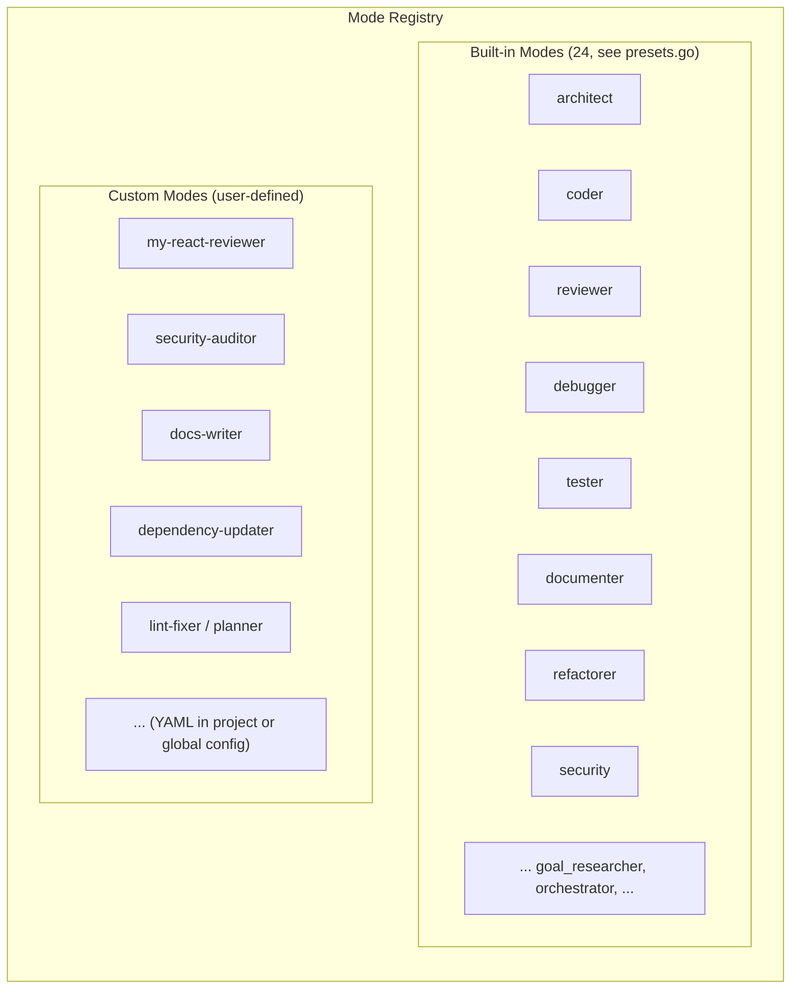
```mermaid
flowchart LR
    subgraph REG["Mode Registry"]
        subgraph BUILTIN["Built-in Modes (24, see presets.go)"]
            B1["architect"]
            B2["coder"]
            B3["reviewer"]
            B4["debugger"]
            B5["tester"]
            B6["documenter"]
            B7["refactorer"]
            B8["security"]
            B9["... goal_researcher, orchestrator, ..."]
        end
        subgraph CUSTOM["Custom Modes (user-defined)"]
            C1["my-react-reviewer"]
            C2["security-auditor"]
            C3["docs-writer"]
            C4["dependency-updater"]
            C6["lint-fixer / planner"]
            C5["... (YAML in project or global config)"]
        end
    end
```

#### Built-in Mode Definitions

> **Implementation status (2026-09-29):** The YAML below is the target design. Built-in modes are Go presets today (24 in `internal/domain/mode/presets.go`, see Directory Structure below) with the fields of `mode.Mode` (`internal/domain/mode/mode.go`): `id`, `name`, `description`, `tools`, `denied_tools`, `denied_actions`, `required_artifact`, `llm_scenario`, `autonomy` (integer 1-5), `prompt_prefix`, `output_schema`, `model_adaptations`. Tool names are canonical policy names (`Read`, `Write`, `Edit`, `Bash`, `Grep`, `Glob`, `ListDir`; ADR-015), not worker tool names; since KI-10 the Go policy enforces them on run and conversation paths (`DeniedTools` denies, a non-empty `Tools` list denies unlisted built-in tools) and the worker offers the LLM only the allowed tools. Per-mode `prompt_template`, `max_steps`, `deliver`, `schedule` and `safety` are planned; termination and delivery currently come from policy profiles and run requests. Actual values differ from the examples, e.g. architect: `tools: [Read, Glob, Grep]`, `denied_tools: [Write, Edit, Bash]`, `required_artifact: PLAN.md`, `llm_scenario: think`, `autonomy: 2`; reviewer: `llm_scenario: review`, `autonomy: 2`; coder and debugger: `llm_scenario: default`, `autonomy: 3`. `nightly-reviewer` is not a built-in.

```yaml
# modes/architect.yaml
name: architect
description: "Analyzes codebase structure, plans changes, creates design documents"
llm_scenario: think            # LiteLLM Tag -> strong reasoning model
autonomy: supervised           # Architecture decisions always with user
tools:
  - read_file
  - search_file
  - search_dir
  - list_files
  - plan                       # Create structured plan
  - web_search                 # Research documentation
# No write_file, no terminal -- Architect may only read and plan
prompt_template: architect.jinja2
max_steps: 30
```

```yaml
# modes/coder.yaml
name: coder
description: "Implements features, fixes bugs, writes code"
llm_scenario: ""               # No tag -> routes to all models
autonomy: auto-edit            # File changes auto, terminal needs approval
tools:
  - read_file
  - write_file
  - search_file
  - search_dir
  - list_files
  - terminal                   # Shell commands (with Safety Evaluator)
  - git_diff
  - git_commit
  - lint
  - test
prompt_template: coder.jinja2
max_steps: 50
```

```yaml
# modes/reviewer.yaml
name: reviewer
description: "Reviews code changes for quality, bugs, security"
llm_scenario: review           # LiteLLM Tag -> review-optimized model
autonomy: headless             # Can run completely autonomously (readonly)
tools:
  - read_file
  - search_file
  - search_dir
  - list_files
  - git_diff
  - lint
  - test
# No write_file -- Reviewer may not edit, only evaluate
prompt_template: reviewer.jinja2
max_steps: 30
deliver: comment               # Result as comment (PR, issue, web GUI)
```

```yaml
# modes/debugger.yaml
name: debugger
description: "Analyzes errors, reproduces bugs, finds root causes"
llm_scenario: think            # Complex reasoning for debugging
autonomy: semi-auto            # Terminal execution with approval
tools:
  - read_file
  - search_file
  - search_dir
  - list_files
  - terminal                   # For reproduction and tests
  - git_log
  - git_diff
  - test
  - lint
prompt_template: debugger.jinja2
max_steps: 40
```

```yaml
# modes/nightly-reviewer.yaml
name: nightly-reviewer
description: "Automatic nightly code review"
llm_scenario: review
autonomy: headless             # Completely autonomous, no UI
tools:
  - read_file
  - search_file
  - search_dir
  - list_files
  - git_diff
  - lint
  - test
prompt_template: reviewer.jinja2
schedule: "0 2 * * *"         # Every night at 2:00
deliver: github-pr-comment
safety:
  budget_hard_limit: 5.00
  max_steps: 30
```

#### Custom Modes (User-Defined)

Users can create their own modes as YAML files. The file is unmarshalled into `mode.Mode` and validated: `id` and `name` are required, and `autonomy` is an integer 1-5 (1 = supervised ... 5 = headless); invalid files are skipped with a log message.

```yaml
# .codeforge/modes/security_auditor.yaml
id: security_auditor
name: Security Auditor
description: "Reviews code for OWASP Top 10, injection, XSS, etc."
llm_scenario: think
autonomy: 5                    # headless
tools: [Read, Glob, Grep, Bash]  # Bash for security scanners (npm audit, bandit, etc.)
denied_tools: [Write, Edit]
denied_actions: [curl, wget]   # No network access
required_artifact: AUDIT_REPORT
# Planned (not read yet): prompt_template, safety (blocked_commands, max_steps),
# deliver: security-report (structured security report)
```

#### Mode Selection and Composition

Modes can be used individually or as a pipeline.

```yaml
# Single mode
task:
  mode: coder
  prompt: "Implement feature X"

# Pipeline: Architect plans, Coder implements, Reviewer reviews
task:
  pipeline:
    - mode: architect
      prompt: "Analyze the codebase and create a plan for feature X"
    - mode: coder
      prompt: "Implement the plan from the previous step"
    - mode: reviewer
      prompt: "Review the coder's changes"
    - mode: tester
      prompt: "Write tests for the new changes"

# DAG: Parallel execution + dependencies
task:
  dag:
    plan:
      mode: architect
    implement:
      mode: coder
      depends_on: [plan]
    test:
      mode: tester
      depends_on: [implement]
    review:
      mode: reviewer
      depends_on: [implement]     # Parallel to test
    deliver:
      mode: coder
      depends_on: [test, review]  # Only when both are done
```

> **Implementation status (2026-09-29):** The task-level `pipeline:`/`dag:` syntax above (per-step prompts, named `depends_on`) is planned. Implemented today are pipeline templates (`internal/domain/pipeline/`): `id`, `name`, `description`, `protocol` (`sequential`, `parallel`, `ping_pong`, `consensus`), `max_parallel` and `steps` with `name`, `mode_id`, `policy_profile`, `deliver_mode` and `depends_on` as step indices. Templates are built in (e.g. `standard-dev`: Plan (architect) -> Implement (coder) -> Review (reviewer) -> Test (tester)), loaded from `workspace.pipeline_dir`, or registered via `/api/v1/pipelines`, and instantiated with task/agent bindings (`POST /api/v1/pipelines/{id}/instantiate`).

#### Directory Structure

```text
# Built-in modes are Go struct presets (not standalone YAML files)
internal/domain/mode/presets.go    # Mode definitions (tools, autonomy, scenario)

# Mode-specific prompts are YAML files loaded by the PromptAssembler
internal/service/prompts/modes/
  architect.yaml
  coder.yaml
  reviewer.yaml
  tester.yaml
  debugger.yaml
  refactorer.yaml
  security.yaml
  documenter.yaml
  frontend.yaml
  ...                              # 24 built-in mode prompts

# Custom modes (user-defined). Today they are server-wide: loaded once at startup
# from ./.codeforge/modes/*.yaml in the Go Core working directory; modes created via
# POST /api/v1/modes are kept in memory only. Per-project loading is planned.
.codeforge/
  modes/
    security_auditor.yaml
    my_react_reviewer.yaml
  project.yaml                 # Project settings (autonomy, safety, etc.) (planned)
  schedules.yaml               # Cron jobs for autonomous tasks (planned)
```

#### Built-in Tool Modules

Tools for agents are Python modules in `workers/codeforge/tools/`. Each tool module exports a `DEFINITION` (`ToolDefinition` from `_base.py`: name, description, JSON Schema arguments, emitted in OpenAI function calling format) and an executor class implementing the `ToolExecutor` protocol (`execute()`); `tools/__init__.py` holds the `ToolRegistry`. Per-mode tool lists are defined inline in each Mode struct (`Mode.Tools` / `Mode.DeniedTools`) in `internal/domain/mode/presets.go`, not as separate YAML tool-bundle files; they use the canonical policy names (`Read`, `Grep`, `ListDir`, ...), which the Go policy maps the worker tool names (`read_file`, `search_files`, `list_directory`, ...) to (`internal/domain/policy/toolnames.go`, ADR-015). They are enforced by the Go policy on run and conversation paths, and the worker registers only the allowed tools (`ToolRegistry.restrict_to_mode`, KI-10, KI-69).

```text
workers/codeforge/tools/
  __init__.py            # ToolRegistry, build_default_registry()
  _base.py               # ToolDefinition, ToolResult, ToolExecutor protocol
  _error_handler.py      # Error handling utilities
  _lint.py               # Post-write syntax check for write_file/edit_file
  read_file.py           # Read file contents
  write_file.py          # Write file contents
  edit_file.py           # Edit file (search/replace)
  bash.py                # Execute shell commands
  search_files.py        # Search file contents (grep)
  glob_files.py          # Glob pattern file matching
  list_directory.py      # List directory contents
  handoff.py             # Agent-to-agent handoff (handoff_to)
  propose_goal.py        # Propose project goals
  propose_roadmap.py     # Propose roadmap items
  spawn_subagent.py      # Sub-agent request (not registered until Go starts sub-agents, KI-25)
  create_skill.py        # Create reusable skills
  search_skills.py       # Search skill registry
  search_conversations.py # Search conversation history
  tool_guide.py          # Tool usage hints for api_with_tools models
  text_protocol.py       # Text tool protocol: prompt section, grammar, parser, wire messages (ADR-021)
  text_protocol_stream.py # Live output of protocol replies
  tool_router.py         # Keyword-based tool pre-selection
  capability.py          # Model capability classification + per-level tool allowlists
```

MCP-discovered tools are merged at runtime into the same tools array. For LLMs without function calling the worker uses the text tool protocol ([ADR-021](architecture/adr/021-text-tool-protocol.md)): offered tools rendered into each request's system message, one JSON reply per turn (JSON-schema grammar where the server supports it) parsed into a normal tool call, results fed back as `<tool_result>` text; a server that refuses native tools switches a run to it.

> **Implementation status (2026-09-29):** For pure-completion models the tools are only described in the system prompt (tool guide) and the `tools` parameter is omitted (`workers/codeforge/agent_loop.py`); the text/JSON tool-call parser fallback is planned.

#### History Processors (Context Window Management)

Long agent sessions exceed the context window. History Processors optimize context as a configurable pipeline.

| Processor | Function |
|---|---|
| LastNObservations | Replace old tool outputs with summaries |
| ClosedWindowProcessor | Remove outdated file views, keep only the most recent |
| CacheControlProcessor | Set cache markers for prompt caching (Anthropic, etc.) |
| RemoveRegex | Remove specific patterns from the history |

Processors are applied as a pipeline one after another. They are configurable per agent type and LLM (small local models need more aggressive trimming).

> **Implementation status (2026-09-29):** Target design; the processor pipeline above is planned. Implemented today: head-and-tail trimming and tool-output truncation (`ConversationHistoryManager` in `workers/codeforge/history.py`), threshold-based summarization (`ConversationSummarizer`, `agent.summarize_threshold`) and on-demand compaction (`conversation.compact.request`).

#### Hook System (Observer Pattern)

Extension points at agent and environment lifecycle, without core modification.

```text
Agent Hooks:
  on_run_start       -> Start monitoring, logging
  on_step_done       -> Record step, update metrics
  on_model_query     -> Track costs, rate limiting
  on_run_end         -> Summary, cleanup

Environment Hooks:
  on_init            -> Prepare container
  on_copy_repo       -> Start repo indexing
  on_startup         -> Install tools
  on_close           -> Clean up container
```

Hooks enable monitoring, custom logging, metrics collection, and integration with external systems, all without modifying the core logic.

> **Implementation status (2026-09-29):** Target design; no hook registry exists yet. Lifecycle visibility comes from agent events (event store) and WebSocket broadcasts (`internal/domain/event/`).

#### Trajectory Recording and Replay

Every agent run is recorded as a trajectory. Each step includes Thought, Action, Observation, Timestamp, and Cost. Trajectories are stored as JSON for analysis and reproducibility. Replay mode deterministically repeats a trajectory for debugging. The Inspector provides a web-based viewer integrated in the GUI. Batch statistics track success rates, costs, and steps across many runs.

Trajectories enable debugging of failed agent runs, comparison of different LLMs/configs on the same tasks, and audit trail for code changes by agents.

#### Python Workers Directory Structure

```text
workers/
  codeforge/
    __init__.py          # Version reading
    agent_loop.py        # Core agentic loop (multi-turn tool-use)
    history.py           # Conversation history manager (head-and-tail)
    llm.py               # LiteLLM proxy client (httpx), scenario/routing resolution
    models.py            # Pydantic data models (NATS payloads)
    tool_executor.py     # Tool-call execution with policy requests
    loop_helpers.py      # Agent loop helpers
    stall_detection.py   # Stall detection + escape prompt
    quality_tracking.py  # Iteration quality tracking, rollout scoring
    nats_subjects.py     # NATS subject constants
    secrets.py           # Docker secret files with env fallback; locks the secrets directory after startup (KI-71)
    tool_process.py      # The only place that starts processes: per-tenant launcher (memfd spec, Landlock), isolation check, sharing pass, removal as the tool user, every helper bounded by a timeout (KI-71, KI-96)
    tool_exec.py         # Launch helper run as the tool UID: reads the spec fd, checks its credentials, applies Landlock, execs (KI-96)
    tool_walk.py         # Descriptor walker run as a tool UID: sharing pass and migration steps (KI-96)
    tool_identity.py     # Tenant tool identity per work item (context variable), accept checks, identity environment (KI-96)
    tool_state.py        # Worker state in <root>/.codeforge: UID bindings, stamps, locks, HOME base (KI-96)
    tool_migration.py    # Per-tenant migration of trees from before KI-96, rollback detection
    tool_reaper.py       # pidfd reaper of a tenant's leftover tool processes (KI-96)
    landlock.py          # Landlock rules, ABI detection, read-path validation (KI-96)
    posix_acl.py         # POSIX ACL xattr codec (vectors shared with internal/workspaceacl)
    host_check.py        # Preflight run by scripts/check-host.sh (KI-96)
    workspace_deletion.py # Project workspace deletion as the tenant's tool UID (workspace.delete.request, KI-96)
    notifications.py     # NotificationHub: shared notification consumers, read-back, never deletes (KI-71)
    subprocess_env.py    # Scrubbed environments for tool processes and MCP servers
    health.py            # HTTP health server: /health (liveness), /health/ready (readiness)
    _error_utils.py      # Error helpers
    config.py            # Worker configuration
    runtime.py           # Runtime API client (policy checks)
    executor.py          # Task executor
    plan_act.py          # Plan/Act mode switching
    qualitygate.py       # Quality gate runner (test/lint)
    graphrag.py          # GraphRAG: vector + graph retrieval
    repomap.py           # tree-sitter repo map (PageRank)
    retrieval.py         # BM25 + semantic hybrid retrieval
    context_reranker.py  # Context reranking
    mcp_workbench.py     # MCP multi-server workbench
    mcp_models.py        # MCP data models
    model_resolver.py    # Health-aware model resolution
    a2a_protocol.py      # A2A protocol types
    artifacts.py         # Artifact handling
    pricing.py           # Token pricing data
    metrics.py           # Metrics collection
    logger.py            # Structured logging (structlog + stdlib, Go slog schema)
    json_utils.py        # JSON utilities
    subprocess_utils.py  # Subprocess helpers
    constants.py         # Shared constants
    _validators.py       # Input validators
    _tree_sitter_common.py # tree-sitter shared utilities
    claude_code_executor.py  # Claude Code backend executor
    claude_code_availability.py # Claude Code detection
    consumer/            # NATS queue consumer (ingress)
    backends/            # Agent backends (Aider, OpenHands, SWE-agent, Goose, OpenCode, Plandex)
    routing/             # Hybrid routing (complexity.py, mab.py, meta_router.py, router.py)
    memory/              # Memory layer (scorer, experience pool, embeddings)
    orchestration/       # Placeholder package (empty); handoff lives in tools/handoff.py + consumer/_handoff.py, DAG plans run in the Go Core
    evaluation/          # Benchmark and evaluation
      evaluators/        #   Evaluator plugins (trajectory_verifier.py, etc.)
      runners/           #   Execution runners (multi_rollout.py, etc.)
      export/            #   Data exporters (trajectory_exporter.py, etc.)
      generators/        #   Code generators (swegen.py, etc.)
      providers/         #   External benchmark providers
    tools/               # Built-in tools (read_file, write_file, edit_file, bash, search_files, glob_files, list_directory, handoff_to, ...)
    skills/              # Skills system (registry, recommender, builtins)
    schemas/             # Structured output schemas (codegen, review, decompose)
    trust/               # Trust annotations (levels, middleware, scorer)
    tracing/             # OTEL tracing (setup, propagation, metrics)
  tool-requirements.txt  # pytest and ruff for the tool PATH's system interpreter in the worker image (hash-pinned to poetry.lock, KI-96)
```

### Framework Insights: Adopted Patterns

From the analysis of LangGraph, CrewAI, AutoGen, and MetaGPT, the following patterns were selected for CodeForge; each subsection states its implementation status. Detailed comparison: [docs/research/market-analysis.md](research/market-analysis.md).

#### Composite Memory Scoring (from CrewAI)

Simple semantic similarity is not enough for memory recall. CodeForge uses weighted scoring from three factors.

```text
Score = (semantic_weight * cosine_similarity)
      + (recency_weight  * recency_decay)
      + (importance_weight * importance_score)
```

| Factor | Default Weight | Calculation |
|---|---|---|
| Semantic | 0.5 | Cosine similarity of embeddings |
| Recency | 0.3 | Exponential decay (half-life configurable) |
| Importance | 0.2 | Supplied with the store request (default 0.5); LLM-based evaluation at storage time is planned |

Two recall modes are designed. **Shallow** recall uses direct vector search with composite scoring. Deep recall has an LLM distill sub-queries, search in parallel, and apply confidence-based routing.

> **Implementation status (2026-09-29):** Implemented: composite scoring (`workers/codeforge/memory/scorer.py`) and shallow recall (`consumer/_memory.py`). Deep recall is planned.

#### Context Window Strategies (from AutoGen)

In addition to the History Processors, different strategies for chat completion context management are supported.

| Strategy | Behavior |
|---|---|
| Unbounded | Keep all messages (only for short sessions) |
| Buffered | Keep last N messages |
| TokenLimited | Trim to token budget |
| HeadAndTail | Keep first N + last M messages (system prompt + current context) |

Strategies are configurable per agent type and LLM. Small local models get more aggressive trimming, large API models keep more context.

> **Implementation status (2026-09-29):** Implemented: HeadAndTail within a token budget plus summarization (`workers/codeforge/history.py`, `HistoryConfig`). Unbounded, Buffered and TokenLimited and per-agent/per-LLM selection are planned.

#### Experience Pool (from MetaGPT)

Successful agent runs are cached and reused for similar tasks.

```python
@exp_cache(context_builder=build_task_context)
async def solve_task(task: Task) -> Result:
    # If similar task was already solved successfully:
    # -> Return cached result
    # Otherwise: Execute normally and cache result
```

The cache key is based on task description + codebase context. Retrieval is similarity-based (not exact match). A configurable confidence threshold controls when cached results are used. This saves LLM costs and improves consistency.

> **Implementation status (2026-09-29):** Implemented in `workers/codeforge/memory/experience.py` (`@exp_cache`); no tenant isolation and `experience.enabled` is ignored, see [Known Issues](todo.md#known-issues) KI-16.

#### Tool Recommendation via BM25 (from MetaGPT)

Instead of passing all available tools to the LLM (token waste), relevant tools are automatically selected. BM25-based ranking scores tools against the current task context. Top-K tools are offered to the LLM as function calls. This reduces token usage and improves tool selection quality. All tools are used as a fallback when confidence score is low.

> **Implementation status (2026-09-29):** Tools are pre-selected by keyword matching against tool names/descriptions (`workers/codeforge/tools/tool_router.py`); base tools are always included. BM25 ranking is used for skill recommendation (`workers/codeforge/skills/recommender.py`); BM25-based tool ranking is planned.

#### Workbench -- Tool Container (from AutoGen)

Related tools share state and lifecycle.

```python
class GitWorkbench(Workbench):
    """Git tools with shared repository state."""

    def __init__(self, repo_path: str):
        self.repo = git.Repo(repo_path)

    def get_tools(self) -> list[Tool]:
        return [
            Tool("git_status", self._status),
            Tool("git_diff", self._diff),
            Tool("git_commit", self._commit),
            # Tools share self.repo
        ]
```

Workbenches provide shared state between related tools, lifecycle management (start/stop/restart), dynamic tool discovery (tools can change), and are ideal for MCP integration (McpWorkbench).

> **Implementation status (2026-09-29):** Implemented only as `McpWorkbench` (`workers/codeforge/mcp_workbench.py`); `GitWorkbench` and a generic `Workbench` base are planned.

#### LLM Guardrail Agent (from CrewAI)

A dedicated agent validates the output of another agent.

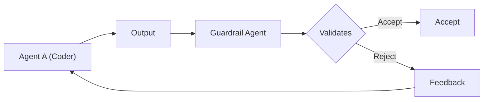
```mermaid
flowchart LR
    A["Agent A (Coder)"] --> OUT["Output"]
    OUT --> GA["Guardrail Agent"]
    GA --> VAL{"Validates"}
    VAL -- Accept --> DONE["Accept"]
    VAL -- Reject --> FB["Feedback"]
    FB --> A
```

This is integrated into the Quality Layer as a fourth strategy alongside Action Sampling, RetryAgent+Reviewer, and Multi-Agent Debate.

| Level | Effort | Mechanism |
|---|---|---|
| 1. Action Sampling | Light | N responses, select the best |
| 2. RetryAgent + Reviewer | Medium | Retry + score/chooser evaluation |
| 3. LLM Guardrail Agent | Medium | Dedicated agent checks output |
| 4. Multi-Agent Debate | Heavy | Pro/Con/Moderator |

> **Implementation status (2026-09-29):** Planned; of the four levels only Multi-Agent Debate is implemented (see Quality Layer above).

#### Structured Output / ActionNode (from MetaGPT)

LLM outputs are validated against a schema and automatically corrected if needed.

```python
class CodeReviewOutput(ActionNode):
    issues: list[Issue]       # Found problems
    severity: str             # critical / warning / info
    suggestion: str           # Improvement suggestion
    approved: bool            # Review passed?
```

Schema definition uses Pydantic models. The LLM fills fields via constrained generation. An automatic review/revise cycle triggers on schema violation. Retry with error feedback is sent to the LLM.

> **Implementation status (2026-09-29):** Planned. Pydantic output schemas (codegen, review, decompose, moderate) exist in `workers/codeforge/schemas/`.

#### Event Bus for Observability (from CrewAI)

All relevant events in the system are emitted via an event bus.

```text
Agent Events:          Task Events:           System Events:
  agent_started          task_assigned          budget_warning
  agent_step_done        task_completed         budget_exceeded
  agent_tool_called      task_failed            provider_error
  agent_tool_result      task_retrying          provider_fallback
  agent_thinking         task_guardrail_fail    queue_backpressure
  agent_finished         task_human_input       worker_started
  agent_error            task_delegated         worker_stopped
```

Events are streamed to the frontend via WebSocket. The dashboard can filter, aggregate, and visualize events. Monitoring/alerting based on events (e.g., budget_exceeded triggers notification) is supported. All events are persisted as an audit trail for traceability.

> **Implementation status (2026-09-29):** The event names above are illustrative. The implemented WebSocket event types are dotted names such as `run.status`, `agent.status` and `run.budget_alert` (`internal/domain/event/broadcast.go`, AG-UI events in `agui.go`); see Observability above and [Known Issues](todo.md#known-issues) KI-12 for broadcast gaps.

#### GraphFlow / DAG Orchestration (from AutoGen)

For complex multi-agent workflows with conditional paths.

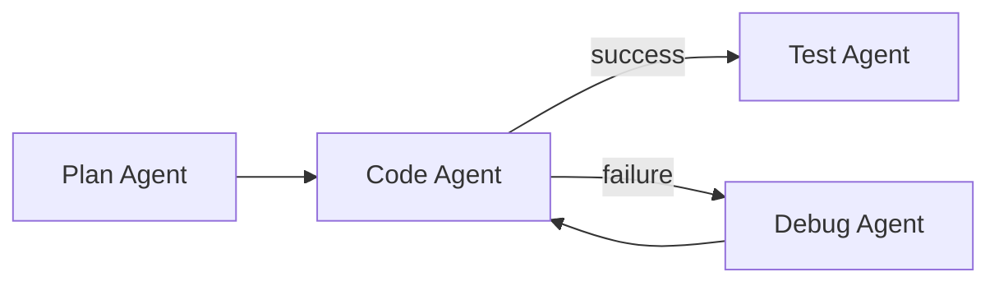
```mermaid
flowchart LR
    PLAN["Plan Agent"] --> CODE["Code Agent"]
    CODE -- success --> TEST["Test Agent"]
    CODE -- failure --> DEBUG["Debug Agent"]
    DEBUG --> CODE
```

This supports conditional edges based on agent output, parallel nodes (activation="any" for race, activation="all" for join), cycle support with exit conditions (max_iterations, success_condition), a DiGraphBuilder API for fluent graph construction, and visualization in the frontend as an interactive DAG editor.

> **Implementation status (2026-09-29):** Implemented: execution-plan DAGs with `depends_on` edges and the protocols `sequential`, `parallel`, `ping_pong` and `consensus` (`internal/domain/plan/`), visualized read-only in the frontend (`AgentFlowGraph.tsx`). Conditional edges, any/all activation, cycles with exit conditions, a builder API and an interactive DAG editor are planned.

#### Termination Conditions (from AutoGen)

Flexible, composable stop conditions for agent workflows.

```python
# Composable with & (AND) and | (OR)
stop = (MaxSteps(50)
        | BudgetExceeded(max_cost=5.0)
        | TextMention("TASK_COMPLETE")
        | Timeout(minutes=30))
        & NotCondition(StallDetected())
```

Available conditions include MaxSteps, MaxMessages, MaxTokens, BudgetExceeded (cost limit), TextMention (specific text in output), Timeout (wall-clock-based), StallDetected (no progress), FunctionCallResult (specific tool result), and Custom (arbitrary predicate function).

> **Implementation status (2026-09-29):** Implemented: per-policy `max_steps`, `timeout_seconds` and `max_cost` limits plus stall detection (`TerminationCondition` in `internal/domain/policy/`, `workers/codeforge/stall_detection.py`). Every stop goes through one completion path (`stopRun` -> `finalizeRun`): the run is marked stopping, the worker is told first, the stored outcome and the stop's own status are kept, plans advance, and HITL waiters are woken after the terminal state is committed. Run status writes follow a transition table (`run.CanTransition`) enforced in SQL; usage is counted only while a run runs and never lowered. Composable conditions (`&`, `|`) and MaxMessages, MaxTokens, TextMention, FunctionCallResult and Custom are planned.

#### Component System / Declarative Configuration (from AutoGen)

Agents, tools, and workflows are JSON/YAML serializable and reconstructable without code changes.

```json
{
  "provider": "codeforge.agents.CodeReviewAgent",
  "version": 1,
  "config": {
    "llm": "claude-sonnet-4-20250514",
    "tools": ["git_diff", "file_read", "lint"],
    "guardrail": "code_quality",
    "max_iterations": 10,
    "budget_limit": 2.0
  }
}
```

This is essential for the GUI workflow editor. Agents/workflows can be saved, shared, and versioned. Schema versioning with migration support enables import/export of agent configurations.

> **Implementation status (2026-09-29):** Planned.

#### Document Pipeline PRD->Design->Tasks->Code (from MetaGPT)

For complex features, structured intermediate artifacts replace direct code generation.

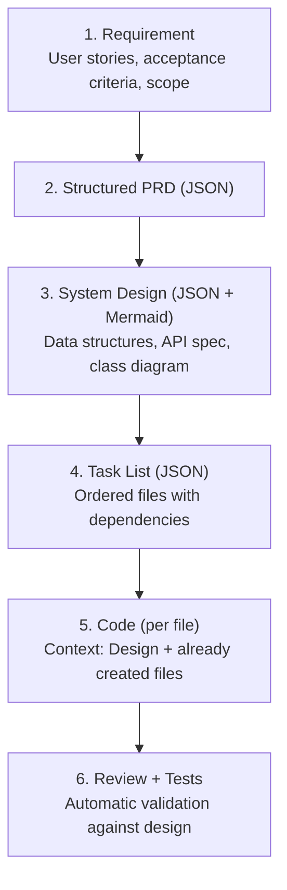
```mermaid
flowchart TD
    REQ["1. Requirement\nUser stories, acceptance criteria, scope"]
    PRD["2. Structured PRD (JSON)"]
    DESIGN["3. System Design (JSON + Mermaid)\nData structures, API spec, class diagram"]
    TASKS["4. Task List (JSON)\nOrdered files with dependencies"]
    CODE["5. Code (per file)\nContext: Design + already created files"]
    REVIEW["6. Review + Tests\nAutomatic validation against design"]

    REQ --> PRD --> DESIGN --> TASKS --> CODE --> REVIEW
```

Each intermediate document is schema-validated (ActionNode). Structured constraints reduce hallucination. Incremental development takes existing code into account. Intermediate documents are visible and editable in the GUI.

> **Implementation status (2026-09-29):** Planned. Related today: `MetaAgentService.DecomposeFeature` (`internal/service/meta_agent.go`) decomposes a feature into an execution plan.

#### MagenticOne Planning Loop (from AutoGen)

For complex, long-lived tasks, adaptive planning with stall detection applies.

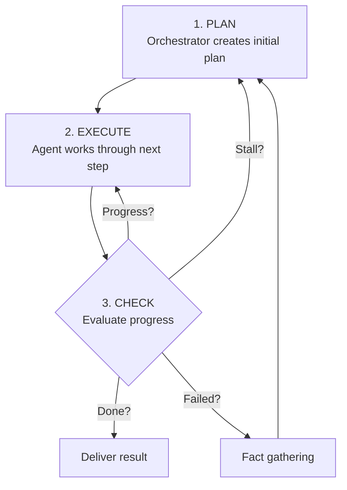
```mermaid
flowchart TD
    PLAN["1. PLAN\nOrchestrator creates initial plan"]
    EXEC["2. EXECUTE\nAgent works through next step"]
    CHECK{"3. CHECK\nEvaluate progress"}

    PLAN --> EXEC --> CHECK
    CHECK -- "Progress?" --> EXEC
    CHECK -- "Stall?" --> PLAN
    CHECK -- "Done?" --> DELIVER["Deliver result"]
    CHECK -- "Failed?" --> FACT["Fact gathering"] --> PLAN
```

Stall detection recognizes when agents are going in circles. Re-planning adjusts the plan based on previous results. Fact gathering collects missing information before a new plan. Progress tracking uses a ledger (progress protocol).

> **Implementation status (2026-09-29):** Stall detection is implemented (`workers/codeforge/stall_detection.py`, policy `stall_detection`). Since S6 (KI-62) the orchestrator re-plans a plan step whose run stalled (marker `stall detected:` in the run's error, shared with the worker): the step gets a new run up to `runtime.stall_max_retries` times (`replanStalledLocked`, `internal/service/orchestrator_consensus.go`); the stall is not yet added to the new run's prompt. Fact gathering and the progress ledger are planned.

#### HandoffMessage Pattern (from AutoGen)

Agents explicitly hand off tasks to specialists.

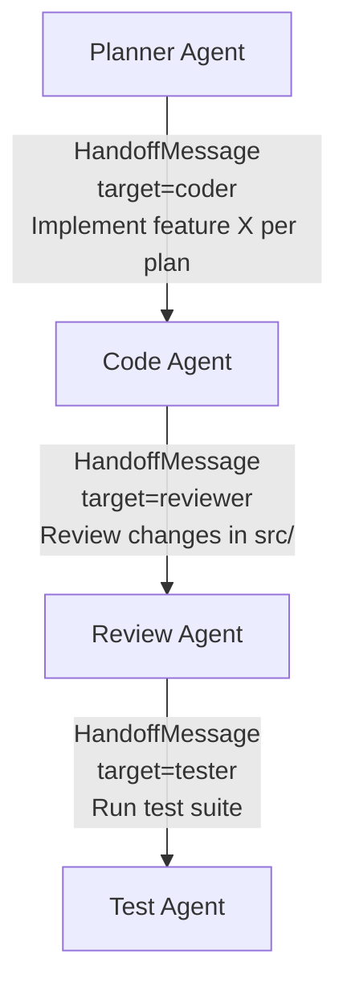
```mermaid
flowchart TD
    PLAN["Planner Agent"]
    CODE["Code Agent"]
    REV["Review Agent"]
    TEST["Test Agent"]

    PLAN -- "HandoffMessage\ntarget=coder\nImplement feature X per plan" --> CODE
    CODE -- "HandoffMessage\ntarget=reviewer\nReview changes in src/" --> REV
    REV -- "HandoffMessage\ntarget=tester\nRun test suite" --> TEST
```

Handoff is explicit with context (not blind forwarding). The agent decides itself who to hand off to. This fits CodeForge's agent specialization (Planner, Coder, Reviewer, etc.) and works with different agent backends (Aider->OpenHands->SWE-agent).

> **Implementation status (2026-10-01):** Implemented as the `handoff_to` tool (`workers/codeforge/tools/handoff.py`, `consumer/_handoff.py`) that publishes `handoff.request` (with a `handoff_id` and string metadata) to the Go Core. `HandoffService` (`internal/service/handoff.go`) carries the handoff out (KI-15): the source and target agent are checked in the request's tenant and project, the handoff is screened by the quarantine (a held one continues on `handoff.approved`, which only the Go Core publishes and consumes), the target agent's configured mode wins (an unknown requested mode is refused), the target gets a task and a run that the Go Core tracks like any other, an inbox message and a `handoff.status` event with `run_id`; its status is `initiated`, `quarantined`, `rejected`, `failed` or `a2a_delegated` (an `a2a://<id>` target). Each stage is claimed once in `handoff_claims` (a claim that was never done is taken over after an 11-minute lease, a retry reuses the stage's task, a permanent start error refuses at once); a transient failure is redelivered with a delay and dead-lettered after the last attempt (`handoff.request.dlq` / `handoff.approved.dlq` end the handoff as failed).

#### Human Feedback Provider Protocol (from CrewAI)

Extensible HITL channels via a provider interface.

```python
class HumanFeedbackProvider(Protocol):
    async def request_feedback(
        self, context: dict, options: list[str]
    ) -> FeedbackResult:
        ...
```

**Implementations** include WebGuiProvider (feedback via the SolidJS web GUI, default), SlackProvider (approval requests as Slack messages), EmailProvider (approval via email link), and CliProvider (terminal input for development/debugging).

> **Implementation status (2026-09-29):** Implemented as the Go port `internal/port/feedback` (`Provider.RequestFeedback`) with Slack and Email adapters (`internal/adapter/slack/feedback.go`, `internal/adapter/email/feedback.go`); web GUI approvals use the run approval endpoints. The Email provider (KI-57) mails a link to the web approval page `<notification.web_ui_url>/approvals/<run>/<call>` (the page reads `GET /api/v1/runs/{id}/approvals/{callId}` and decides with `POST /api/v1/feedback/{run_id}/{call_id}`, tenant-scoped, audit with tool and user); it is registered only when SMTP, recipients and the web UI URL are configured and mails only the requests of the tenants in `notification.approval_tenants` (default: the default tenant). The Slack provider (KI-84) posts the same fields, escaped for mrkdwn, with a link to the same page and no buttons; it is registered only when `slack_webhook_url` and `web_ui_url` are set and gets only the requests of `approval_tenants`. A CLI provider is planned.

### Coding Agent Insights: Adopted Patterns

From the deep analysis of Cline, Devika, OpenHands, SWE-agent, and Aider, the following patterns were selected for CodeForge; subsections state their implementation status where it differs from the design. Detailed analysis: [docs/research/market-analysis.md](research/market-analysis.md) and [docs/research/aider-deep-analysis.md](research/aider-deep-analysis.md).

#### Shadow Git Checkpoints (from Cline)

An isolated git repository provides safe rollback during agent execution. Before each agent action, a checkpoint is created in a shadow git repo. On failure or user rejection, instant rollback to last good state occurs. This is separate from the project's actual git history (no polluting commits). It complements the Sandbox mode's container isolation and is integrated into the Safety Layer as the Rollback component.

> **Implementation status (2026-09-30):** No separate shadow repository. Checkpoints are commits built from a private index and kept under `refs/codeforge/checkpoints/<run>` in the project's own repository, never on a branch (see Checkpoint System above); the ref is deleted when the run ends. `RewindToFirst` restores the pre-run state (tree, user's index, HEAD) when a check fails under `rollback_on_gate_fail`, and single tool calls can be reverted via the conversation API.

#### Event-Sourcing Architecture (from OpenHands)

All agent activities are recorded as an append-only event stream.

```mermaid
flowchart TD
    ES["EventStream\nAgent actions, observations, thoughts, tool results"]
    ES --> REPLAY["Replay: Reconstruct any point in time"]
    ES --> AUDIT["Audit: Complete traceability of all actions"]
    ES --> DEBUG["Debug: Step through failed runs"]
    ES --> PERSIST["Persist: Events stored for trajectory recording"]
```

The EventStream serves as the central abstraction for agent execution. All components communicate through events (not direct calls). This enables the Trajectory Recording system. The frontend receives events via WebSocket for live visualization.

#### Microagents (from OpenHands)

Small, trigger-driven agents defined in YAML+Markdown.

```markdown
<!-- .codeforge/microagents/fix-imports.md -->
name: fix-imports
type: knowledge
trigger: "import error"
---
When you see import errors in Python, check:
1. Is the package in pyproject.toml?
2. Is the import path correct?
3. Run: poetry install
```

The file uses `key: value` front matter (`name`, `type`, `trigger`, `description`) ended by `---`; the Markdown body is the prompt. Three types exist: knowledge (factual), repo (project-specific), and task (action). They are auto-injected into agent context when the trigger matches; today triggers are matched against the task prompt on the run path (`internal/service/runtime.go`), matching agent output is planned. Microagents provide a lightweight alternative to full agent modes for simple patterns. Global microagents are loaded once at startup from `.codeforge/microagents/*.md` in the Go Core's working directory; project microagents are managed via the `/api/v1/projects/{id}/microagents` API.

#### Diff-based File Review (from Cline)

Before applying changes, the user sees a side-by-side diff. The agent proposes changes as a unified diff. The frontend renders before/after with syntax highlighting. The user can accept, reject, or edit individual hunks.

This is integrated into the Plan -> Approve -> Execute workflow. At autonomy level 3+, diffs are auto-approved for file edits.

> **Implementation status (2026-09-29):** Implemented as whole-diff accept/reject (`frontend/src/features/project/DiffModal.tsx`); hunk-level accept/reject/edit is planned.

#### Stateless Agent Design (from Devika)

Agent processes are stateless with all state living in the Go Core. The agent receives full context (task, repo info, history) per invocation. No persistent agent processes exist between tasks. State transitions are tracked in the core service via database.

This enables horizontal scaling since any worker can pick up any task. Agent State Visualization in the frontend reads from core, not from agents.

#### ACI -- Agent-Computer Interface (from SWE-agent)

Shell commands are optimized for LLM agents (not for humans). `open <file> [line]` replaces complex `vim`/`cat` invocations. `edit <start>:<end> <content>` replaces sed/awk. `search_dir <pattern> [dir]` replaces `grep -r`. `find_file <name> [dir]` replaces `find`.

This reduces error rate by providing LLM-friendly abstractions. The commands are planned as YAML tool bundles (see Tool Definitions section).

> **Implementation status (2026-09-29):** Planned. Today the agent uses the built-in Python tools (`read_file`, `edit_file`, `search_files`, `glob_files`, `list_directory`, `bash`) in `workers/codeforge/tools/`.

#### tree-sitter Repo Map (from Aider)

A semantic code map is generated via tree-sitter parsing. It extracts class/function/method definitions from all files. Results are ranked by relevance to the current task (PageRank on call graph). This provides a codebase overview without sending all file contents.

It reduces token usage while maintaining context quality. The repo map is part of the Context Layer (GraphRAG) and complements vector search.

#### Architect/Editor Pattern (from Aider)

Separate LLM roles handle planning and implementation. The architect model (strong reasoning, e.g., Claude Opus) analyzes the codebase and creates a plan. The editor model (fast coding, e.g., Claude Sonnet) implements the plan. This maps directly to CodeForge's Modes System: `architect` -> `coder` pipeline.

Cost optimization uses the expensive model only for planning and the cheaper model for execution. The pattern is configurable via mode pipelines (today: pipeline templates such as the built-in `standard-dev`; task-level pipeline YAML is planned).

#### Edit Formats (from Aider)

Multiple output formats support different LLM capabilities.

| Format | When | How |
|---|---|---|
| whole-file | Small files, local models | LLM outputs complete file |
| diff | Standard edits, capable models | Unified diff format |
| search/replace | Precise edits | Search block -> Replace block |
| udiff | Complex multi-file edits | Universal diff with context |

Format selection is based on LLM capability level and file size. Automatic retry with simpler format occurs on parse failure. This is integrated into the Execution Layer's tool provisioning.

> **Implementation status (2026-09-29):** Planned. Today edits use search/replace via the `edit_file` tool (`workers/codeforge/tools/edit_file.py`).

#### Skills System (from OpenHands)

Reusable Python snippets are automatically injected into agent context. Pre-built skills cover common operations (file manipulation, git, testing). Skills are Python functions available in the agent's execution environment. They are automatically included in the prompt based on task context.

Users can extend them with custom skills in `.codeforge/skills/`. Skills complement YAML Tool Bundles (skills are code, bundles are declarations).

> **Implementation status (2026-09-29):** Implemented differently: skills are reusable Markdown workflows/patterns stored in the database (plus built-in YAML skills in `workers/codeforge/skills/builtins/`), selected by BM25 (`skills/recommender.py`) and injected into the prompt. Users add skills via the API, the `create_skill` agent tool (currently always fails, see [Known Issues](todo.md#known-issues) KI-58) or by importing Claude/Cursor/Markdown rule files (`skills/parsers.py`). Executable Python skills and a `.codeforge/skills/` directory are planned.

#### Risk Management (from OpenHands)

LLM-based security analysis evaluates agent actions. The InvariantAnalyzer validates agent actions against security policies. It checks for path traversal, command injection, and credential exposure. It runs as a pre-execution filter in the Safety Layer and complements the Command Safety Evaluator with LLM-based reasoning.

It can be disabled for trusted agents to reduce latency.

> **Implementation status (2026-09-29):** Planned. Today safety is rule-based: the policy layer plus the regex risk scorer of the message quarantine (see Security and Trust Infrastructure below).

### CSRF Protection

CodeForge does not use explicit CSRF tokens because:
1. **API-only backend** — no HTML forms, no cookie-based auth for mutations
2. **Bearer token authentication** — tokens are sent via Authorization header, not auto-attached by browsers
3. **Refresh tokens** use HttpOnly + SameSite=Lax cookies (immune to CSRF)
4. **CORS** restricts cross-origin requests to the configured origin

Reference: OWASP CSRF Prevention Cheat Sheet — token-based authentication (Bearer/JWT) is inherently CSRF-resistant when tokens are not auto-attached by the browser.

### Security and Trust Infrastructure (Phase 23)

#### Trust Annotations

Inter-agent messages carry trust annotations for provenance tracking. Four trust levels (`untrusted`, `partial`, `verified`, `full`) are auto-stamped by the Go Core on NATS payloads based on agent identity and authentication context.

- Go domain: `internal/domain/trust/` -- `trust.Level` enum, `trust.Annotation` struct
- Auto-stamping: NATS middleware applies trust level before dispatch (planned; see status)
- Python models: `workers/codeforge/trust/` -- mirror types for worker-side consumption; `trust/middleware.py` (`stamp_outgoing`) stamps the worker's outgoing payloads

> **Implementation status (2026-10-01):** The Go Core stamps the payloads it builds itself with `full` (`trust.Internal()` in `RuntimeService` for `runs.start` and in `HandoffService` for internal agents); an inbound A2A prompt carries the partial trust of an authenticated A2A key. Identity-based levels and a NATS-level stamping middleware are planned.

#### Message Quarantine System

Low-trust messages are intercepted before NATS dispatch, risk-scored, and held for admin review. This prevents untrusted or external agents from executing potentially harmful actions without oversight.

- Risk scorer: 13 scoring tests covering shell/SQL injection, path traversal, env-var access, base64 blobs, prompt override, role hijack and exfiltration patterns
- PostgreSQL storage: migration 049, `quarantine_messages` table
- `QuarantineService`: Evaluate/Approve/Reject/List/Get with 9 service tests
- Integration: Runtime gate (`runs.start`), the handoff gate in `HandoffService`, the inbound A2A executor, HTTP handlers (`/api/v1/quarantine`, admin only), WebSocket `quarantine.*` events

> **Implementation status (2026-10-01):** Quarantine is disabled by default (`quarantine.enabled`). Gates: `runs.start` (always `full` trust, which meets the default `min_trust_bypass: verified`, so it holds nothing in practice), handoffs (`HandoffService`) and inbound A2A prompts (KI-15). For an A2A prompt the task is created first and records the held message (`quarantine_message_id`): Approve replays the prompt only while the task is still `submitted` (otherwise the message is rejected and the call answers 409), Reject rejects the task, a cancel by the A2A caller withdraws the message, and a prompt whose task cannot record the screening is withdrawn. The reviewer is the logged-in user (`reviewed_by_user_id`, KI-79; erasure replaces the name with "Deleted user"). Messages carry `expires_at` but nothing sets the status `expired` yet (KI-91).

#### Persistent Agent Identity

Agents maintain persistent identity records with accumulated stats, a key-value state map, capabilities and an inbox (migration 050).

- Stats accumulation: total runs, total cost, success rate and last activity per agent across sessions (`IncrementAgentStats`)
- Active work visibility: list (`GET /projects/{id}/active-work`) and claim (`POST /tasks/{id}/claim`) endpoints; stale claims are released automatically by a background job; WebSocket events `activework.claimed` / `activework.released`
- War Room (`frontend/src/features/project/WarRoom.tsx`): live multi-agent collaboration view with swim lanes, handoff arrows, shared context panel (the arrows follow `handoff.status`; an `initiated` arrow is never removed, [Known Issues](todo.md#known-issues) KI-92)
- Planned: agent fingerprints and agent scan/discovery; tool-call and token stats per agent

### Benchmark and Evaluation System (Phase 26 + 28)

#### Benchmark Provider Interface (Phase 26)

The benchmark system uses a provider registry pattern (matching the hexagonal architecture). External code-gen providers (HumanEval, MBPP, BigCodeBench, SWE-bench, DPAI Arena, Terminal-Bench) register via the provider interface. Three runner types (Simple, ToolUse, Agent) support different evaluation modes.

- Evaluator plugins: LLMJudge, FunctionalTest, SPARC, FilesystemState (composable pipeline)
- Go API: multi-compare, cost analysis, leaderboard, WebSocket progress events
- Export pipelines: DPO training pairs, RLVR dataset (`GET /api/v1/benchmarks/runs/{id}/export/rlvr`); results with evaluation errors and no valid score are left out of both exports, a partial result uses its valid dimensions

#### Hybrid Verification and Test-Time Scaling (Phase 28)

Based on R2E-Gym (COLM 2025) and EntroPO (arXiv 2509.12434):

- **Hybrid Verification Pipeline** (`workers/codeforge/evaluation/hybrid_pipeline.py`): Two-stage filter-then-rank evaluation. Execution-based filtering first (binary pass/fail), then LLM ranking of survivors only. Eliminates wasted tokens on broken outputs.
- **Trajectory Verifier** (`workers/codeforge/evaluation/evaluators/trajectory_verifier.py`): 5-dimension LLM trajectory evaluation (solution_quality, approach_efficiency, code_quality, error_recovery, completeness). It calls the model through the worker's LiteLLM HTTP client (`VerifierClient`: the worker's client is used as is, otherwise one client is created and closed by `aclose()`) with the resolved model (KI-37). A verdict it cannot use is an evaluation error per dimension, never a 0.0 score: a failed or partial verifier answer sets `EvalDimension.error`, the `logprob_verifier` reads a leading yes/no and treats an empty answer as an error, and the pipeline records an evaluator that raised as `<name>_error`. Errors travel apart from scores (`evaluation_errors` on the benchmark result, migration 110); averages skip the `*_error` keys, and a rollout with an error in the filter or rank stage ranks below fully evaluated ones, also for early stopping.
- **Multi-Rollout Scaling** (`workers/codeforge/evaluation/runners/multi_rollout.py`): N sequential rollouts with early stopping and best-of-N selection (strategies: `best` via hybrid verification, `majority`, `longest`, `shortest`).
- **Diversity-Aware MAB** (`workers/codeforge/routing/mab.py`): Entropy-enhanced UCB1 (`entropy_ucb1 = avg_reward + c * sqrt(ln(N)/n_i) + lambda * (-log(p_i))`) prevents diversity collapse during test-time scaling. The entropy-UCB1 logic lives in the `MABModelSelector` class.
- **DPO Export** (`workers/codeforge/evaluation/export/trajectory_exporter.py`): Trajectory pairs (chosen/rejected) exported as JSONL for preference optimization training.
- **SWE-GEN** (`workers/codeforge/evaluation/generators/swegen.py`): Synthetic benchmark task generation from Git commit history.

### Roadmap/Feature-Map: Auto-Detection and Adaptive Integration

#### Core Principle

CodeForge automatically detects which spec-driven development tools, PM platforms, and roadmap artifacts are used in a project, and offers appropriate integration. No proprietary PM tool is built. Instead, bidirectional sync with existing tools is provided.

#### Provider Registry for Specs and PM

The same architecture as `gitprovider` applies. New adapters only require a new package and a blank import.

```text
port/
  specprovider/
    provider.go        # Interface: Detect(), ListSpecs(), ReadSpec(); optional ItemParser/ItemWriter
    registry.go        # Register(), New(), Available()
  pmprovider/
    provider.go        # Interface: ListItems(), GetItem(), CreateItem(), UpdateItem()
    registry.go        # Register(), New(), Available()

adapter/
  openspec/            # OpenSpec (openspec/ directory)
  speckit/             # GitHub Spec Kit (.specify/ directory)
  autospec/            # Autospec (specs/spec.yaml)
  markdownspec/        # Markdown specs (ROADMAP.md, TODO.md, ...), provider name "markdown"
  plane/               # Plane.so (REST API v1)
  openproject/         # OpenProject (REST API v3) (planned)
  githubpm/            # GitHub Issues/Projects (REST + GraphQL), provider name "github-issues"
  gitlab/              # GitLab Issues (PM provider)
  gitea/               # Gitea / Forgejo / Codeberg Issues (PM provider)
```

#### Three-Tier Auto-Detection

```mermaid
flowchart TD
    subgraph ENGINE["Auto-Detection Engine"]
        subgraph T1["Tier 1: Spec-Driven Detectors (repo files)"]
            OS["OpenSpec\nopenspec/"]
            SK["Spec Kit\n.specify/"]
            AS["Autospec\nspecs/*.y"]
            ADR["ADR/RFC\ndocs/adr/"]
        end
        subgraph T2["Tier 2: Platform Detectors (API-based)"]
            GH["GitHub\nIssues/PR"]
            GL["GitLab\nIssues/MR"]
            PL["Plane.so\nREST API"]
            OP["OpenProject\nREST API"]
        end
        subgraph T3["Tier 3: File-Based Detectors (simple markers)"]
            RM["ROADMAP.md"]
            TM["TASKS.md"]
            BL["backlog/"]
            CL["CHANGELOG"]
        end
    end

    T1 --> T2 --> T3
```

Each detector implements the `specprovider.Provider` or `pmprovider.Provider` interface and registers itself via `init()`. The detection engine iterates over all registered detectors and returns a list of detected tools.

> **Implementation status (2026-09-29):** `RoadmapService.AutoDetect` (`internal/service/roadmap_import.go`) asks the registered spec providers, falls back to file markers (`ROADMAP.md`, `TODO.md`, `CHANGELOG.md`, `openspec/`, `.specify/`, `specs/spec.yaml`) and a keyword scan, and detects PM platforms from the git remote host and project config (`internal/service/detection.go`); PM providers have no `Detect()`. ADR/RFC, `TASKS.md` and `backlog/` detectors and API-based platform detection are planned.

#### Spec Provider Interface

```go
type SpecProvider interface {
    // Detect checks if this spec format is present in the repo
    Detect(repoPath string) (bool, error)

    // ReadSpecs reads all specs from the repo
    ReadSpecs(repoPath string) ([]Spec, error)

    // WriteChange writes a change (delta format)
    WriteChange(repoPath string, change Change) error

    // Watch observes spec changes (for bidirectional sync)
    Watch(repoPath string, callback func(event SpecEvent)) error

    // Capabilities declares supported operations
    Capabilities() []Capability
}
```

> **Implementation status (2026-09-29):** The interface above is the target design. Implemented today (`internal/port/specprovider/provider.go`):
>
> ```go
> type Provider interface {
>     Name() string
>     Capabilities() Capabilities // struct {Read, Write, Sync bool}
>     Detect(ctx context.Context, workspacePath string) (bool, error)
>     ListSpecs(ctx context.Context, workspacePath string) ([]Spec, error)
>     ReadSpec(ctx context.Context, workspacePath, specPath string) ([]byte, error)
> }
> // Optional: ItemParser.ParseItems(...), ItemWriter.WriteItems(...)
> ```
>
> `WriteChange` (delta format) and `Watch` are planned.

#### PM Provider Interface

```go
type PMProvider interface {
    // Detect checks if this PM platform is configured for the project
    Detect(projectConfig ProjectConfig) (bool, error)

    // SyncItems synchronizes items bidirectionally
    SyncItems(ctx context.Context, direction SyncDirection) (SyncResult, error)

    // CreateItem creates a new item on the platform
    CreateItem(ctx context.Context, item Item) (string, error)

    // RegisterWebhook registers a webhook for real-time sync
    RegisterWebhook(ctx context.Context, callbackURL string) error

    // Capabilities declares supported operations
    Capabilities() []Capability
}
```

> **Implementation status (2026-09-29):** The interface above is the target design. Implemented today (`internal/port/pmprovider/provider.go`):
>
> ```go
> type Provider interface {
>     Name() string
>     Capabilities() Capabilities // struct {ListItems, GetItem, CreateItem, UpdateItem, Webhooks bool}
>     ListItems(ctx context.Context, projectRef string) ([]Item, error)
>     GetItem(ctx context.Context, projectRef, itemID string) (*Item, error)
>     CreateItem(ctx context.Context, projectRef string, item *Item) (*Item, error)
>     UpdateItem(ctx context.Context, projectRef string, item *Item) (*Item, error)
> }
> ```
>
> Sync is orchestrated by `internal/service/sync.go` (pull/push/bidirectional) and incoming webhooks by `internal/service/pm_webhook.go`; `Detect`, `SyncItems` and `RegisterWebhook` on the provider are planned.

#### Bidirectional Sync

```mermaid
flowchart TD
    CF["CodeForge Roadmap Model\nMilestone | Feature | Task"]
    PM["External PM\n(Plane/GitHub/OpenProject)\nInitiative | Epic/Issue | Work Item"]
    SPECS["Repo Specs\n(OpenSpec / Spec Kit / Autospec)"]

    CF <-- "Bidirectional Sync" --> PM
    CF <-- "Bidirectional Sync" --> SPECS
```

Import brings PM tool data into the CodeForge roadmap model (issues/epics become features/tasks). Export sends CodeForge data to the PM tool (new features are created as issues). **Bidirectional** sync means changes are synchronized in both directions. Conflict resolution is timestamp-based + user decision on conflicts. Sync triggers include webhook (real-time), poll (periodic), and manual. Webhook-triggered sync (KI-56, KI-85) is registered per project (`POST /api/v1/projects/{id}/webhooks`): the webhook's own ID and secret name its tenant and project (`X-Tenant-ID` is never read), the event must name the project's repository exactly (host and path; Plane `plane_project_id`), the provider name maps to the registered provider (`github` -> `github-issues`), the answer is 202 when the sync started, 400 when the provider cannot sync, 200 for an ignored or duplicate event and one uniform 401 for an unknown webhook or a wrong signature, and the outcome is a `pm.sync` event (`status`, `error`). The sync uses the integration's own API token; the operator's Plane token and the Core's gh login serve only the default tenant. The GitLab PM provider connects through `netutil.OutboundPolicy` (`pm.allowed_private_hosts`).

#### Roadmap Data Model

```go
// Internal roadmap model -- PM adapters map to this format
// (excerpt of internal/domain/roadmap/roadmap.go; timestamps omitted)
type Milestone struct {
    ID          string
    RoadmapID   string
    Title       string
    Description string
    Status      RoadmapStatus    // draft, active, complete, archived
    SortOrder   int
    DueDate     *time.Time
    Version     int              // Optimistic Locking (from OpenProject)
    Features    []Feature
}

type Feature struct {
    ID          string
    MilestoneID string
    RoadmapID   string
    Title       string
    Description string
    Status      FeatureStatus    // backlog, planned, in_progress, done, cancelled
    Labels      []string         // Label-triggered sync (from Plane)
    SpecRef     string           // Reference to spec file (openspec/specs/feature.md)
    ExternalIDs map[string]string // {"plane": "abc", "github": "123"}
    SortOrder   int
    Version     int
    // Planned: Priority, Tasks []Task
}
```

#### `/ai` Endpoint for LLM Consumption (from Ploi Roadmap)

```text
GET /api/v1/projects/{id}/roadmap/ai?format=json
GET /api/v1/projects/{id}/roadmap/ai?format=yaml
GET /api/v1/projects/{id}/roadmap/ai?format=markdown
```

This endpoint provides the roadmap in an LLM-optimized format. It returns a compact summary of all milestones, features, and tasks with status information and dependencies. AI agents use this to understand project context.

#### Directory Structure (Extension)

```text
internal/
  port/
    specprovider/          # Spec detection interface
      provider.go          # Provider Interface + Capabilities
      registry.go          # Register(), New(), Available()
    pmprovider/            # PM platform interface
      provider.go          # Provider Interface + Capabilities
      registry.go          # Register(), New(), Available()
  adapter/
    openspec/              # OpenSpec adapter (openspec/ directory)
    speckit/               # GitHub Spec Kit adapter (.specify/)
    autospec/              # Autospec adapter (specs/spec.yaml)
    markdownspec/          # ROADMAP.md / TODO.md adapter
    plane/                 # Plane.so REST API v1 adapter
    openproject/           # OpenProject REST API v3 adapter (planned)
    githubpm/              # GitHub Issues/Projects adapter
    gitlab/                # GitLab Issues adapter
    gitea/                 # Gitea / Forgejo / Codeberg adapter
  domain/
    roadmap/               # Roadmap domain (Roadmap, Milestone, Feature)
  service/
    roadmap_import.go      # Auto-Detection Engine (AutoDetect, spec import)
    detection.go           # PM platform detection (git remote host, project config)
    sync.go                # Bidirectional Sync Service
    pm_webhook.go          # PM webhook handling
```

### LLM Integration: LiteLLM Proxy as Sidecar

#### Architecture Decision

After analysis of LiteLLM, OpenRouter, Claude Code Router, and OpenCode CLI, the decision was made that CodeForge does not build its own LLM provider interface. LiteLLM Proxy runs as a Docker sidecar and provides a unified OpenAI-compatible API. Detailed analysis: [docs/research/market-analysis.md](research/market-analysis.md).

#### Integration Architecture

```mermaid
flowchart TD
    subgraph FE["TypeScript Frontend"]
        CD["Cost Dashboard"]
        PCI["Provider Config UI"]
    end

    subgraph GO["Go Core Service"]
        LCM["LiteLLM Config Mgr"]
        UKM["User-Key Mapping"]
        LMD["Local Model Discovery"]
        CTE["Copilot Token Exch."]
    end

    subgraph PYW["Python Worker"]
        SR["Scenario Router + HybridRouter"]
    end

    subgraph LITE["LiteLLM Proxy (Sidecar)"]
        ROUTER["Router (6 Strat.)"]
        BUDGET["Budget Manager"]
        CACHE["Caching (optional, not configured)"]
        CB["Callbacks (optional, not configured)"]
    end

    PROVIDERS["OpenAI | Anthropic | Ollama | Bedrock | OpenRouter"]

    FE -- "REST / WebSocket" --> GO
    GO -- "NATS JetStream" --> PYW
    GO -- "OpenAI-compatible + admin API (Port 4000)" --> LITE
    PYW -- "OpenAI-compatible API (Port 4000)" --> LITE
    LITE -- "Provider APIs" --> PROVIDERS
```

#### What LiteLLM Provides (not built by us)

| Feature | LiteLLM Mechanism |
|---|---|
| Provider abstraction | 127+ providers, unified API |
| Routing | 6 strategies: latency, cost, usage, least-busy, shuffle, tag-based |
| Fallbacks | Fallback chains with cooldown (60s default) |
| Cost tracking | Per call, per model, per key via pricing DB (36,000+ entries) |
| Budgets | Per key, per team, per user, per provider limits |
| Streaming | `CustomStreamWrapper` normalizes all providers to OpenAI SSE |
| Tool calling | Unified via `tools` parameter, provider conversion automatic |
| Structured output | `response_format` cross-provider (native or via tool-call fallback) |
| Caching | In-memory, Redis, semantic (Qdrant), S3, GCS |
| Observability | 42+ integrations (Prometheus, Langfuse, Datadog, etc.) |
| Rate limiting | Per-key TPM/RPM, per-team, per-model |

#### What CodeForge Builds (Custom Development)

| Component | Layer | Description |
|---|---|---|
| LiteLLM Config Manager | Go Core | Generates `litellm/config.yaml` from CodeForge DB. CRUD for models, deployments, keys. **Today:** lists, adds and deletes models at runtime through the LiteLLM admin API (`/model/info`, `/model/new`, `/model/delete`); `litellm/config.yaml` is a static wildcard config; config generation and key/deployment CRUD are planned. |
| User-Key Mapping | Go Core | CodeForge user -> LiteLLM Virtual Keys. API keys stored securely in CodeForge DB, forwarded to LiteLLM. **Today:** per-user provider keys are stored encrypted (`user_llm_keys`, `/api/v1/llm-keys`) and sent to LiteLLM as a per-request `api_key` for that user's conversations; virtual keys are planned. |
| Scenario Router | Python Worker (scenario from the mode in Go Core) | Task type -> LiteLLM tag via `SCENARIO_DEFAULTS` in `workers/codeforge/llm.py`; sent as top-level `tags: ["think"]` in the request when the HybridRouter does not pick a model -> LiteLLM routes to matching deployment. |
| Cost Dashboard | Frontend | Aggregates CodeForge's own run/tool-call cost records via `/api/v1/costs` and `/api/v1/projects/{id}/costs[/by-model\|/by-tool\|/daily\|/runs]`; visualization per project, model, tool and day. Querying the LiteLLM Spend API (`/spend/logs`, `/global/spend/per_team`) and per-user/agent views are planned. |
| Local Model Discovery | Go Core | Queries LiteLLM (`/model/info`, `/v1/models`) and Ollama (`/api/tags`, when `OLLAMA_BASE_URL` is set) and caches the result with health status in the ModelRegistry (`/api/v1/llm/discover`, `/api/v1/llm/available`). Local models are routed through the `ollama/*` (Ollama's OpenAI-compatible `/v1` endpoint, from `OLLAMA_BASE_URL`) and `lm_studio/*` wildcards in `litellm/config.yaml`; cloud routes of providers without a key (`litellm.keyed_providers`) are listed as one entry each, a keyed provider's models in full; direct LM Studio discovery and automatic addition to the LiteLLM config are planned. |
| Copilot Token Exchange | Go Core | Read GitHub OAuth token from `~/.config/github-copilot/hosts.json`, exchange for bearer token via `api.github.com/copilot_internal/v2/token`. |

#### Hybrid Intelligent Model Routing (Phase 29)

CodeForge uses a three-layer routing cascade to automatically select the best model for each task. This replaces manual tag-based routing with adaptive, data-driven model selection.

```mermaid
flowchart TD
    PROMPT["User prompt"]
    L1["Layer 1: ComplexityAnalyzer\n(rule-based, < 1ms)\nPromptAnalysis: complexity_tier, task_type, confidence"]
    L2["Layer 2: MABModelSelector\n(UCB1 learning)\nmodel name or None (cold start)"]
    L3["Layer 3: LLMMetaRouter\n(small cheap model, cold-start fallback)\nmodel name or None"]
    FB["Fallback: Static tier-to-model mapping\n(COMPLEXITY_DEFAULTS)"]
    OUT["Selected model name --> LiteLLM\n(provider wildcard routing)"]

    PROMPT --> L1 --> L2 --> L3 --> FB --> OUT
```

**Layer 1 -- ComplexityAnalyzer** (`workers/codeforge/routing/complexity.py`) scores prompts across 7 dimensions (code presence, reasoning markers, technical terms, prompt length, multi-step, context requirements, output complexity). Weighted combination maps to four tiers: SIMPLE (<0.25), MEDIUM (<0.50), COMPLEX (<0.75), REASONING (>=0.75). Also infers task type (CODE, REVIEW, PLAN, QA, CHAT, DEBUG, REFACTOR). Runs in <1ms with zero API calls.

**Layer 2 -- MABModelSelector** (`workers/codeforge/routing/mab.py`) implements UCB1 (Upper Confidence Bound) to balance exploration vs exploitation. Each model accumulates reward signals from benchmark runs and conversation outcomes. UCB1 score: `avg_reward + c * sqrt(ln(N) / n_i)`. Returns None when all candidates have fewer than `mab_min_trials` observations (cold start). Respects cost constraints and model availability.

**Layer 3 -- LLMMetaRouter** (`workers/codeforge/routing/meta_router.py`) uses a configurable classifier model (`CODEFORGE_ROUTING_META_MODEL` / `routing.meta_router_model`; default empty = the auto-resolved best available model) to classify the prompt and recommend a model. Only runs when Layer 2 returns None. Falls back to tier-based mapping (economy/standard/premium/reasoning) if the LLM response is malformed.

**Fallback** selects from static tier-to-model preference lists per complexity tier.

**Reward computation** (`workers/codeforge/routing/reward.py`): `reward = quality_weight * quality - cost_weight * norm_cost - latency_weight * norm_latency`. Failure = -0.5. Rewards are recorded via `POST /api/v1/routing/outcomes` for MAB learning.

**Configuration:**

`CODEFORGE_ROUTING_ENABLED` (default `true`) is read by both the Go Core and the Python worker. All other routing fields are Python-side (`RoutingConfig` in `workers/codeforge/routing/models.py`), loaded by `load_routing_config()` in `workers/codeforge/llm.py` from the `routing:` YAML section or `CODEFORGE_ROUTING_*` env vars (further fields such as cascade, cost-penalty and diversity settings are omitted below).

| Field | Env var | Default | Layer | Purpose |
|---|---|---|---|---|
| `enabled` | `CODEFORGE_ROUTING_ENABLED` | true | Go + Python | Master switch for intelligent routing |
| `mab_enabled` | `CODEFORGE_ROUTING_MAB_ENABLED` | true | Python (`RoutingConfig`) | Enable Layer 2 (UCB1) |
| `llm_meta_enabled` | `CODEFORGE_ROUTING_LLM_META_ENABLED` | true | Python (`RoutingConfig`) | Enable Layer 3 (LLM classifier) |
| `mab_min_trials` | `CODEFORGE_ROUTING_MAB_MIN_TRIALS` | 10 | Python (`RoutingConfig`) | Minimum observations before MAB trusts data |
| `mab_exploration_rate` | `CODEFORGE_ROUTING_MAB_EXPLORATION_RATE` | 1.414 | Python (`RoutingConfig`) | UCB1 exploration parameter |
| `cost_weight` | `CODEFORGE_ROUTING_COST_WEIGHT` | 0.3 | Python (`RoutingConfig`) | Cost weight in reward function |
| `quality_weight` | `CODEFORGE_ROUTING_QUALITY_WEIGHT` | 0.5 | Python (`RoutingConfig`) | Quality weight in reward function |
| `latency_weight` | `CODEFORGE_ROUTING_LATENCY_WEIGHT` | 0.2 | Python (`RoutingConfig`) | Latency weight in reward function |
| `meta_router_model` | `CODEFORGE_ROUTING_META_MODEL` | (empty -> auto-resolved model) | Python (`RoutingConfig`) | Model for Layer 3 |

When routing is disabled, the system falls back to scenario-based tag routing (legacy).

#### Scenario-Based Routing (Legacy Fallback)

When `CODEFORGE_ROUTING_ENABLED=false`, task types are routed to models via LiteLLM's tag-based routing. This is the legacy approach, preserved as a fallback.

| Scenario | When | Typical Models |
|---|---|---|
| *(none)* | General coding tasks (no tag sent) | All models eligible |
| `background` | Batch, index, embedding | GPT-4o-mini, DeepSeek, local |
| `think` | Architecture, debugging, complex logic | Claude Opus, o3 |
| `longContext` | Input > 60K tokens | Gemini Pro (1M context) |
| `review` | Code review, quality check | Claude Sonnet |
| `plan` | Feature planning, design documents | Claude Opus |

#### LiteLLM Wildcard Configuration

LiteLLM config uses provider-level wildcards. The HybridRouter selects the exact model name (e.g., `openai/gpt-4o`), and LiteLLM routes it directly via the matching wildcard entry.

```yaml
# litellm/config.yaml (excerpt; also has lm_studio/*, openai/container, mistral/*,
# cerebras/*, chutes/*, aihubmix/* entries and scenario tags on most entries)
model_list:
  - model_name: "ollama/*"
    litellm_params:
      model: "ollama/*"
      api_base: "http://host.docker.internal:11434"   # hardcoded, OLLAMA_BASE_URL is ignored (KI-51)
      timeout: 600
      tags: ["background"]
  - model_name: "openai/*"
    litellm_params:
      model: "openai/*"
      api_key: "os.environ/OPENAI_API_KEY"
  - model_name: "anthropic/*"
    litellm_params:
      model: "anthropic/*"
      api_key: "os.environ/ANTHROPIC_API_KEY"
  - model_name: "gemini/*"
    litellm_params:
      model: "gemini/*"
      api_key: "os.environ/GEMINI_API_KEY"
  - model_name: "groq/*"
    litellm_params:
      model: "groq/*"
      api_key: "os.environ/GROQ_API_KEY"
      tags: ["default", "background", "think", "longContext", "review", "plan"]
  - model_name: "openrouter/*"
    litellm_params:
      model: "openrouter/*"
      api_key: "os.environ/OPENROUTER_API_KEY"
      tags: ["default", "background", "think", "longContext", "review", "plan"]
```

#### LiteLLM Proxy Configuration

```yaml
# docker-compose.yml (excerpt)
services:
  litellm:
    image: docker.litellm.ai/berriai/litellm:main-stable
    ports:
      - "4000:4000"
    volumes:
      - ${HOST_PROJECT_PATH:-.}/litellm:/app/data
    command: ["--config", "/app/data/config.yaml", "--port", "4000"]
    environment:
      LITELLM_MASTER_KEY: ${LITELLM_MASTER_KEY:-sk-codeforge-dev}
      DATABASE_URL: postgresql://codeforge:${POSTGRES_PASSWORD:-codeforge_dev}@postgres:5432/codeforge
      # ... provider API keys, LM_STUDIO_API_BASE, OTEL_EXPORTER_* (see docker-compose.yml)
    depends_on:
      postgres:
        condition: service_healthy
    healthcheck:
      test: ["CMD", "python3", "-c", "import urllib.request; urllib.request.urlopen('http://localhost:4000/health/liveliness')"]
```

### Goal Discovery: Project-Aware Context for Agents

Auto-detection of project goals from workspace files, injected into agent system prompts for project-aware context.

#### Detection Architecture

```mermaid
flowchart TD
    WS["Workspace Directory"]
    T1["Tier 1: GSD .planning/\nPROJECT.md, REQUIREMENTS.md, STATE.md, NN-CONTEXT.md"]
    T2["Tier 2: Agent Instructions\nCLAUDE.md, .cursorrules, .clinerules"]
    T3["Tier 3: Project Docs\nREADME.md, CONTRIBUTING.md, docs/architecture.md, docs/requirements.md"]
    DETECT["detectGoalFiles()\n[]ProjectGoal (kind, title, content, source, priority)"]
    DB["DetectAndImport()\nDB (idempotent: delete-by-source + recreate)"]
    CTX["AsContextEntries()\nContextPack (EntryGoal, priority-weighted)"]
    SYS["renderGoalContext()\nSystem Prompt (GoalContext template variable)"]

    WS --> T1
    WS --> T2
    WS --> T3
    T1 --> DETECT
    T2 --> DETECT
    T3 --> DETECT
    DETECT --> DB
    DETECT --> CTX
    DETECT --> SYS
```

Five goal kinds: `vision`, `requirement`, `constraint`, `state`, `context`. Safety: files >50KB skipped, binary detection (null bytes), UTF-8-safe truncation at 2000 bytes for README first-section extraction.

#### Frontend Directory Structure (SolidJS)

```text
frontend/
  src/
    features/            # Feature modules (dashboard, project, llm, costs, benchmarks, ...)
    features/dev/        # Dev-mode pages (DesignSystemPage)
    features/onboarding/ # Onboarding wizard (3-step first-time user flow)
    components/          # Shared app components and providers (WebSocket, auth, theme, toast)
    hooks/               # Shared hooks
    lib/, utils/         # Helpers
    i18n/                # Translations
    config/, shortcuts/  # Shared constants, keyboard shortcuts
    ui/                  # Design system (tokens, primitives, composites, layout)
    ui/icons/            # Brand icons (CodeForgeLogo, EmptyStateIcons)
    ui/layout/           # Layout components (PageTransition, Sidebar, etc.)
    api/                 # API client, WebSocket handler
  public/
    favicon.svg          # Anvil brand favicon
    fonts/               # Self-hosted woff2 (Outfit, Source Sans 3)
```

#### Typography System

Two typefaces, self-hosted as woff2 in `frontend/public/fonts/` (no external CDN, no new npm dependencies):

- **Outfit** -- display headings (h1-h3, hero text, brand elements)
- **Source Sans 3** -- body text, UI labels, descriptions (variable font, weights 200-900)

Font files are loaded via `@font-face` declarations in the global CSS. Outfit has 3 weight files (400/500/700), Source Sans 3 is a variable font (2 files: latin + latin-ext).

#### Design System Page

A living style guide available at `/design-system` in development mode only (`APP_ENV=development`). Renders all design tokens, typography scale, color palette, component variants, and micro-interaction examples. Token documentation lives in `frontend/src/ui/DESIGN-SYSTEM.md`.

#### Onboarding Wizard

A 3-step wizard shown on first login when the user has 0 projects. Steps: Connect Code (repository setup), Configure AI (LLM provider), Create Project. Completion state is stored in `localStorage` under the key `codeforge-onboarding-completed`. The wizard is implemented in `frontend/src/features/onboarding/OnboardingWizard.tsx` with individual step components.

#### Page Transitions

The `PageTransition` component (`frontend/src/ui/layout/PageTransition.tsx`) wraps page content with a CSS fade-in animation for smooth route transitions. Applied to all pages rendered with `PageLayout` (most top-level pages); the project detail, channel, auth and 404 pages do not use it.
