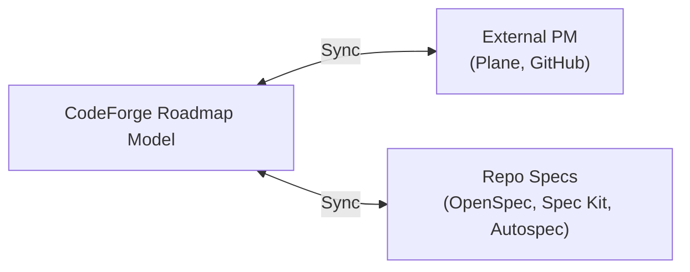

# Feature: Roadmap/Feature-Map (Pillar 2)

> Status: Complete (Phase 8A + 9A + 9D) -- domain, store, service, REST API, 4 spec providers, 5 PM providers, auto-detection, Feature-Map visual editor
> Priority: Phase 8 (Foundation) then Phase 9+ (Advanced integrations)
> Architecture reference: [architecture.md](../architecture.md) -- "Roadmap/Feature-Map: Auto-Detection & Adaptive Integration"

### Purpose

Visual management of project roadmaps and feature maps. Compatible with OpenSpec and other spec-driven development tools. Supports **bidirectional** sync with external PM platforms. CodeForge does not build a proprietary PM tool but integrates with existing ones.

### Core Principle

CodeForge automatically detects which spec tools, PM platforms, and roadmap artifacts a project uses, then offers appropriate integration.

### Three-Tier Auto-Detection

- Spec-Driven Detectors (repo files): OpenSpec (`openspec/`), Spec Kit (`.specify/`), Autospec (`specs/spec.yaml`), ADR/RFC.
- Platform Detectors (API-based): GitHub Issues, GitLab Issues, Plane.so. <!-- OpenProject: NOT IMPLEMENTED as of 2026-03-22 -->
- **File-Based Detectors** (simple markers): ROADMAP.md, TASKS.md, backlog/, CHANGELOG.md.

Each detector implements `specprovider.SpecProvider` or `pmprovider.PMProvider` and self-registers via `init()`. This follows the same pattern as git providers.

### Supported Integrations

#### Spec Providers

| Provider | Adapter | Detection |
|---|---|---|
| OpenSpec | `adapter/openspec/` | `openspec/` directory |
| GitHub Spec Kit | `adapter/speckit/` | `.specify/` directory |
| Autospec | `adapter/autospec/` | `specs/spec.yaml` file |

#### PM Providers

| Provider | Adapter | Sync Method |
|---|---|---|
| Plane.so | `adapter/plane/` | REST API v1, Webhooks, HMAC-SHA256 |
| GitHub Issues/Projects | `adapter/githubpm/` | `gh` CLI integration, issue CRUD |
| Forgejo/Codeberg Issues | `adapter/githubpm/` (compatible) | REST API (GitHub-compatible) |

### Bidirectional Sync



- Import: PM tool items become CodeForge features/tasks.
- Export: New features created as PM issues.
- **Conflict resolution** uses timestamp-based comparison plus user decision.
- Sync triggers: Webhook (real-time), poll (periodic), manual.

### Internal Data Model

- `Milestone` contains Features, which contain Tasks.
- `Feature` has Labels (for sync), SpecRef (link to spec file), ExternalIDs (PM mappings).
- Optimistic Locking (from OpenProject pattern) prevents concurrent edit conflicts.

### `/ai` Endpoint

LLM-optimized roadmap format for AI agents:

```text
GET /api/v1/projects/{id}/roadmap/ai?format=json|yaml|markdown
```

### Adopted Patterns

- Plane: Cursor Pagination, HMAC-SHA256 webhook verification, Label-triggered Sync.
- OpenProject: Optimistic Locking, Schema Endpoints.
- **OpenSpec**: Delta Spec Format (incremental changes).
- Ploi Roadmap: `/ai` endpoint for LLM consumption.

### Phase 8A: Foundation (Completed)

- [x] Domain models: `internal/domain/roadmap/` (Roadmap, Milestone, Feature, statuses, validation, optimistic locking).
- [x] Migration 017: `roadmaps`, `milestones`, `features` tables with indexes, triggers.
- [x] Port interfaces: `specprovider.SpecProvider` + `pmprovider.PMProvider` (interface + registry).
- [x] Store: 16 methods on `database.Store` + Postgres adapter.
- [x] RoadmapService: CRUD, AutoDetect (file markers), AIView (json/yaml/markdown).
- [x] REST API: 12 endpoints (roadmap CRUD, milestones, features, AI view, detect).
- [x] WS event: `roadmap.status` broadcast on mutations.
- [x] Frontend: RoadmapPanel.tsx (milestone/feature tree, forms, auto-detect, AI view).
- [x] `/ai` endpoint for LLM consumption (json/yaml/markdown formats).

### Phase 9A: Spec Provider Adapters + Enhanced AutoDetect + Spec Import (Completed)

- [x] OpenSpec adapter (`internal/adapter/openspec/`) -- detect `openspec/` dir, list `.yaml`/`.yml`/`.json` specs, read with path traversal protection, YAML title extraction.
- [x] Markdown spec adapter (`internal/adapter/markdownspec/`) -- detect `ROADMAP.md`/`roadmap.md`, list, read.
- [x] GitHub Issues PM adapter (`internal/adapter/githubpm/`) -- `gh` CLI integration, list/get issues, swappable execCommand for testing.
- [x] Enhanced AutoDetect -- two-phase: providers first, hardcoded `fileMarkers` fallback for uncovered formats, format alias dedup.
- [x] ImportSpecs service method -- discover specs via providers, auto-create roadmap, milestone per format, features per spec.
- [x] ImportPMItems service method -- find PM provider by name, list items, create milestone + features.
- [x] 4 new REST endpoints: `POST /projects/{id}/roadmap/import`, `POST /projects/{id}/roadmap/import/pm`, `GET /providers/spec`, `GET /providers/pm`.
- [x] Provider wiring via blank imports + main.go instantiation from registries.
- [x] Frontend: Import Specs button, Import from PM form (provider dropdown + project ref), import result display.
- [x] 24 new adapter tests (8 openspec, 7 markdownspec, 9 githubpm), all passing.

### Phase 9D: Plane.so Adapter + Full Auto-Detection + Feature-Map Editor (Completed)

- [x] Plane.so PM Adapter (`internal/adapter/plane/`) -- REST API v1 with `X-API-Key` auth, full CRUD (ListItems, GetItem, CreateItem, UpdateItem), cursor pagination, status mapping (5 Plane state groups to FeatureStatus), self-registration via `init()`, 22 tests.
- [x] Full Auto-Detection Engine (`internal/service/detection.go`) -- extends Phase 3 AutoDetect with PM platform detection: `detectFromGitRemote()` (github.com -> github-issues, gitlab.com -> gitlab), `detectFromProjectConfig()` (Plane workspace/project, generic pm_provider/pm_project_ref), deduplication, filtered by `pmprovider.Available()`. New `PlatformDetection` struct in domain model. 19 tests.
- [x] Backend: Cross-milestone feature move -- `milestone_id` field added to UpdateFeature handler + SQL UPDATE, enabling drag-and-drop across milestone columns.
- [x] Frontend: Feature-Map Visual Editor -- Kanban-style board view as new `"Feature Map"` tab in ProjectDetailPage:
  - `FeatureMapPanel.tsx` -- main panel, fetches roadmap data via `createResource`, orchestrates DnD state and mutations.
  - `MilestoneColumn.tsx` -- vertical column with HTML5 drop zone, insertion index calculation, blue indicator line.
  - `FeatureCard.tsx` -- draggable card with status badge, labels, inline status toggle.
  - `FeatureCardForm.tsx` -- inline create/edit form with keyboard shortcuts (Enter/Escape).
  - `MilestoneForm.tsx` -- inline milestone creation form.
  - `featuremap-dnd.ts` -- DnD utilities: custom MIME type `application/x-codeforge-feature`, encode/decode helpers.
  - 21 i18n keys (EN + DE).

### Open Items

> **Task tracking:** See [docs/todo.md](../todo.md) for current open items related to Roadmap/Feature-Map.
