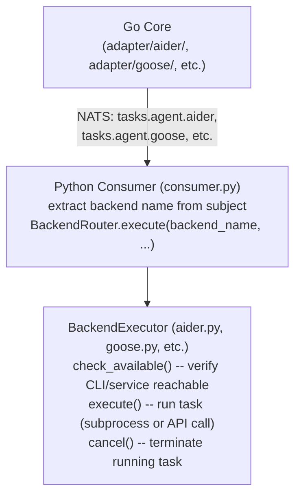
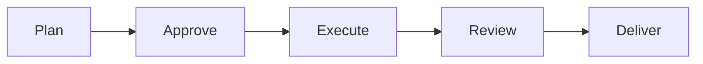
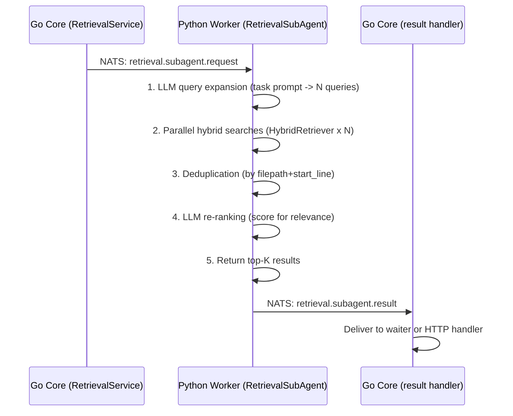

# Feature: Agent Orchestration (Pillar 4)

> Status: Core implemented (Phases 2-6) -- agent backends, runtime API, policy layer, multi-agent orchestration, 4-tier Code-RAG
> Priority: Phase 2-6 completed; Phase 9+ for additional backends and advanced features
> Architecture reference: [architecture.md](../architecture.md) -- "Agent Execution", "Worker Modules", "Modes System"

### Purpose

Coordination of various AI coding agents through a **unified** orchestration layer. Agents are swappable backends that run in configurable execution modes with safety controls and quality assurance.

### Agent Backends

| Agent | Go Adapter | Python Executor | Status | Capabilities |
|---|---|---|---|---|
| Aider | `adapter/aider/` | `backends/aider.py` | CLI wrapper | code-edit, git-commit, multi-file |
| Goose | `adapter/goose/` | `backends/goose.py` | CLI wrapper (requires CLI installed) | code-edit, mcp-native |
| OpenHands | `adapter/openhands/` | `backends/openhands.py` | CLI wrapper (requires CLI installed) | code-edit, browser, sandbox |
| OpenCode | `adapter/opencode/` | `backends/opencode.py` | CLI wrapper (requires CLI installed) | code-edit, lsp |
| Plandex | `adapter/plandex/` | `backends/plandex.py` | CLI wrapper (requires CLI installed) | code-edit, planning, multi-file |
| SWE-agent | `adapter/sweagent/` | -- | Phase 9+ | Not yet implemented |

All Go backends implement the `agentbackend.Backend` interface with capability declarations. All Python backends implement the `BackendExecutor` protocol (see below).

> **Current status:** All backends are implemented as CLI wrappers. `AiderExecutor` runs `aider --yes-always --no-auto-commits --message` as a subprocess with streaming output, timeout, and cancel support. Goose, OpenHands, OpenCode, and Plandex wrap their respective CLIs (requires each CLI to be installed). The Python consumer routes tasks to the correct backend based on the NATS subject name.

### Backend Routing Architecture

The Python consumer extracts the backend name from the NATS subject (`tasks.agent.<backend_name>`) and routes via `BackendRouter`:



#### BackendExecutor Protocol (`workers/codeforge/backends/_base.py`)

```python
class BackendExecutor(Protocol):
    @property
    def info(self) -> BackendInfo: ...
    async def check_available(self) -> bool: ...
    async def execute(self, task_id, prompt, workspace_path, config, on_output) -> TaskResult: ...
    async def cancel(self, task_id: str) -> None: ...
```

#### Configuration (Environment Variables)

| Variable | Default | Purpose |
|---|---|---|
| `CODEFORGE_AIDER_PATH` | `aider` | Path to Aider CLI binary |
| `CODEFORGE_GOOSE_PATH` | `goose` | Path to Goose CLI binary |
| `CODEFORGE_OPENCODE_PATH` | `opencode` | Path to OpenCode CLI binary |
| `CODEFORGE_PLANDEX_PATH` | `plandex` | Path to Plandex CLI binary |
| `CODEFORGE_OPENHANDS_URL` | `http://localhost:3000` | OpenHands service URL |

#### Key Files

| File | Purpose |
|------|---------|
| `workers/codeforge/backends/_base.py` | BackendExecutor protocol, BackendInfo, TaskResult |
| `workers/codeforge/backends/router.py` | BackendRouter dispatcher |
| `workers/codeforge/backends/aider.py` | AiderExecutor (real CLI wrapper) |
| `workers/codeforge/backends/goose.py` | GooseExecutor (CLI wrapper) |
| `workers/codeforge/backends/openhands.py` | OpenHandsExecutor (CLI wrapper) |
| `workers/codeforge/backends/opencode.py` | OpenCodeExecutor (CLI wrapper) |
| `workers/codeforge/backends/plandex.py` | PlandexExecutor (CLI wrapper) |
| `workers/codeforge/backends/__init__.py` | `build_default_router()` factory |

### Execution Modes

| Mode | Security | Speed | Use Case |
|---|---|---|---|
| Sandbox | High (isolated container) | Medium | Untrusted agents, batch jobs |
| Mount | Low (direct file access) | High | Trusted agents, local dev |
| Hybrid | Medium (controlled access) | Medium | Review workflows, CI-like |

### Agent Workflow



Each step is individually configurable. The **autonomy** level determines who approves.

### Autonomy Spectrum (5 Levels)

| Level | Name | Who Approves | Use Case |
|---|---|---|---|
| 1 | `supervised` | User at every step | Learning, critical codebases |
| 2 | `semi-auto` | User for destructive actions | Everyday development |
| 3 | `auto-edit` | User only for terminal/deploy | Experienced users |
| 4 | `full-auto` | Safety rules | Batch jobs, delegated tasks |
| 5 | `headless` | Safety rules, no UI | CI/CD, cron jobs, API |

### Safety Layer (8 Components)

- Budget Limiter -- hard stop on cost exceeded.
- Command Safety Evaluator -- blocklist + regex matching.
- Branch Isolation -- never on main, always feature branch.
- Test/Lint Gate -- deliver only when tests + lint pass.
- Max Steps -- infinite loop detection.
- Rollback -- automatic on failure (Shadow Git).
- **Path Blocklist** -- sensitive files protected.
- Stall Detection -- re-planning or abort.

### Quality Layer (4 Tiers)

- Action Sampling (light) -- N responses, select best.
- RetryAgent + Reviewer (medium) -- retry + score/chooser evaluation.
- LLM Guardrail Agent (medium) -- dedicated agent checks output.
- **Multi-Agent Debate** (heavy) -- Pro/Con/Moderator.

### Modes System

YAML-configurable agent specializations. Built-in modes include architect, coder, reviewer, debugger, tester, lint-fixer, planner, and researcher. Users can define custom modes in `.codeforge/modes/`. Modes support composition through pipelines and DAG workflows.

### Worker Modules

| Module | Purpose |
|---|---|
| Context (GraphRAG) | Vector search + graph DB + web fallback |
| Quality | Debate, reviewer, sampler, guardrail |
| Routing | Task-based model routing via LiteLLM |
| Safety | Command evaluation, blocklists, policies |
| Execution | Sandbox/mount management, tool provisioning |
| Memory | Composite scoring, context strategies, experience pool |
| History | Context window optimization pipeline |
| Events | Event bus for observability |
| Orchestration | DAG flow, termination conditions, handoff, planning loop |
| Hooks | Agent/environment lifecycle observer |
| Trajectory | Recording, replay, audit trail |
| HITL | Human feedback provider protocol |

### Policy System

The policy layer governs agent permissions, quality gates, and termination conditions.

#### Backend

- Domain: `internal/domain/policy/` -- PolicyProfile, PermissionRule, ToolSpecifier, QualityGate, TerminationCondition.
- Presets (4): plan-readonly, headless-safe-sandbox, headless-permissive-sandbox, trusted-mount-autonomous.
- Service: `internal/service/policy.go` -- first-match-wins rule evaluation, CRUD (SaveProfile, DeleteProfile).
- **Loader**: `internal/domain/policy/loader.go` -- YAML file loading + SaveToFile for custom profiles.
- REST API: GET/POST /policies, GET/DELETE /policies/{name}, POST /policies/{name}/evaluate.

#### Frontend (PolicyPanel)

- Component: `frontend/src/features/project/PolicyPanel.tsx`.
- 3 views: List (presets + custom), Detail (summary + rules table + evaluate tester), Editor (create/clone).
- Evaluate tester lets you test a tool call against a policy and see the decision (allow/deny/ask).
- Types: `PolicyProfile`, `PermissionRule`, `PolicyQualityGate`, `TerminationCondition`, `ResourceLimits`.

#### Deferred

- Scope levels: global (user) to project to run/session (override).
- "Effective Permission Preview" -- show which rule matched and why.
- Run-level policy overrides.

### Retrieval Sub-Agent (Phase 6C)

LLM-guided multi-query retrieval that improves context quality for agents working on complex tasks.

#### Architecture



#### Backend

- Python: `RetrievalSubAgent` in `workers/codeforge/retrieval.py` -- composes `HybridRetriever` + `LiteLLMClient`.
- Go Service: `SubAgentSearchSync()` / `HandleSubAgentSearchResult()` in `internal/service/retrieval.go`.
- **Context Optimizer**: `fetchRetrievalEntries()` tries sub-agent first, falls back to single-shot search.
- REST API: `POST /api/v1/projects/{id}/search/agent`.
- Config: `SubAgentModel`, `SubAgentMaxQueries`, `SubAgentRerank` in `config.Orchestrator`.

#### Frontend (RetrievalPanel)

- Standard/Agent toggle button next to search bar.
- Agent mode shows expanded queries as tags + total candidates count.
- Component: `frontend/src/features/project/RetrievalPanel.tsx`.

#### Deferred

- Configurable expansion prompts per project.
- Streaming results (partial results as queries complete).
- Cost tracking for sub-agent LLM calls.

### Completed (Phase 1-2)

- [x] `agentbackend.Backend` interface definition (`internal/port/agentbackend/`).
- [x] Agent backend registry with self-registration via `init()`.
- [x] Basic queue consumer (Python worker) -- NATS-based async dispatch.
- [x] Aider backend adapter (`internal/adapter/aider/`).
- [x] Simple task to single agent execution.
- [x] Mount mode implementation (direct file access).
- [x] Basic safety evaluator (command blocklist + regex matching).
- [x] Frontend: Agent Monitor (live logs, status via WebSocket).
- [x] Frontend: Task submission form, task list, agent CRUD.

### Completed (Phase 3 -- Reliability and Agent Foundation)

- [x] Configuration management (hierarchical: defaults < YAML < ENV).
- [x] Structured logging (async JSON, Go + Python, request ID propagation).
- [x] Circuit breaker for NATS + LiteLLM calls.
- [x] Graceful 4-phase shutdown, idempotency middleware, dead letter queue.
- [x] Event sourcing for agent trajectory (`agent_events` table, 22+ event types).
- [x] Tiered cache (L1 Ristretto + L2 NATS KV), rate limiting, connection pool tuning.

### Completed (Phase 4 -- Agent Execution Engine)

- [x] Policy layer: 4 presets, YAML custom policies, first-match-wins evaluation, REST API + frontend PolicyPanel.
- [x] Runtime API: step-by-step execution protocol (Go to Python via NATS), per-tool-call policy enforcement.
- [x] Checkpoint system: shadow Git commits for safe rollback.
- [x] Docker Sandbox: container lifecycle management with resource limits.
- [x] Stall detection: FNV-64a hash ring buffer, configurable threshold.
- [x] Quality gate enforcement: test/lint gates via NATS request/result protocol.
- [x] 5 deliver modes: none, patch, commit-local, branch, PR.

### Completed (Phase 5 -- Multi-Agent Orchestration)

- [x] Execution plans: DAG scheduling with 4 protocols (sequential, parallel, ping_pong, consensus).
- [x] Orchestrator agent (meta-agent): LLM-based feature decomposition, agent strategy selection.
- [x] Agent teams: team CRUD, role-based members, protocol selection.
- [x] Context optimizer: token budget management, workspace scanning, context packing.
- [x] Shared context: team-level versioned state with NATS notifications.
- [x] Modes system: 8 built-in presets, ModeService, REST API.

### Completed (Phase 6 -- Code-RAG)

- [x] Tier 1 -- RepoMap: tree-sitter symbol extraction, PageRank file ranking (16+ languages).
- [x] Tier 2 -- Hybrid Retrieval: BM25S keyword + semantic embeddings, RRF fusion.
- [x] Tier 3 -- Retrieval Sub-Agent: LLM multi-query expansion, parallel search, re-ranking.
- [x] Tier 4 -- GraphRAG: PostgreSQL adjacency-list graph, BFS with hop-decay scoring.

### MCP Integration (Phase 15)

Model Context Protocol integration gives agents access to external tools (databases, APIs, cloud services, file systems) and allows external MCP clients (Claude Desktop, VS Code, Cursor) to invoke CodeForge workflows.

#### MCP Server (Go Core)

Exposes CodeForge operations to external MCP clients via the mcp-go SDK with Streamable HTTP transport.

- **Tools**: `list_projects`, `get_project`, `get_run_status`, `get_cost_summary`
- **Resources**: `codeforge://projects`, `codeforge://costs/summary`
- **Auth**: Bearer token / API key middleware
- **Config**: `mcp.enabled`, `mcp.server_port` (default 3001)
- **Code**: `internal/adapter/mcp/` (server.go, tools.go, resources.go, auth.go)

#### MCP Client (Python Workers)

Agents connect to external MCP servers during runs to use their tools.

- **McpWorkbench**: Multi-server container (connect/disconnect, tool discovery, tool call bridging)
- **McpToolRecommender**: BM25-based ranking of relevant tools for task prompts
- **Transport**: stdio and SSE via Python `mcp` SDK
- **Code**: `workers/codeforge/mcp_workbench.py`, `workers/codeforge/mcp_models.py`

#### MCP Server Registry

Persistent storage for MCP server definitions with project-level assignment.

- **Database**: `mcp_servers`, `project_mcp_servers`, `mcp_server_tools` tables (migration 036)
- **HTTP API**: 10 endpoints for CRUD, test connection, tools listing, project assignment
- **Frontend**: MCPServersPage (server list, add/edit modal, test connection, tools discovery)
- **Code**: `internal/adapter/postgres/store_mcp.go`, `internal/adapter/http/handlers_mcp.go`, `frontend/src/features/mcp/MCPServersPage.tsx`

#### Policy Integration

MCP tool calls use namespaced identifiers `mcp:{server}:{tool}` and flow through the existing policy engine with glob matching. Mode-based filtering via `Mode.Tools` and `Mode.DeniedTools` supports the same convention.

### Agentic Conversation Mode (Phase 17)

The agentic conversation mode transforms the Chat UI into an autonomous coding agent. Rather than a single LLM call per message, the system runs a multi-turn tool-use loop where the LLM reads files, edits code, runs commands, and iterates until the task is complete.

#### How It Works

1. **User sends a message** via the Chat UI (or API with `?mode=agentic` / `"agentic": true`)
2. **Go Core** stores the message, builds a context pack (system prompt, conversation history, tool definitions, MCP servers, policy profile), and publishes to NATS
3. **Python Worker** receives the job and starts the agent loop (calls LLM with tool definitions, streams text via AG-UI WebSocket events, executes each `tool_calls` response with per-call policy enforcement, appends tool results and feeds back to the LLM, repeats until the LLM responds without tool calls or termination limits are hit)
4. **Go Core** receives the completion, stores all tool messages and the final reply, and broadcasts `agui.run_finished`

#### Built-in Tools

| Tool | Policy Name | Description |
|------|-------------|-------------|
| Read | `Read` | Read file contents with optional line range (offset/limit) |
| Write | `Write` | Create or overwrite a file, creating parent directories |
| Edit | `Edit` | Search-and-replace: validate old_text is unique, replace with new_text |
| Bash | `Bash` | Execute shell command with timeout (default 120s), captures stdout+stderr |
| Search | `Search` | Regex search across files via `grep -rn` |
| Glob | `Glob` | Find files by glob pattern via `pathlib.Path.glob()` |
| ListDir | `ListDir` | List directory contents, optional recursive |

Tools are registered in the `ToolRegistry` (`workers/codeforge/tools/`). MCP-discovered tools merge in with `mcp__{server}__{tool}` naming and route through `McpWorkbench.call_tool()`.

#### Conversation History Management

The `ConversationHistoryManager` assembles messages within a configurable token budget (`MaxContextTokens`, default 120000):

- **Head-and-tail strategy**: System prompt + first few messages + last N messages always included
- **Tool result truncation**: Long outputs capped at `ToolOutputMaxChars` (default 10000) with head+tail preservation
- **Context injection**: RepoMap, retrieval results, and LSP diagnostics embedded in the system prompt

#### Human-in-the-Loop (HITL) Approval

When the policy layer returns `DecisionAsk` for a tool call:

1. Runtime broadcasts `agui.permission_request` via WebSocket (includes tool name, command, path)
2. Frontend displays an inline approval card with Allow/Deny buttons and a countdown timer
3. User decision sent via `POST /api/v1/runs/{id}/approve/{callId}` with `{"decision": "allow"|"deny"}`
4. If approved, tool executes normally; if denied or timeout (default 60s), a "Permission denied" result is returned to the LLM

#### Configuration

```yaml
agent:
  builtin_tools: [Read, Write, Edit, Bash, Search, Glob, ListDir]
  default_model: ""  # Uses project's configured model
  max_context_tokens: 120000
  max_loop_iterations: 50
  agentic_by_default: false
  tool_output_max_chars: 10000
  context_enabled: false        # Enable proactive context injection for conversations
  context_budget: 2048          # Token budget for conversation context
  context_prompt_reserve: 512   # Tokens reserved for prompt in conversation context
  context_enabled: false       # Enable proactive context injection for conversations
  context_budget: 2048         # Token budget for conversation context (smaller than orchestration's 4096)
  context_prompt_reserve: 512  # Tokens reserved for prompt overhead

runtime:
  approval_timeout_seconds: 60
```

Environment overrides: `CODEFORGE_AGENT_DEFAULT_MODEL`, `CODEFORGE_AGENT_MAX_CONTEXT_TOKENS`, `CODEFORGE_AGENT_MAX_LOOP_ITERATIONS`, `CODEFORGE_AGENT_AGENTIC_BY_DEFAULT`, `CODEFORGE_APPROVAL_TIMEOUT_SECONDS`.

#### Proactive Context Injection for Conversations

When `context_enabled: true`, the conversation agent receives pre-packed codebase context in the NATS payload before the agent loop begins. This reuses the same `ContextOptimizerService` pipeline used by orchestration runs (workspace scan, hybrid retrieval, GraphRAG, repo map, shared context, LSP diagnostics, goals) but with a smaller token budget (2048 vs 4096) to leave room for conversation history.

**Benefits:**
- Agents start with relevant file context instead of discovering it reactively via tool calls
- Reduces initial tool-call overhead by 2-3x (fewer `Read`/`Search`/`Glob` calls)
- Especially impactful for weaker LLMs that struggle with multi-step context discovery

**How it works:**
1. `ConversationService.buildConversationContextEntries()` checks `ContextEnabled` flag
2. Calls `ContextOptimizerService.BuildConversationContext()` with the user message as the relevance query
3. Entries are packed within the conversation-specific budget and added to `ConversationRunStartPayload.Context`
4. Python worker's `_build_system_content()` injects these entries into the system prompt (existing pipeline, no Python changes needed)

**Key difference from orchestration:** No persistence — conversation context is ephemeral (assembled per-message, not stored as a `ContextPack` in the database).

#### Frontend

- **ToolCallCard**: Tool-type icons (file, terminal, search), collapsible arguments/results, permission denied badge
- **ChatPanel**: Step counter during agentic turns ("Step 3/50"), running cost display, grouped tool calls, agentic mode indicator
- **Approval UI**: Inline card on `permission_request` events with countdown and Allow/Deny buttons

#### Key Files

| File | Purpose |
|------|---------|
| `workers/codeforge/agent_loop.py` | Core agentic loop executor |
| `workers/codeforge/history.py` | Conversation history manager |
| `workers/codeforge/tools/` | Built-in tool registry (7 tools) |
| `internal/service/conversation.go` | Agentic dispatch and completion handler |
| `internal/service/runtime.go` | HITL approval (waitForApproval, ResolveApproval) |
| `internal/adapter/http/handlers.go` | HTTP handlers (agentic routing, approval endpoint) |
| `frontend/src/features/project/ChatPanel.tsx` | Chat UI with agentic enhancements |
| `frontend/src/features/project/ToolCallCard.tsx` | Tool call display component |

### Benchmark Mode (Phase 20, Dev-Only)

Structured evaluation framework for measuring agent and model quality. Only accessible when `APP_ENV=development`.

#### Architecture

Three-pillar evaluation stack running in the Python worker:

1. **DeepEval** — LLM-as-judge metrics (correctness, faithfulness, relevancy, tool correctness) via `LiteLLMJudge` wrapper
2. **AgentNeo** — Optional tracing for tool selection accuracy, goal decomposition, and plan adaptability
3. **GEMMAS Collaboration** — Information Diversity Score (IDS) and Unnecessary Path Ratio (UPR) for multi-agent workflows

#### Workflow

1. User creates a benchmark run via `/benchmarks` page (selects dataset, model, metrics)
2. Go Core stores run in `benchmark_runs` table and publishes `benchmark.run.request` to NATS
3. Python worker loads YAML dataset, executes tasks against LLM, evaluates with selected metrics
4. Results published back via `benchmark.run.result`, stored in `benchmark_results` table
5. Frontend displays per-task scores, summary, and supports run-to-run comparison

#### API Endpoints

| Method | Path | Purpose |
|--------|------|---------|
| POST | `/api/v1/benchmarks/runs` | Create benchmark run |
| GET | `/api/v1/benchmarks/runs` | List all runs |
| GET | `/api/v1/benchmarks/runs/{id}` | Get run details |
| DELETE | `/api/v1/benchmarks/runs/{id}` | Delete run |
| GET | `/api/v1/benchmarks/runs/{id}/results` | List results for run |
| GET | `/api/v1/benchmarks/datasets` | List available datasets |
| POST | `/api/v1/benchmarks/compare` | Compare two runs |

All endpoints gated by `DevModeOnly` middleware.

#### Key Files

| File | Purpose |
|------|---------|
| `workers/codeforge/evaluation/runner.py` | BenchmarkRunner (dataset execution + evaluation) |
| `workers/codeforge/evaluation/metrics.py` | DeepEval metric wrappers |
| `workers/codeforge/evaluation/litellm_judge.py` | LiteLLM judge for DeepEval |
| `workers/codeforge/evaluation/datasets.py` | Dataset loading and result persistence |
| `workers/codeforge/evaluation/collaboration.py` | IDS + UPR collaboration metrics |
| `workers/codeforge/evaluation/dag_builder.py` | CollaborationDAG from agent messages |
| `workers/codeforge/tracing/setup.py` | TracingManager with AgentNeo/NoOp fallback |
| `workers/codeforge/tracing/metrics.py` | AgentNeo metric wrappers |
| `internal/service/benchmark.go` | Go benchmark service (CRUD + dataset listing) |
| `internal/adapter/postgres/benchmark.go` | PostgreSQL benchmark store |
| `internal/adapter/http/handlers_benchmark.go` | HTTP handlers for benchmark API |
| `configs/benchmarks/basic-coding.yaml` | Sample benchmark dataset |
| `frontend/src/features/benchmarks/BenchmarkPage.tsx` | Benchmark dashboard UI |

#### ADR

See [ADR-008: Benchmark Evaluation Framework](../architecture/adr/008-benchmark-evaluation-framework.md).

> **Note:** Benchmarks are gated by `APP_ENV=development` by design (see ADR-008). They are not available in production mode.

### Advanced Evaluation (Phase 28 -- R2E-Gym/EntroPO)

Extends Phase 20 benchmarks with hybrid verification, multi-rollout scaling, synthetic task generation, and DPO trajectory export.

#### Components

| Component | File | Purpose |
|-----------|------|---------|
| **MultiRolloutRunner** | `workers/codeforge/evaluation/runners/multi_rollout.py` | Parallel evaluation runner for multi-rollout scaling |
| **TrajectoryVerifier** | `workers/codeforge/evaluation/evaluators/trajectory_verifier.py` | Hybrid verification pipeline for trajectory validation |
| **SWE-GEN** | `workers/codeforge/evaluation/generators/swegen.py` | Synthetic task generator for SWE-bench style evaluation |
| **DPO Trajectory Exporter** | `workers/codeforge/evaluation/export/trajectory_exporter.py` | Export trajectories in DPO format for training |

#### Features

- **Multi-rollout scaling**: Run multiple evaluation rollouts in parallel via `MultiRolloutRunner`, aggregate results with diversity-aware MAB (entropy-UCB1) selection
- **Hybrid verification**: `TrajectoryVerifier` combines functional test results with LLM-based trajectory analysis for robust pass/fail decisions
- **Synthetic tasks**: `SWE-GEN` generates SWE-bench style tasks from real repositories for custom evaluation datasets
- **DPO export**: `DPO Trajectory Exporter` converts successful/failed trajectory pairs into DPO training format for model fine-tuning

### Phase 21: Intelligent Agent Orchestration (2026-02-26)

Extends Phase 5 orchestration and Phase 12 quality layer with three capabilities:

#### Confidence-Based Moderator Router (21A)

Before executing each plan step, an LLM evaluates whether the subtask needs moderated review.
If confidence is below the configurable threshold (default 0.7), the step is routed through a
multi-agent debate before proceeding.

- `ReviewRouter` service calls LiteLLM with structured JSON output
- Go `text/template` prompt with criteria: architecture decisions, security, ambiguous requirements, cross-component changes
- Config: `Orchestrator.ReviewRouterEnabled`, `ReviewConfidenceThreshold`, `ReviewRouterModel`
- REST: `POST /api/v1/plans/{id}/steps/{stepId}/evaluate` for manual evaluation
- WS event: `review_router.decision` broadcasts decision to frontend
- Frontend: green (auto-proceed) / yellow (routed) badge per step with confidence % tooltip

#### Typed Agent Module Schemas (21B)

Pydantic-based input/output schemas per agent step type, enabling structured output validation.

- Schemas: `DecomposeInput/Output`, `CodeGenInput/Output`, `ReviewInput/Output`, `ModerateInput/Output`
- `StructuredOutputParser`: wraps LiteLLM `response_format`, validates against Pydantic, retry on failure (max 2)
- `output_schema` field on Mode domain struct (Go) and ModeConfig (Python)

#### Agent Flow Visualization (21C)

Live SVG-based DAG rendering of execution plans with step status, review decisions, and click-to-detail.

- `AgentFlowGraph.tsx`: layered layout algorithm, status-colored nodes, dependency arrows with protocol labels
- `StepDetailPanel.tsx`: metadata, review decision, debate status, error display
- `GET /api/v1/plans/{id}/graph`: returns DAG in frontend-friendly format (nodes + edges)

#### Moderator Agent Mode / Multi-Agent Debate (21D)

When the review router triggers, a ping_pong sub-plan is created with proponent + moderator agents.

- `moderator` mode: synthesizes proposals, identifies conflicts, produces unified decision (read-only tools)
- `proponent` mode: defends proposed approach with codebase evidence (read-only tools)
- Debate protocol: `startDebate()` creates sub-plan, `handleDebateComplete()` injects synthesis into parent step context
- Configurable: `DebateRounds` (default 1, max 3)
- WS event: `debate.status` with started/completed/failed status and synthesis text
- Frontend: debate visualization in StepDetailPanel, status badges in step list

| Key File | Purpose |
|---|---|
| `internal/domain/orchestration/review_decision.go` | ReviewDecision domain model |
| `internal/service/review_router.go` | Confidence-based review evaluation |
| `internal/service/orchestrator.go` | Debate protocol integration |
| `internal/domain/mode/presets.go` | moderator + proponent mode presets |
| `internal/adapter/ws/events.go` | review_router.decision + debate.status events |
| `workers/codeforge/schemas/` | Typed Pydantic schemas per step |
| `frontend/src/features/project/AgentFlowGraph.tsx` | SVG DAG renderer |
| `frontend/src/features/project/StepDetailPanel.tsx` | Step detail with debate visualization |
| `frontend/src/features/project/PlanPanel.tsx` | Integration hub |

### Completed (Audit Priority 4 -- OTEL Wiring + Backend Routing)

- [x] OTEL agent-level spans and metrics wired into service layer (runtime.go, conversation.go).
- [x] `NewMetrics()` instantiated in main.go, injected via `SetMetrics()` setters.
- [x] Python `BackendRouter` dispatcher with 5 registered backend executors.
- [x] `AiderExecutor` real CLI wrapper (subprocess, streaming, timeout, cancel).
- [x] Goose/OpenHands/OpenCode/Plandex CLI wrapper executors (requires respective CLIs installed).
- [x] Consumer extracts backend name from NATS subject, routes to correct executor.
- [x] 40 new Python tests (router, aider, CLI wrappers, consumer).

### Active Work Visibility (Phase 24)

When multiple agents execute tasks in parallel, both the frontend and API consumers need to see which tasks are currently being worked on. This prevents redundant work and provides operational transparency.

**API Endpoints:**

| Method | Path | Description |
|--------|------|-------------|
| `GET` | `/projects/{id}/active-work` | List running/queued tasks with agent and run metadata |
| `POST` | `/tasks/{id}/claim` | Atomically claim a pending task for an agent |

**Claim Protocol:**

1. Agent calls `POST /tasks/{id}/claim` with `{"agent_id": "..."}`.
2. Backend reads current task `version`, validates `status=pending`.
3. Atomic `UPDATE WHERE version=$expected` — only one agent succeeds (optimistic locking).
4. Success: 200 `{claimed: true}`, broadcasts `activework.claimed` via WebSocket.
5. Conflict: 409 `{claimed: false, reason: "already claimed by agent X"}`.

**WebSocket Events:**

| Event | Payload | Trigger |
|-------|---------|---------|
| `activework.claimed` | `{task_id, task_title, project_id, agent_id, agent_name}` | Task claimed by agent |
| `activework.released` | `{task_id, project_id, reason}` | Stale task auto-released |

**Stale Recovery:**

Background ticker runs every 60s, releasing tasks stuck in `running`/`queued` status for longer than 30 minutes (configurable). Released tasks are reset to `pending` with `agent_id=NULL`.

**Frontend:**

`ActiveWorkPanel` component renders above the chat panel on the project page. Shows each active task with: pulsing status dot (green=running, yellow=queued), task title, agent name + mode badge, step count, and cost. Auto-refreshes on WS events with 500ms debounce.

### Goal Discovery — Project-Aware Context for Agents (Phase 30)

Agents previously received only code and conversation as context. Goal Discovery auto-detects project vision, requirements, constraints, and state from workspace files and injects them into the agent's context window. This gives agents a "north star" so they make decisions aligned with the project's actual goals, not just the immediate task prompt.

#### Detection Tiers

Three-tier file scanning with priority-based ordering:

| Tier | Source Files | Goal Kind | Priority |
|------|-------------|-----------|----------|
| 1. GSD (Goal-Structured Development) | `.planning/goals.md`, `.planning/requirements.md`, `.planning/constraints.md` | vision, requirement, constraint | 95-85 |
| 2. Agent Instructions | `CLAUDE.md`, `.cursorrules`, `.clinerules` | context | 80 |
| 3. Project Documentation | `README.md`, `docs/architecture.md`, `docs/requirements.md`, `CONTRIBUTING.md` | state, context | 75-70 |

Detection is workspace-path-based: files are read from disk, parsed for relevant sections, and imported as `ProjectGoal` records in PostgreSQL.

#### Goal Kinds

| Kind | Purpose | Example Source |
|------|---------|---------------|
| `vision` | High-level project purpose and direction | `.planning/goals.md`, README intro |
| `requirement` | Functional/non-functional requirements | `.planning/requirements.md`, docs/requirements.md |
| `constraint` | Architecture decisions, tech choices, coding standards | `.planning/constraints.md`, CLAUDE.md |
| `state` | Current project status, what is built, what is missing | README "Status" section, CONTRIBUTING.md |
| `context` | General context that helps agents understand the codebase | `.cursorrules`, docs/architecture.md |

#### Context Injection

Goals reach agents through two complementary paths:

1. **System prompt injection** -- `renderGoalContext()` in `conversation_agent.go` fetches enabled goals via `GoalDiscoveryService.ListEnabled()`, renders them as structured markdown grouped by kind, and injects them into the `GoalContext` template field of the agent system prompt.

2. **Context pack entries** -- `ContextOptimizerService` includes goal entries (kind `EntryGoal`) as high-priority candidates during context packing, ensuring goals survive token budget trimming.

#### Proactive Context Injection for Conversations

Conversations can optionally pre-pack codebase context into the NATS payload before the agent loop starts.

- **Opt-in**: Set `agent.context_enabled: true` in config YAML
- **Pipeline**: Reuses the existing ContextOptimizerService parallel pipeline
- **Budget**: Separate token budget (context_budget: 2048) smaller than orchestration
- **Graceful degradation**: Conversation proceeds without pre-packed context on failure
- **Key files**: context_optimizer.go, conversation_agent.go, conversation.go
- **Python side**: No changes needed

#### Auto-Discovery

Goal detection runs automatically during `SetupProject()` (Step 4) after repo clone completes. The service gracefully handles missing workspaces, missing goal files, and detection failures without blocking project setup.

#### API Endpoints

| Method | Path | Description |
|--------|------|-------------|
| `GET` | `/api/v1/projects/{id}/goals` | List all goals for a project |
| `POST` | `/api/v1/projects/{id}/goals` | Create a goal manually |
| `POST` | `/api/v1/projects/{id}/goals/detect` | Trigger auto-detection from workspace |
| `GET` | `/api/v1/goals/{id}` | Get a single goal by ID |
| `PUT` | `/api/v1/goals/{id}` | Update a goal (title, content, kind, priority, enabled) |
| `DELETE` | `/api/v1/goals/{id}` | Delete a goal |

#### Frontend

`GoalsPanel` component renders on the project detail page. Goals are grouped by kind with color-coded badges. Users can detect goals from workspace, create goals manually, toggle enabled/disabled, and delete. i18n support for English and German.

#### Key Files

| File | Purpose |
|------|---------|
| `internal/domain/goal/goal.go` | GoalKind enum, ProjectGoal, CreateRequest, UpdateRequest, validation |
| `internal/service/goal_discovery.go` | GoalDiscoveryService (detect, CRUD, context rendering) |
| `internal/service/goal_discovery_test.go` | 11 unit tests |
| `internal/adapter/postgres/store_project_goal.go` | PostgreSQL CRUD (7 methods) |
| `internal/adapter/postgres/migrations/056_project_goals.sql` | DB migration |
| `internal/adapter/http/handlers_goals.go` | HTTP handlers (6 endpoints) |
| `internal/service/conversation_agent.go` | System prompt injection (`renderGoalContext()`) |
| `internal/service/context_optimizer.go` | Context pack injection (`SetGoalService()`) |
| `internal/service/project.go` | Auto-detection in `SetupProject()` Step 4 |
| `frontend/src/features/project/GoalsPanel.tsx` | Goal management UI |

### Open Items

> **Task tracking:** See [docs/todo.md](../todo.md) for current open items related to Agent Orchestration.

### A2A Protocol Integration (Phase 27)

CodeForge implements the [A2A Protocol v0.3.0](https://github.com/a2aproject/a2a-go) (Linux Foundation) for secure, interoperable agent-to-agent communication. CodeForge acts as both **server** (exposing agents) and **client** (delegating to remote agents).

**Server Role (inbound):**
- Dynamic `AgentCard` at `/.well-known/agent.json` with skills from registered modes
- SDK-based handler via `a2a-go` — JSON-RPC task lifecycle (submit/working/completed/failed)
- `AgentExecutor` bridges A2A tasks to CodeForge's NATS-based execution pipeline
- Trust annotations stamped on all inbound tasks (origin="a2a", level=untrusted)
- Quarantine evaluation before task execution (Phase 23B integration)
- Bearer token authentication middleware with configurable API keys

**Client Role (outbound):**
- `A2AService` (`internal/service/a2a.go`) manages remote agent discovery and task delegation
- AgentCard resolution via `a2a-go` SDK at `/.well-known/agent-card.json`
- Remote agent registry with cached cards, skills, and trust levels
- Client connection cache with `sync.RWMutex` for concurrent safety
- Outbound tasks tracked in `a2a_tasks` table with direction="outbound"

**Handoff Integration (Phase 27M):**
- `a2a://` prefix in handoff target routes to A2A instead of NATS
- Example: `TargetAgentID: "a2a://remote-coder"` delegates via A2A protocol
- Existing trust and quarantine checks still applied before delegation

**API Endpoints:**

| Method | Path | Description |
|--------|------|-------------|
| `POST` | `/api/v1/a2a/agents` | Register a remote A2A agent |
| `GET` | `/api/v1/a2a/agents` | List registered remote agents |
| `DELETE` | `/api/v1/a2a/agents/{id}` | Remove a remote agent |
| `POST` | `/api/v1/a2a/agents/{id}/discover` | Re-discover agent card |
| `POST` | `/api/v1/a2a/agents/{id}/send` | Send a task to remote agent |
| `GET` | `/api/v1/a2a/tasks` | List A2A tasks (filter by state/direction) |
| `GET` | `/api/v1/a2a/tasks/{id}` | Get A2A task details |
| `POST` | `/api/v1/a2a/tasks/{id}/cancel` | Cancel an A2A task |
| `POST` | `/api/v1/a2a/tasks/{id}/push-config` | Create push notification config |
| `GET` | `/api/v1/a2a/tasks/{id}/push-config` | List push configs for a task |
| `DELETE` | `/api/v1/a2a/push-config/{id}` | Delete a push notification config |
| `GET` | `/api/v1/a2a/tasks/{id}/subscribe` | SSE stream for task state changes |

**WebSocket Events:**

| Event | Payload | Trigger |
|-------|---------|---------|
| `a2a.task.created` | `{task_id, state, skill_id, direction}` | A2A task created |
| `a2a.task.status` | `{task_id, state, direction, remote_agent_id}` | A2A task state change |
| `a2a.task.complete` | `{task_id, state}` | A2A task completed/failed |

**Configuration:**

| YAML Key | ENV Variable | Default | Description |
|---|---|---|---|
| `a2a.enabled` | `CODEFORGE_A2A_ENABLED` | `false` | Enable A2A endpoints |
| `a2a.base_url` | `CODEFORGE_A2A_BASE_URL` | auto-detect | Public URL for AgentCard |
| `a2a.api_keys` | `CODEFORGE_A2A_API_KEYS` | (empty) | Comma-separated API keys |
| `a2a.transport` | `CODEFORGE_A2A_TRANSPORT` | `jsonrpc` | Transport protocol |
| `a2a.max_tasks` | `CODEFORGE_A2A_MAX_TASKS` | `100` | Max concurrent A2A tasks |
| `a2a.allow_open` | `CODEFORGE_A2A_ALLOW_OPEN` | `true` | Allow unauthenticated discovery |

**Key Files:**

| File | Purpose |
|------|---------|
| `internal/adapter/a2a/executor.go` | A2A AgentExecutor implementation |
| `internal/adapter/a2a/taskstore.go` | SDK TaskStore backed by PostgreSQL |
| `internal/adapter/a2a/agentcard.go` | Dynamic AgentCard builder |
| `internal/service/a2a.go` | Outbound A2A client service |
| `internal/adapter/http/handlers_a2a.go` | REST API handlers |
| `internal/middleware/a2a_auth.go` | Bearer token auth middleware |
| `internal/domain/a2a/` | Domain types (A2ATask, RemoteAgent) |
| `internal/adapter/postgres/store_a2a.go` | PostgreSQL persistence |

**Security Hardening (Phase 27P):**

| Feature | Implementation | Protection |
|---------|---------------|------------|
| Constant-time auth | `crypto/subtle.ConstantTimeCompare` in `a2a_auth.go` | Timing attack prevention |
| Webhook URL validation | `validateWebhookURL()` — require https, block private IPs | SSRF prevention |
| Prompt length limit | `MaxA2APromptLength = 100,000` in `SendTask()` | Abuse prevention |
| HMAC-SHA256 signature | `X-CodeForge-Signature: sha256=...` on push webhooks | Payload integrity |

### Goal Discovery (Phase 30)

> Status: Completed (2026-03-02)
> Auto-detection of project goals from workspace files, priority-based injection into agent system prompts, full CRUD REST API.

#### Goal Kinds

| Kind | Description | Typical Source |
|---|---|---|
| `vision` | What the project aims to achieve | `PROJECT.md`, `README.md` |
| `requirement` | Functional requirements | `REQUIREMENTS.md`, `docs/requirements.md` |
| `constraint` | Rules and architectural decisions | `CLAUDE.md`, `.cursorrules`, `docs/architecture.md` |
| `state` | Current progress / phase info | `STATE.md` |
| `context` | Background context for agents | `NN-CONTEXT.md` files |

#### Detection Tiers

Three-tier priority-ordered detection from workspace files:

1. **GSD `.planning/`** — `PROJECT.md` (vision, p95), `REQUIREMENTS.md` (requirement, p90), `STATE.md` (state, p80), `NN-CONTEXT.md` (context, p75)
2. **Agent Instructions** — `CLAUDE.md` (constraint, p88), `.cursorrules` (constraint, p85), `.clinerules` (constraint, p85)
3. **Project Docs** — `README.md` first section only (vision, p70), `CONTRIBUTING.md` (constraint, p60), `docs/architecture.md` (constraint, p75), `docs/requirements.md` (requirement, p85)

Safety guards: files >50KB skipped, binary files (null bytes) skipped, README truncated to first section with UTF-8-safe 2000-byte limit.

#### Context Injection (Dual-Path)

Goals are injected into agent interactions through two complementary paths:

1. **ContextPack entries** — `AsContextEntries()` converts enabled goals into `EntryGoal` entries for the context optimizer's token-budget-aware assembly
2. **System prompt markdown** — `renderGoalContext()` renders goals grouped by kind into structured markdown injected via `{{.GoalContext}}` template variable

#### API Endpoints

| Method | Path | Description |
|---|---|---|
| `GET` | `/api/v1/projects/{id}/goals` | List goals for a project |
| `POST` | `/api/v1/projects/{id}/goals` | Create a goal (manual) |
| `POST` | `/api/v1/projects/{id}/goals/detect` | Trigger auto-detection |
| `GET` | `/api/v1/goals/{id}` | Get a single goal |
| `PUT` | `/api/v1/goals/{id}` | Update a goal |
| `DELETE` | `/api/v1/goals/{id}` | Delete a goal |

#### Key Files

| File | Purpose |
|---|---|
| `internal/domain/goal/goal.go` | Domain model, kinds, validation |
| `internal/service/goal_discovery.go` | Detection logic, context rendering, CRUD service |
| `internal/adapter/postgres/store_project_goal.go` | PostgreSQL persistence (7 methods) |
| `internal/adapter/postgres/migrations/056_project_goals.sql` | DB migration |
| `internal/adapter/http/handlers_goals.go` | REST API handlers |
| `internal/service/context_optimizer.go` | Goal → ContextPack integration |
| `workers/codeforge/tools/manage_goals.py` | Phase 30 goal management tool (create, update, track goals) |
| `internal/service/conversation_agent.go` | Goal → system prompt injection |
