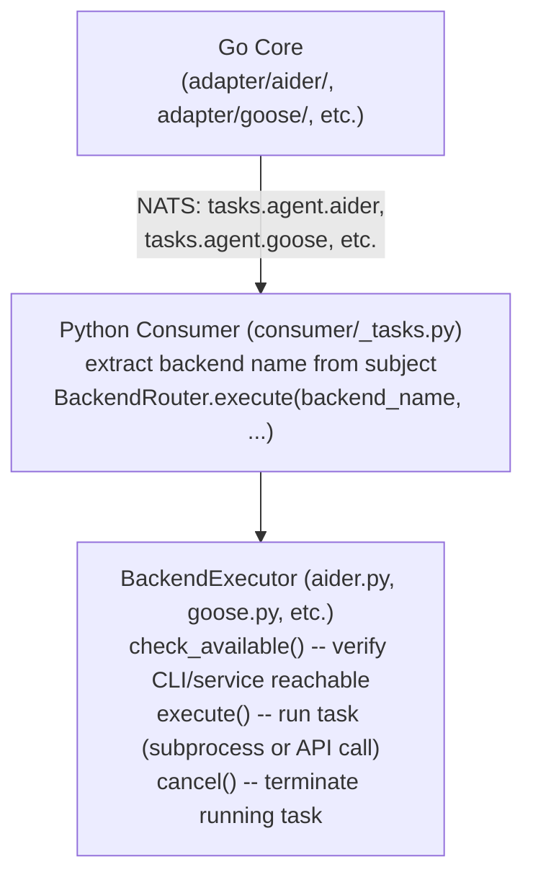
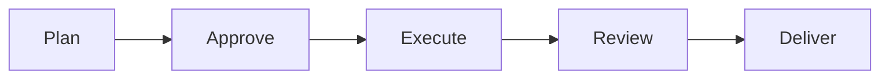
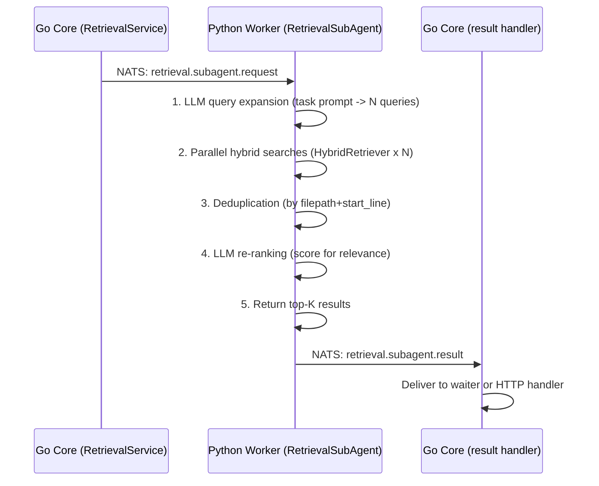

# Feature: Agent Orchestration (Pillar 4)

> Status: Core implemented (Phases 2-6) -- agent backends, runtime API, policy layer, multi-agent orchestration, 4-tier Code-RAG
> Priority: Phase 2-6 completed; Phase 9+ for additional backends and advanced features
> Architecture reference: [architecture.md](../architecture.md) -- "Agent Execution", "Worker Modules", "Modes System"

### Purpose

Coordination of various AI coding agents through a **unified** orchestration layer. Agents are swappable backends that run in configurable execution modes with safety controls and quality assurance.

### Agent Backends

| Agent | Go Adapter | Python Executor | Status | Capabilities |
|---|---|---|---|---|
| Aider | `adapter/aider/` | `backends/aider.py` | CLI wrapper | code-edit, git-commit, multi-file |
| Goose | `adapter/goose/` | `backends/goose.py` | CLI wrapper (requires CLI installed) | code-edit, mcp-native |
| OpenHands | `adapter/openhands/` | `backends/openhands.py` | HTTP API client (requires a running OpenHands server at `CODEFORGE_OPENHANDS_URL`) | code-edit, browser, sandbox |
| OpenCode | `adapter/opencode/` | `backends/opencode.py` | CLI wrapper (requires CLI installed) | code-edit, lsp |
| Plandex | `adapter/plandex/` | `backends/plandex.py` | CLI wrapper (requires CLI installed) | code-edit, planning, multi-file |
| SWE-agent | -- | `backends/sweagent.py` | CLI wrapper (requires Docker) | code-edit, sandbox, multi-file |

All Go backends implement the `agentbackend.Backend` interface with capability declarations. All Python backends implement the `BackendExecutor` protocol (see below).

> **Current status:** Aider, Goose, OpenCode, Plandex and SWE-agent are CLI wrappers (each CLI must be installed); OpenHands is an HTTP API client that talks to a running OpenHands server. `AiderExecutor` runs `aider --yes-always --no-auto-commits --message` as a subprocess with streaming output, timeout, and cancel support. The Python consumer routes tasks to the correct backend based on the NATS subject name. Gaps: `tasks.cancel` does not stop a running backend process, and backend tasks always receive an empty `workspace_path` (see [Known Issues](../todo.md#known-issues) KI-22, KI-23).

#### Claude Code (`claudecode/*` routing target)

With `CODEFORGE_CLAUDECODE_ENABLED=true` the router can pick `claudecode/default` for conversations in the configured complexity tiers (runs never use it). `workers/codeforge/claude_code_executor.py` runs the Claude Code CLI in the conversation's workspace, and every tool call is decided by the Go policy (KI-72):

- **Hook and socket:** a PreToolUse hook (matcher `*`, `workers/codeforge/claude_code_policy_hook.py`, stdlib only, run as `<python> -I <hook> || exit 2`) sends each call to a per-run unix socket (private 0700 directory under `/tmp`, random token) served by the executor, which asks Go via `runs.toolcall.request`; mode tool lists, path and command rules and HITL apply. Any error blocks the call.
- **Tools:** only tools the Go policy maps to canonical names are offered (`--tools Read,Write,Edit,MultiEdit,NotebookEdit,Bash,Grep,Glob,LS,Monitor`; `Monitor` counts as `Bash`); any other tool name is denied before Go is asked. WebFetch and WebSearch are not offered: presets restrict network access through Bash command rules, which a fetch tool would bypass.
- **Paths:** the same mapping as the agent loop (`workers/codeforge/policy_args.py`): paths relative to the real (symlink-resolved) workspace, a path outside stays absolute and is denied; glob patterns are checked where they can reach.
- **Isolation from the repository:** `--setting-sources ""` (no user, project or local settings, hooks or permission rules), `--strict-mcp-config` with no MCP servers, `--permission-mode dontAsk` (only hook-allowed calls run), never `bypassPermissions`; the prompt goes to stdin and the system prompt to a 0600 file (`--system-prompt-file`).
- **Supervision:** the CLI runs in its own process group; timeout (`CODEFORGE_CLAUDECODE_TIMEOUT`, run time without approval waits) and cancel (Stop in the chat, polled every 0.5 s) stop the whole group; output is streamed and usage counted even when a turn ends early. A failed turn falls back to the next model only if it changed nothing (`fallback_safe`).
- **Capability check:** before a run, `<cli> --help` must list every flag used, and a probe checks the hidden `--system-prompt-file` / `--max-turns`; only a passing check is cached (per binary path and mtime). An unsupported CLI fails the run and is hidden from routing. Tested with Claude Code 2.1.x.

### Backend Routing Architecture

The Python consumer extracts the backend name from the NATS subject (`tasks.agent.<backend_name>`) and routes via `BackendRouter`:


```mermaid
flowchart TD
    GO["Go Core\n(adapter/aider/, adapter/goose/, etc.)"]
    CONSUMER["Python Consumer (consumer/_tasks.py)\nextract backend name from subject\nBackendRouter.execute(backend_name, ...)"]
    EXEC["BackendExecutor (aider.py, goose.py, etc.)\ncheck_available() -- verify CLI/service reachable\nexecute() -- run task (subprocess or API call)\ncancel() -- terminate running task"]

    GO -- "NATS: tasks.agent.aider,\ntasks.agent.goose, etc." --> CONSUMER
    CONSUMER --> EXEC
```

#### BackendExecutor Protocol (`workers/codeforge/backends/_base.py`)

```python
class BackendExecutor(Protocol):
    @property
    def info(self) -> BackendInfo: ...
    async def check_available(self) -> bool: ...
    async def execute(self, task_id, prompt, workspace_path, config, on_output) -> TaskResult: ...
    async def cancel(self, task_id: str) -> None: ...
```

#### Configuration (Environment Variables)

| Variable | Default | Purpose |
|---|---|---|
| `CODEFORGE_AIDER_PATH` | `aider` | Path to Aider CLI binary |
| `CODEFORGE_GOOSE_PATH` | `goose` | Path to Goose CLI binary |
| `CODEFORGE_OPENCODE_PATH` | `opencode` | Path to OpenCode CLI binary |
| `CODEFORGE_PLANDEX_PATH` | `plandex` | Path to Plandex CLI binary |
| `CODEFORGE_SWEAGENT_PATH` | `sweagent` | Path to SWE-agent CLI binary |
| `CODEFORGE_OPENHANDS_URL` | `http://localhost:3000` | OpenHands service URL |
| `CODEFORGE_OPENHANDS_POLL_INTERVAL` / `_HTTP_TIMEOUT` / `_HEALTH_TIMEOUT` / `_CANCEL_TIMEOUT` | `2.0` / `30.0` / `5.0` / `5.0` | OpenHands client polling interval and timeouts (seconds) |

#### Key Files

| File | Purpose |
|------|---------|
| `workers/codeforge/backends/_base.py` | BackendExecutor protocol, BackendInfo, TaskResult |
| `workers/codeforge/backends/router.py` | BackendRouter dispatcher |
| `workers/codeforge/backends/aider.py` | AiderExecutor (real CLI wrapper) |
| `workers/codeforge/backends/goose.py` | GooseExecutor (CLI wrapper) |
| `workers/codeforge/backends/openhands.py` | OpenHandsExecutor (HTTP API client) |
| `workers/codeforge/backends/opencode.py` | OpenCodeExecutor (CLI wrapper) |
| `workers/codeforge/backends/plandex.py` | PlandexExecutor (CLI wrapper) |
| `workers/codeforge/backends/sweagent.py` | SweagentExecutor (CLI wrapper) |
| `workers/codeforge/backends/__init__.py` | `build_default_router()` factory |

### Execution Modes

| Mode | Security | Speed | Use Case |
|---|---|---|---|
| Sandbox | High (isolated container) | Medium | Untrusted agents, batch jobs |
| Mount | Low (direct file access) | High | Trusted agents, local dev |
| Hybrid | Medium (controlled access) | Medium | Review workflows, CI-like |

> **Implementation status (2026-09-30):** Mount is the default (`POST /api/v1/runs` without `exec_mode`, else the project config `execution_mode`). The sandbox code (`internal/service/sandbox.go`) creates per-run containers, but the worker runs tools locally (`bash -c` in `workers/codeforge/tools/bash.py`), so runs, agentic conversations and benchmark runs in `sandbox`/`hybrid` exec mode are rejected with HTTP 400 (`run.ExecMode.CheckAvailable`, fail closed since 2026-09-30, KI-13) until tools execute inside the container; the worker also refuses non-`mount` `runs.start`.

### Agent Workflow


```mermaid
flowchart LR
    Plan --> Approve --> Execute --> Review --> Deliver
```

Each step is individually configurable. The **autonomy** level determines who approves.

### Autonomy Spectrum (5 Levels)

| Level | Name | Who Approves | Use Case |
|---|---|---|---|
| 1 | `supervised` | User at every step | Learning, critical codebases |
| 2 | `semi-auto` | User for destructive actions | Everyday development |
| 3 | `auto-edit` | User only for terminal/deploy | Experienced users |
| 4 | `full-auto` | Safety rules | Batch jobs, delegated tasks |
| 5 | `headless` | Safety rules, no UI | CI/CD, cron jobs, API |

> **Implementation status (2026-09-30):** A mode's autonomy level is mapped to a policy preset by `policyForAutonomy()` in `internal/service/conversation_dispatch.go` (1 → `supervised-ask-all`, 4-5 → `trusted-mount-autonomous`, otherwise `headless-safe-sandbox`). Dispatch and tool-call evaluation use one resolver: the project's explicit profile (`policy_profile`, then `config["policy_preset"]`) wins, then the mode-derived preset, then the default, so a mode cannot escalate a project that pins a stricter profile.

### Safety Layer (8 Components)

- Budget Limiter -- hard stop on cost exceeded.
- Command Safety Evaluator -- blocklist + regex matching.
- Branch Isolation -- never on main, always feature branch.
- Test/Lint Gate -- deliver only when tests + lint pass.
- Max Steps -- infinite loop detection.
- Rollback -- automatic on failure (Shadow Git).
- **Path Blocklist** -- sensitive files protected.
- Stall Detection -- re-planning or abort.

> **Implementation status (2026-09-29):** Per-tool-call policy checks, budget and step limits, and stall detection run in the Go runtime (`internal/service/runtime_execution.go`, `internal/service/policy.go`); quality gates, delivery and checkpoint rollback in `runtime_gate.go`, `runtime_lifecycle.go`, `deliver.go` and `checkpoint.go` (checkpoints under `refs/codeforge/checkpoints/<run>`, never on a branch; every workspace git call hardened, KI-77). Policy evaluation follows ADR-015 (canonical tool names, deny lists win, shell-aware command matching). Gate and delivery rules since S3 (KI-26 to KI-29): every completed run delivers; only a check that ran and failed rolls back; gate commands from the project config (`test_command`, `lint_command`, validated on write), the workspace language or the runtime defaults; a stuck gate is failed by the watchdog. Stops (cancel, timeout, termination limit, budget, stall) end runs through the common completion path and advance plans (KI-30, fixed). See [Known Issues](../todo.md#known-issues).

### Quality Layer (4 Tiers)

- Action Sampling (light) -- N responses, select best.
- RetryAgent + Reviewer (medium) -- retry + score/chooser evaluation.
- LLM Guardrail Agent (medium) -- dedicated agent checks output.
- **Multi-Agent Debate** (heavy) -- Pro/Con/Moderator.

### Modes System

YAML-configurable agent specializations. 24 built-in mode presets including architect, coder, reviewer, debugger, tester, documenter, refactorer, security, moderator, proponent, devops, api_tester, benchmarker, frontend, backend_architect, lsp_engineer, orchestrator, evaluator, workflow_optimizer, infra_maintainer, prototyper, goal_researcher, boundary_analyzer, and contract_reviewer. Users can define custom modes in `.codeforge/modes/`. Modes support composition through pipelines and DAG workflows.

> **Implementation status (2026-09-30):** Mode `Tools` / `DeniedTools` use canonical names and are enforced by the Go policy evaluation on the run and conversation paths: a tool in `DeniedTools` is denied, and a built-in tool missing from a non-empty `Tools` list is denied, so read-only modes (architect, reviewer, security) cannot write or run bash. The worker still offers those tools to the LLM; calls are refused at execution time ([Known Issues](../todo.md#known-issues) KI-69).

### Worker Modules

| Module | Purpose |
|---|---|
| Context (GraphRAG) | Vector search + graph DB + web fallback |
| Quality | Debate, reviewer, sampler, guardrail |
| Routing | Task-based model routing via LiteLLM |
| Safety | Command evaluation, blocklists, policies |
| Execution | Sandbox/mount management, tool provisioning |
| Memory | Composite scoring, context strategies, experience pool |
| Skills | LLM-based skill selection, multi-format import, agent-generated drafts |
| History | Context window optimization pipeline |
| Events | Event bus for observability |
| Orchestration | DAG flow, termination conditions, handoff, planning loop |
| Hooks | Agent/environment lifecycle observer |
| Trajectory | Recording, replay, audit trail |
| HITL | Human feedback provider protocol |

### Experience Pool in Agentic Loop

The Experience Pool (`workers/codeforge/memory/experience.py`) caches successful agent runs and reuses them for similar future tasks. It is integrated into the `AgentLoopExecutor` as a two-phase cache:

1. **Pre-loop check:** Before starting the tool-use loop, the executor calls `experience_pool.lookup()` with the user prompt and project ID. If a cached result with sufficient similarity (default threshold: 0.85) is found, the cached output is returned immediately — skipping the LLM loop entirely.

2. **Post-loop store:** After a successful loop completion (no error, non-empty output), the executor stores the result via `experience_pool.store()` for future reuse.

**Tenant isolation (target design):** The NATS `conversation.run.start` payload carries `tenant_id` (injected by Go Core via `tenantctx.FromContext(ctx)`), and `ExperiencePool` filters all queries by `AND tenant_id = %s`. However, the worker creates one shared `ExperiencePool` at startup without a tenant (`workers/codeforge/consumer/__init__.py`), so all entries are stored and queried under the default zero-UUID tenant and isolation is effectively per project only (see [Known Issues](../todo.md#known-issues) KI-16).

**Eviction:** When `max_entries` is configured (default: 1000), the `store()` method evicts the oldest entries (by `last_used_at`) after each INSERT to keep the pool bounded per project+tenant.

**Key files:**
- `workers/codeforge/agent_loop.py` — cache check before loop, store after loop
- `workers/codeforge/memory/experience.py` — `ExperiencePool` with `lookup()`, `store()`, tenant filtering, eviction
- `workers/codeforge/consumer/_conversation.py` — passes `experience_pool` to `AgentLoopExecutor`
- Config: `experience.enabled`, `experience.confidence_threshold`, `experience.max_entries` exist in the Go config (`internal/config/config.go`) but are not wired yet; the worker always enables the pool with threshold 0.85 and `max_entries` 1000 (KI-16)

### Skills System (Auto-Agent)

Reusable workflows and code patterns automatically injected into agent prompts.

| Component | File | Purpose |
|---|---|---|
| Skill Model | `internal/domain/skill/skill.go` | Domain model with type, source, status, content |
| Skill Service | `internal/service/skill.go` | CRUD, ListActive, IncrementUsage |
| Skill Selector | `workers/codeforge/skills/selector.py` | LLM-based pre-loop selection with BM25 fallback |
| Format Parsers | `workers/codeforge/skills/parsers.py` | Import from CodeForge YAML, Claude, Cursor, Markdown |
| Safety Check | `workers/codeforge/skills/safety.py` | LLM-based injection detection helper (not yet wired into the import path) |
| Search Tool | `workers/codeforge/tools/search_skills.py` | In-loop BM25 skill discovery for agents |
| Create Tool | `workers/codeforge/tools/create_skill.py` | Agent-proposed skill drafts with injection guard (persisting drafts currently fails, see [Known Issues](../todo.md#known-issues) KI-58) |
| Import Handler | `internal/adapter/http/handlers_agent_features.go` (`ImportSkill`) | `POST /api/v1/skills/import` URL fetch + regex quarantine scoring |
| Meta-Skill | `workers/codeforge/skills/builtins/codeforge-skill-creator.yaml` | Built-in skill teaching agents how to create skills |
| Builtin Loader | `workers/codeforge/skills/registry.py` | Auto-loads YAML skills from `builtins/` directory |

**Two skill types:**
- **Workflow** -- Step-by-step behavioral instructions (e.g., TDD debugging workflow)
- **Pattern** -- Reusable code templates (e.g., NATS handler pattern)

**Three-layer prompt injection protection:**
1. Regex scorer (Go quarantine scorer + Python regex check)
2. LLM safety check (`check_skill_safety`, fail-open) -- implemented in the worker but not yet called on import; imports currently use only the Go regex quarantine scorer
3. Runtime sandboxing via `<skill>` tags with trust levels

**Skill selection flow:**
1. Pre-loop: `select_skills_for_task()` uses cheapest tool-capable model
2. Fallback: BM25 text similarity if no LLM available
3. In-loop: `search_skills` tool for on-demand discovery
4. Agent creation: `create_skill` tool proposes drafts (requires user approval)

### Policy System

The policy layer governs agent permissions, quality gates, and termination conditions.

#### Backend

- Domain: `internal/domain/policy/` -- PolicyProfile, PermissionRule, ToolSpecifier, QualityGate, TerminationCondition.
- Presets (5): plan-readonly, headless-safe-sandbox, headless-permissive-sandbox, trusted-mount-autonomous, supervised-ask-all.
- Service: `internal/service/policy.go` -- first-match-wins rule evaluation, CRUD (SaveProfile, DeleteProfile), `EvaluateWithReason` (decision, scope, matched rule, reason).
- Run-level policy override: `policy_profile` on `POST /api/v1/runs` (falls back to the service default); `ResolveProfile` (run -> project -> service default) is used when dispatching agentic conversations.
- **Loader**: `internal/domain/policy/loader.go` -- YAML file loading + SaveToFile for custom profiles.
- REST API: GET/POST /policies, POST /policies/allow-always (admin), GET/DELETE /policies/{name}, POST /policies/{name}/evaluate.

> **Implementation status (2026-09-30):** The policy defects KI-4 to KI-10 are fixed ([ADR-015](../architecture/adr/015-policy-deny-lists-and-tool-names.md)). Open: policy profiles are not tenant-scoped (KI-68) and smaller follow-ups (KI-69). See [Known Issues](../todo.md#known-issues).

#### Frontend (PolicyPanel)

- Component: `frontend/src/features/project/PolicyPanel.tsx`.
- 4 views: List (presets + custom), Detail (summary + rules table + evaluate tester), Editor (create/clone), Effective Permission Preview (policy + tool/command/path -> decision, scope, matched rule, reason).
- Evaluate tester lets you test a tool call against a policy and see the decision (allow/deny/ask).
- Types: `PolicyProfile`, `PermissionRule`, `PolicyQualityGate`, `TerminationCondition`, `ResourceLimits`.

#### Deferred

- Scope levels: global (user) to project to run/session (override); only the run-level override exists so far (see Backend).

### Retrieval Sub-Agent (Phase 6C)

LLM-guided multi-query retrieval that improves context quality for agents working on complex tasks.

#### Architecture


```mermaid
sequenceDiagram
    participant GO1 as Go Core (RetrievalService)
    participant PY as Python Worker (RetrievalSubAgent)
    participant GO2 as Go Core (result handler)

    GO1->>PY: NATS: retrieval.subagent.request
    PY->>PY: 1. LLM query expansion (task prompt -> N queries)
    PY->>PY: 2. Parallel hybrid searches (HybridRetriever x N)
    PY->>PY: 3. Deduplication (by filepath+start_line)
    PY->>PY: 4. LLM re-ranking (score for relevance)
    PY->>PY: 5. Return top-K results
    PY->>GO2: NATS: retrieval.subagent.result
    GO2->>GO2: Deliver to waiter or HTTP handler
```

#### Backend

- Python: `RetrievalSubAgent` in `workers/codeforge/retrieval.py` -- composes `HybridRetriever` + `LiteLLMClient`.
- Go Service: `SubAgentSearchSync()` / `HandleSubAgentSearchResult()` in `internal/service/retrieval.go`.
- **Context Optimizer**: `fetchRetrievalEntriesWithHits()` tries sub-agent first, falls back to single-shot search.
- REST API: `POST /api/v1/projects/{id}/search/agent`.
- Config: `SubAgentModel`, `SubAgentMaxQueries`, `SubAgentRerank` in `config.Orchestrator`.
- Per-project expansion prompt: project config key `expansion_prompt` replaces the default query-expansion system prompt (`internal/service/context_sources.go`, `internal/adapter/http/handlers_retrieval.go`; `PUT /projects/{id}` merges config keys, so other settings do not remove it).
- Cost tracking: the worker reports `cost_usd` / `tokens_in` / `tokens_out` in `retrieval.subagent.result`; `HandleSubAgentSearchResult()` records them in the event store.

#### Frontend (RetrievalPanel)

- Standard/Agent toggle button next to search bar.
- Agent mode shows expanded queries as tags + total candidates count.
- Component: `frontend/src/features/project/RetrievalPanel.tsx`.

#### Deferred

- Streaming results (partial results as queries complete).

### Completed (Phase 1-2)

- [x] `agentbackend.Backend` interface definition (`internal/port/agentbackend/`).
- [x] Agent backend registry (`agentbackend.Register`), populated by explicit `<adapter>.Register(queue)` calls in `cmd/codeforge/main.go`.
- [x] Basic queue consumer (Python worker) -- NATS-based async dispatch.
- [x] Aider backend adapter (`internal/adapter/aider/`).
- [x] Simple task to single agent execution.
- [x] Mount mode implementation (direct file access).
- [x] Basic safety evaluator (command blocklist + regex matching).
- [x] Frontend: Agent Monitor (live logs, status via WebSocket).
- [x] Frontend: Task submission form, task list, agent CRUD.

### Completed (Phase 3 -- Reliability and Agent Foundation)

- [x] Configuration management (hierarchical: defaults < YAML < ENV).
- [x] Structured logging (async JSON, Go + Python, request ID propagation).
- [x] Circuit breaker for NATS + LiteLLM calls.
- [x] Graceful 4-phase shutdown, idempotency middleware, dead letter queue.
- [x] Event sourcing for agent trajectory (`agent_events` table, 22+ event types).
- [x] Tiered cache (L1 Ristretto + L2 NATS KV), rate limiting, connection pool tuning.

### Completed (Phase 4 -- Agent Execution Engine)

- [x] Policy layer: 5 presets, YAML custom policies, deny lists win then first-match-wins (ADR-015), REST API + frontend PolicyPanel (KI-4 to KI-10 fixed 2026-09-30; open: KI-68, KI-69).
- [x] Runtime API: step-by-step execution protocol (Go to Python via NATS), per-tool-call policy enforcement. `runs.start` runs the agent loop (`AgentLoopExecutor`) in the project workspace named by the run start; Go decides every LLM and tool call (KI-21 fixed 2026-09-30).
- [x] Checkpoint system: working-tree commits from a private index under `refs/codeforge/checkpoints/<run>` for rollback (tree, user's index and HEAD); hardened git (KI-27, KI-77 fixed 2026-09-30).
- [x] Docker Sandbox: container lifecycle management with resource limits (use gated: tools do not run inside it yet, so sandbox/hybrid runs are rejected, KI-13).
- [ ] Execute agent tools inside the sandbox container (`SandboxService.Exec`), then lift the KI-13 gate
- [x] Stall detection: FNV-64a hash ring buffer, configurable threshold.
- [x] Quality gate enforcement: test/lint gates via NATS request/result protocol with project/language commands, per-command timeout, heartbeats and a watchdog (KI-26, KI-28, KI-29 fixed 2026-09-30).
- [x] 5 deliver modes: none, patch, commit-local, branch, PR; delivery for every completed run, before checkpoint cleanup; patches in `.git/codeforge/patches/` (KI-26, KI-27 fixed 2026-09-30).

### Completed (Phase 5 -- Multi-Agent Orchestration)

- [x] Execution plans: DAG scheduling with 4 protocols (sequential, parallel, ping_pong, consensus) (a failed or cancelled step ends sequential/parallel plans as failed and skips blocked dependents; follow-ups: [Known Issues](../todo.md#known-issues) KI-62, KI-76).
- [x] Orchestrator agent (meta-agent): LLM-based feature decomposition, agent strategy selection.
- [x] Agent teams: internal team assembly by the orchestrator/task planner (`PoolManagerService`, `internal/service/pool_manager.go`); the team CRUD REST API and Teams page were removed (only `/teams/{teamId}/shared-context` remains). Teams are never cleaned up (KI-33).
- [x] Context optimizer: token budget management, workspace scanning, context packing.
- [x] Shared context: team-level versioned state with NATS notifications.
- [x] Modes system: 24 built-in presets, ModeService, REST API.

### Completed (Phase 6 -- Code-RAG)

- [x] Tier 1 -- RepoMap: tree-sitter symbol extraction, PageRank file ranking (13 languages / 14 tree-sitter grammars).
- [x] Tier 2 -- Hybrid Retrieval: BM25S keyword + semantic embeddings, RRF fusion.
- [x] Tier 3 -- Retrieval Sub-Agent: LLM multi-query expansion, parallel search, re-ranking.
- [x] Tier 4 -- GraphRAG: PostgreSQL adjacency-list graph, BFS with hop-decay scoring.

### MCP Integration (Phase 15)

Model Context Protocol integration gives agents access to external tools (databases, APIs, cloud services, file systems) and allows external MCP clients (Claude Desktop, VS Code, Cursor) to invoke CodeForge workflows.

#### MCP Server (Go Core)

Exposes CodeForge operations to external MCP clients via the mcp-go SDK with Streamable HTTP transport.

- **Tools**: `list_projects`, `get_project`, `get_run_status`, `get_cost_summary`
- **Resources**: `codeforge://projects`, `codeforge://costs/summary`
- **Auth**: Bearer token / API key middleware
- **Config**: `mcp.enabled`, `mcp.server_port` (default 3001)
- **Code**: `internal/adapter/mcp/` (server.go, tools.go, resources.go, auth.go)

#### MCP Client (Python Workers)

Agents connect to external MCP servers during runs to use their tools.

- **McpWorkbench**: Multi-server container (connect/disconnect, tool discovery, tool call bridging)
- **McpToolRecommender**: BM25-based ranking of relevant tools for task prompts
- **Transport**: stdio, SSE and Streamable HTTP via Python `mcp` SDK
- **Code**: `workers/codeforge/mcp_workbench.py`, `workers/codeforge/mcp_models.py`

#### MCP Server Registry

Persistent storage for MCP server definitions with project-level assignment.

- **Database**: `mcp_servers`, `project_mcp_servers`, `mcp_server_tools` tables (migration 036)
- **HTTP API**: 11 endpoints for CRUD, test connection, tools listing, project assignment
- **Frontend**: MCPServersPage (server list, add/edit modal, test connection, tools discovery)
- **Code**: `internal/adapter/postgres/store_mcp.go`, `internal/adapter/http/handlers_mcp.go`, `frontend/src/features/mcp/MCPServersPage.tsx`

#### Policy Integration

MCP tools reach the policy engine as `mcp__{server}__{tool}` (the worker's tool name, kept unchanged by canonicalization) and are matched by `PolicyProfile.Evaluate` in `internal/domain/policy/evaluation.go`, the single evaluator, which supports glob patterns (e.g. `mcp__github__*`). `Mode.DeniedTools` denies MCP tools too; a mode's `Tools` list only restricts built-in tools.

### Agentic Conversation Mode (Phase 17)

The agentic conversation mode transforms the Chat UI into an autonomous coding agent. Rather than a single LLM call per message, the system runs a multi-turn tool-use loop where the LLM reads files, edits code, runs commands, and iterates until the task is complete.

#### How It Works

1. **User sends a message** via the Chat UI (or API with body field `"agentic": true`; without it, `agent.agentic_by_default` applies when the project has a workspace)
2. **Go Core** stores the message, builds a context pack (system prompt, conversation history, tool definitions, MCP servers, policy profile), and publishes to NATS
3. **Python Worker** receives the job and starts the agent loop (calls LLM with tool definitions, streams text via AG-UI WebSocket events, executes each `tool_calls` response with per-call policy enforcement, appends tool results and feeds back to the LLM, repeats until the LLM responds without tool calls or termination limits are hit)
4. **Go Core** receives the completion, stores all tool messages and the final reply, and broadcasts `agui.run_finished`

#### Built-in Tools

| Tool name (LLM function + policy `tool`) | Preset rule name (not mapped) | Description |
|------|-------------|-------------|
| `read_file` | `Read` | Read file contents with optional line range (offset/limit) |
| `write_file` | `Write` | Create or overwrite a file, creating parent directories |
| `edit_file` | `Edit` | Search-and-replace: old_text must appear exactly once, replaced with new_text |
| `bash` | `Bash` | Execute shell command in the workspace with timeout (default 120s), captures stdout+stderr |
| `search_files` | `Grep` | Search file contents by pattern (grep), returns matching lines with paths and line numbers |
| `glob_files` | `Glob` | Find files by glob pattern via `pathlib.Path.glob()` |
| `list_directory` | -- | List directory contents, optional recursive (depth 3) |
| `search_conversations` | -- | Search past conversation messages by keyword |
| `search_skills` | -- | In-loop BM25 skill discovery |
| `create_skill` | -- | Propose a reusable skill draft |

Tools are registered in the `ToolRegistry` (`workers/codeforge/tools/`, `build_default_registry()`); `handoff_to`, `propose_goal`, `propose_roadmap` and `spawn_subagent` are added per run (`spawn_subagent` reports success but starts nothing, KI-25). MCP-discovered tools merge in with `mcp__{server}__{tool}` naming and route through `McpWorkbench.call_tool()`.

> **Implementation status (2026-09-30):** The worker sends its own tool name (`read_file`, `bash`, ...) with the real `command` (bash only) and `path` (`workers/codeforge/tool_executor.py`, `policy_request_args`); `claudecode/*` runs send Claude Code's tool names (`workers/codeforge/claude_code_executor.py`). The Go policy domain maps both to the preset names (`internal/domain/policy/toolnames.go`, ADR-015), so preset rules match agent tool calls.

#### Conversation History Management

The `ConversationHistoryManager` assembles messages within a per-model token budget resolved by the worker (`resolve_context_limit()` in `workers/codeforge/consumer/_conversation.py`: 85% of the model's context window, capped at 120000 / 32000 / 16000 for the full / api_with_tools / pure_completion capability tiers). `agent.max_context_tokens` is only exposed to the frontend via `GET /api/v1/agent-config`:

- **Head-and-tail strategy**: System prompt + first few messages + last N messages always included
- **Tool result truncation**: Long outputs capped at 10000 characters (`DEFAULT_TOOL_OUTPUT_MAX_CHARS` in `workers/codeforge/history.py`) with head+tail preservation
- **Context injection**: RepoMap, retrieval results, and LSP diagnostics embedded in the system prompt

#### Human-in-the-Loop (HITL) Approval

When the policy layer returns `DecisionAsk` for a tool call:

1. Runtime broadcasts `agui.permission_request` via WebSocket (includes tool name, command, path)
2. Frontend displays an inline approval card with Allow/Deny buttons and a countdown timer
3. User decision sent via `POST /api/v1/runs/{id}/approve/{callId}` with `{"decision": "allow"|"deny"}`
4. If approved, tool executes normally; if denied or timeout (default 60s), a "Permission denied" result is returned to the LLM

> **Implementation status (2026-09-29):** The worker stops waiting for a policy decision after 30 s while the Go Core waits up to 60 s, so approvals given after 30 s are lost (KI-21). After a conversation is stopped once, every later tool call in it is denied until the Go Core restarts (KI-24). See [Known Issues](../todo.md#known-issues).

#### Configuration

```yaml
agent:
  builtin_tools: []             # Default: all; not read yet, the worker registers all tools (KI-38)
  default_model: ""  # Uses project's configured model
  max_context_tokens: 128000    # Only reported to the frontend (GET /api/v1/agent-config)
  max_loop_iterations: 50
  agentic_by_default: true
  tool_output_max_chars: 10000  # Not read yet, the worker uses a fixed 10000 (KI-38)
  context_enabled: true         # Enable proactive context injection for conversations (default: true)
  context_budget: 2048          # Base token budget for conversation context (adaptive: decays with history length)
  context_prompt_reserve: 512   # Tokens reserved for prompt overhead

runtime:
  approval_timeout_seconds: 60
```

Environment overrides: `CODEFORGE_AGENT_DEFAULT_MODEL`, `CODEFORGE_AGENT_MAX_CONTEXT_TOKENS`, `CODEFORGE_AGENT_MAX_LOOP_ITERATIONS`, `CODEFORGE_AGENT_AGENTIC_BY_DEFAULT`, `CODEFORGE_APPROVAL_TIMEOUT_SECONDS`.

#### Proactive Context Injection for Conversations

Context injection is **enabled by default** (`context_enabled: true`). The conversation agent receives pre-packed codebase context in the NATS payload before the agent loop begins. This reuses the same `ContextOptimizerService` pipeline used by orchestration runs (workspace scan, hybrid retrieval, GraphRAG, repo map, shared context, LSP diagnostics, goals).

**Adaptive Budget:** The token budget decays linearly based on conversation history length via `AdaptiveContextBudget()` (`internal/service/context_budget.go`):
- Turn 1 (0 history): full budget (2048 tokens) — agent needs orientation
- Turn 10 (~20 messages): ~1365 tokens — still useful for focused retrieval
- Turn 30 (~60 messages): 0 tokens — agent has built its own context through tool calls
- Threshold: 60 messages. Formula: `budget * (60 - len(history)) / 60`

**Auto-Indexing:** Clone, Adopt, and Setup handlers auto-trigger all three index builds (`autoIndexProject()` in `internal/adapter/http/handlers_project.go`, delegating to `ProjectService.AutoIndex()` in `internal/service/project.go`, which also records a review trigger):
- RepoMap (tree-sitter + PageRank)
- Retrieval Index (BM25S + semantic embeddings)
- GraphRAG (AST adjacency graph)

**Benefits:**
- Agents start with relevant file context instead of discovering it reactively via tool calls
- Reduces initial tool-call overhead by 2-3x (fewer `read_file`/`search_files`/`glob_files` calls)
- Especially impactful for weaker LLMs that struggle with multi-step context discovery
- Token-efficient: budget shrinks automatically as the agent learns the codebase

**How it works:**
1. `ConversationService.buildConversationContextEntries()` checks `ContextEnabled` flag
2. `AdaptiveContextBudget()` computes the effective budget based on history length
3. `ContextOptimizerService.BuildConversationContext()` runs the parallel pipeline (workspace scan, retrieval, GraphRAG, repo map, LSP, goals)
4. Entries packed by priority within the adaptive budget and added to `ConversationRunStartPayload.Context`
5. Python worker's `_build_system_content()` injects these entries into the system prompt (no Python changes needed)

**Key difference from orchestration:** No persistence — conversation context is ephemeral (assembled per-message, not stored as a `ContextPack` in the database). Budget is adaptive (shrinks with history) vs. fixed for orchestration tasks.

#### Frontend

- **ToolCallCard**: Tool-type icons (file, terminal, search), collapsible arguments/results, permission denied badge
- **ChatPanel**: Step counter during agentic turns ("Step 3/50"), running cost display, grouped tool calls, agentic mode indicator
- **Approval UI**: Inline card on `permission_request` events with countdown and Allow/Deny buttons

#### Key Files

| File | Purpose |
|------|---------|
| `workers/codeforge/agent_loop.py` | Core agentic loop executor |
| `workers/codeforge/history.py` | Conversation history manager |
| `workers/codeforge/tools/` | Built-in tool registry (10 default tools + per-run `handoff_to` / `propose_goal` / `propose_roadmap` / `spawn_subagent`) |
| `internal/service/conversation_dispatch.go`, `internal/service/conversation_agent.go` | Agentic dispatch and completion handler |
| `internal/service/runtime_approval.go` | HITL approval (waitForApproval, ResolveApproval) |
| `internal/adapter/http/handlers_conversation.go` | HTTP handlers (approval endpoint) |
| `frontend/src/features/project/ChatPanel.tsx` | Chat UI with agentic enhancements |
| `frontend/src/features/project/ToolCallCard.tsx` | Tool call display component |

### Benchmark Mode (Phase 20, Dev-Only)

Structured evaluation framework for measuring agent and model quality. Only accessible when `APP_ENV=development`.

#### Architecture

Three-pillar evaluation stack running in the Python worker:

1. **DeepEval** — LLM-as-judge metrics (correctness, faithfulness, relevancy, tool correctness) via `LiteLLMJudge` wrapper
2. **AgentNeo** — Optional tracing for tool selection accuracy, goal decomposition, and plan adaptability (removed 2026-03-05, replaced by OpenTelemetry tracing in `workers/codeforge/tracing/`)
3. **GEMMAS Collaboration** — Information Diversity Score (IDS) and Unnecessary Path Ratio (UPR) for multi-agent workflows

#### Workflow

1. User creates a benchmark run via `/benchmarks` page (selects dataset, model, metrics)
2. Go Core stores run in `benchmark_runs` table and publishes `benchmark.run.request` to NATS
3. Python worker loads YAML dataset, executes tasks against LLM, evaluates with selected metrics
4. Results published back via `benchmark.run.result`, stored in `benchmark_results` table
5. Frontend displays per-task scores, summary, and supports run-to-run comparison

#### API Endpoints

| Method | Path | Purpose |
|--------|------|---------|
| POST | `/api/v1/benchmarks/runs` | Create benchmark run |
| GET | `/api/v1/benchmarks/runs` | List all runs |
| GET | `/api/v1/benchmarks/runs/{id}` | Get run details |
| PATCH | `/api/v1/benchmarks/runs/{id}` | Cancel run |
| DELETE | `/api/v1/benchmarks/runs/{id}` | Delete run |
| GET | `/api/v1/benchmarks/runs/{id}/results` | List results for run |
| GET | `/api/v1/benchmarks/runs/{id}/export/results`, `/export/training`, `/export/rlvr` | Export results, training data, RLVR data |
| GET | `/api/v1/benchmarks/runs/{id}/cost-analysis` | Cost analysis |
| POST | `/api/v1/benchmarks/runs/{id}/analyze` | Analyze run |
| GET, POST | `/api/v1/benchmarks/suites` | List / create suites |
| GET, PUT, DELETE | `/api/v1/benchmarks/suites/{id}` | Get / update / delete suite |
| GET | `/api/v1/benchmarks/datasets` | List available datasets |
| POST | `/api/v1/benchmarks/compare` | Compare two runs |
| POST | `/api/v1/benchmarks/compare-multi` | Compare multiple runs |
| GET | `/api/v1/benchmarks/leaderboard` | Leaderboard |

All endpoints gated by `DevModeOnly` middleware.

#### Key Files

| File | Purpose |
|------|---------|
| `workers/codeforge/evaluation/runners/` | BenchmarkRunner variants (simple.py, tool_use.py, agent.py) |
| `workers/codeforge/evaluation/metrics.py` | DeepEval metric wrappers |
| `workers/codeforge/evaluation/litellm_judge.py` | LiteLLM judge for DeepEval |
| `workers/codeforge/evaluation/datasets.py` | Dataset loading and result persistence |
| `workers/codeforge/evaluation/collaboration.py` | IDS + UPR collaboration metrics |
| `workers/codeforge/evaluation/dag_builder.py` | CollaborationDAG from agent messages |
| `workers/codeforge/tracing/setup.py` | TracingManager (OpenTelemetry, NoOp fallback) |
| `workers/codeforge/tracing/metrics.py` | OpenTelemetry metric instruments |
| `internal/service/benchmark.go` | Go benchmark service (CRUD + dataset listing) |
| `internal/adapter/postgres/store_benchmark.go` | PostgreSQL benchmark store |
| `internal/adapter/http/handlers_benchmark.go` | HTTP handlers for benchmark API |
| `configs/benchmarks/basic-coding.yaml` | Sample benchmark dataset |
| `frontend/src/features/benchmarks/BenchmarkPage.tsx` | Benchmark dashboard UI |

#### ADR

See [ADR-008: Benchmark Evaluation Framework](../architecture/adr/008-benchmark-evaluation-framework.md).

> **Note:** Benchmarks are gated by `APP_ENV=development` by design (see ADR-008). They are not available in production mode.

### Advanced Evaluation (Phase 28 -- R2E-Gym/EntroPO)

Extends Phase 20 benchmarks with hybrid verification, multi-rollout scaling, synthetic task generation, and DPO trajectory export.

#### Components

| Component | File | Purpose |
|-----------|------|---------|
| **MultiRolloutRunner** | `workers/codeforge/evaluation/runners/multi_rollout.py` | Multi-rollout evaluation runner (sequential, early stopping) |
| **HybridEvaluationPipeline** | `workers/codeforge/evaluation/hybrid_pipeline.py` | Two-stage hybrid verification: execution-based filter, then LLM rank |
| **TrajectoryVerifier** | `workers/codeforge/evaluation/evaluators/trajectory_verifier.py` | LLM trajectory rank stage of the hybrid pipeline (currently always scores 0.0, see [Known Issues](../todo.md#known-issues) KI-37) |
| **SWE-GEN** | `workers/codeforge/evaluation/generators/swegen.py` | Synthetic task generator for SWE-bench style evaluation |
| **DPO Trajectory Exporter** | `workers/codeforge/evaluation/export/trajectory_exporter.py` | Export trajectories in DPO format for training |

#### Features

- **Multi-rollout scaling**: Run N rollouts sequentially (with early stopping) via `MultiRolloutRunner`, score diversity, and select the best by hybrid verification, majority, longest or shortest strategy
- **Hybrid verification**: `HybridEvaluationPipeline` filters with execution-based evaluators (e.g. functional tests), then ranks survivors with LLM-based evaluators (`TrajectoryVerifierEvaluator` among them) for robust pass/fail decisions
- **Synthetic tasks**: `SWE-GEN` generates SWE-bench style tasks from real repositories for custom evaluation datasets
- **DPO export**: `DPO Trajectory Exporter` converts successful/failed trajectory pairs into DPO training format for model fine-tuning

### Phase 21: Intelligent Agent Orchestration (2026-02-26)

Extends Phase 5 orchestration and Phase 12 quality layer with three capabilities:

#### Confidence-Based Moderator Router (21A)

Before executing each plan step, an LLM evaluates whether the subtask needs moderated review.
If confidence is below the configurable threshold (default 0.7), the step is routed through a
multi-agent debate before proceeding.

- `ReviewRouter` service calls LiteLLM with structured JSON output
- Go `text/template` prompt with criteria: architecture decisions, security, ambiguous requirements, cross-component changes
- Config: `Orchestrator.ReviewRouterEnabled`, `ReviewConfidenceThreshold`, `ReviewRouterModel`
- REST: `POST /api/v1/plans/{id}/steps/{stepId}/evaluate` for manual evaluation
- WS event: `review_router.decision` broadcasts decision to frontend
- Frontend: green (auto-proceed) / yellow (routed) badge per step with confidence % tooltip

#### Typed Agent Module Schemas (21B)

Pydantic-based input/output schemas per agent step type, enabling structured output validation.

- Schemas: `DecomposeInput/Output`, `CodeGenInput/Output`, `ReviewInput/Output`, `ModerateInput/Output`
- `StructuredOutputParser`: wraps LiteLLM `response_format`, validates against Pydantic, retry on failure (max 2)
- `output_schema` field on Mode domain struct (Go) and ModeConfig (Python)

#### Agent Flow Visualization (21C)

Live SVG-based DAG rendering of execution plans with step status, review decisions, and click-to-detail.

- `AgentFlowGraph.tsx`: layered layout algorithm, status-colored nodes, dependency arrows with protocol labels
- `StepDetailPanel.tsx`: metadata, review decision, debate status, error display
- `GET /api/v1/plans/{id}/graph`: returns DAG in frontend-friendly format (nodes + edges)

#### Moderator Agent Mode / Multi-Agent Debate (21D)

When the review router triggers, a ping_pong sub-plan is created with proponent + moderator agents.

- `moderator` mode: synthesizes proposals, identifies conflicts, produces unified decision (read-only tools)
- `proponent` mode: defends proposed approach with codebase evidence (read-only tools)
- Debate protocol: `startDebate()` creates sub-plan, `handleDebateComplete()` injects synthesis into parent step context
- Configurable: `DebateRounds` (default 1, max 3)
- WS event: `debate.status` with started/completed/failed status and synthesis text
- Frontend: debate visualization in StepDetailPanel, status badges in step list

| Key File | Purpose |
|---|---|
| `internal/domain/orchestration/review_decision.go` | ReviewDecision domain model |
| `internal/service/review_router.go` | Confidence-based review evaluation |
| `internal/service/orchestrator_consensus.go` | Debate protocol integration (`startDebate`, `handleDebateComplete`) |
| `internal/domain/mode/presets.go` | moderator + proponent mode presets |
| `internal/domain/event/broadcast.go` | review_router.decision + debate.status events |
| `workers/codeforge/schemas/` | Typed Pydantic schemas per step |
| `frontend/src/features/project/AgentFlowGraph.tsx` | SVG DAG renderer |
| `frontend/src/features/project/StepDetailPanel.tsx` | Step detail with debate visualization |
| `frontend/src/features/project/PlanPanel.tsx` | Integration hub |

### Completed (Audit Priority 4 -- OTEL Wiring + Backend Routing)

- [x] OTEL agent-level spans and metrics wired into service layer (runtime.go, conversation.go).
- [x] `NewMetrics()` instantiated in main.go, injected via `SetMetrics()` setters.
- [x] Python `BackendRouter` dispatcher with 6 registered backend executors (incl. SWE-agent).
- [x] `AiderExecutor` real CLI wrapper (subprocess, streaming, timeout, cancel).
- [x] Goose/OpenCode/Plandex CLI wrapper executors (requires respective CLIs installed) and OpenHands HTTP API executor (requires a running OpenHands server).
- [x] Consumer extracts backend name from NATS subject, routes to correct executor.
- [x] 40 new Python tests (router, aider, CLI wrappers, consumer).

### Active Work Visibility (Phase 24)

When multiple agents execute tasks in parallel, both the frontend and API consumers need to see which tasks are currently being worked on. This prevents redundant work and provides operational transparency.

**API Endpoints:**

| Method | Path | Description |
|--------|------|-------------|
| `GET` | `/projects/{id}/active-work` | List running/queued tasks with agent and run metadata |
| `POST` | `/tasks/{id}/claim` | Atomically claim a pending task for an agent |

**Claim Protocol:**

1. Agent calls `POST /tasks/{id}/claim` with `{"agent_id": "..."}`.
2. Backend reads current task `version`, validates `status=pending`.
3. Atomic `UPDATE WHERE version=$expected` — only one agent succeeds (optimistic locking).
4. Success: 200 `{claimed: true}`, broadcasts `activework.claimed` via WebSocket.
5. Conflict: 409 `{claimed: false, reason: "already claimed by agent X"}`.

**WebSocket Events:**

| Event | Payload | Trigger |
|-------|---------|---------|
| `activework.claimed` | `{task_id, task_title, project_id, agent_id, agent_name}` | Task claimed by agent |
| `activework.released` | `{task_id, project_id, reason}` | Stale task auto-released |

**Stale Recovery:**

Background ticker runs every 60s, releasing tasks stuck in `running`/`queued` status for longer than 30 minutes (configurable). Released tasks are reset to `pending` with `agent_id=NULL`.

**Frontend:**

`ActiveWorkPanel` component renders above the chat panel on the project page. Shows each active task with: pulsing status dot (green=running, yellow=queued), task title, agent name + mode badge, step count, and cost. Auto-refreshes on WS events with 500ms debounce.

### Goal Discovery — Project-Aware Context for Agents (Phase 30)

Agents previously received only code and conversation as context. Goal Discovery auto-detects project vision, requirements, constraints, and state from workspace files and injects them into the agent's context window. This gives agents a "north star" so they make decisions aligned with the project's actual goals, not just the immediate task prompt.

#### Detection Tiers

Three-tier file scanning with priority-based ordering:

| Tier | Source Files | Goal Kind | Priority |
|------|-------------|-----------|----------|
| 1. GSD (Goal-Structured Development) | `.planning/PROJECT.md`, `.planning/REQUIREMENTS.md`, `.planning/STATE.md`, `.planning/NN-CONTEXT.md` | vision, requirement, state, context | 95-75 |
| 2. Agent Instructions | `CLAUDE.md`, `.cursorrules`, `.clinerules` | constraint | 88-85 |
| 3. Project Documentation | `README.md` first section (vision), `docs/requirements.md` (requirement), `docs/architecture.md`, `CONTRIBUTING.md` (constraint) | vision, requirement, constraint | 85-60 |

Detection is workspace-path-based: files are read from disk, parsed for relevant sections, and imported as `ProjectGoal` records in PostgreSQL.

#### Goal Kinds

| Kind | Purpose | Example Source |
|------|---------|---------------|
| `vision` | High-level project purpose and direction | `.planning/PROJECT.md`, README intro |
| `requirement` | Functional/non-functional requirements | `.planning/REQUIREMENTS.md`, docs/requirements.md |
| `constraint` | Architecture decisions, tech choices, coding standards | `CLAUDE.md`, `.cursorrules`, `.clinerules`, docs/architecture.md, CONTRIBUTING.md |
| `state` | Current project status, what is built, what is missing | `.planning/STATE.md` |
| `context` | General context that helps agents understand the codebase | `.planning/NN-CONTEXT.md` |

#### Context Injection

Goals reach agents through two complementary paths:

1. **System prompt injection** -- `internal/service/conversation_prompt.go` fetches enabled goals via `GoalDiscoveryService.ListEnabled()`, and `renderGoalContext()` (`internal/service/goal_discovery.go`) renders them as structured markdown grouped by kind; the result fills the `GoalContext` template field of the agent system prompt. Note: `internal/service/goal_discovery.go` provides `AsContextEntries()` for context pack integration.

2. **Context pack entries** -- `ContextOptimizerService` includes goal entries (kind `EntryGoal`) as high-priority candidates during context packing, ensuring goals survive token budget trimming.

#### Proactive Context Injection for Conversations

Conversations can optionally pre-pack codebase context into the NATS payload before the agent loop starts.

- **Enabled by default** (`agent.context_enabled: true`); set it to `false` to disable
- **Pipeline**: Reuses the existing ContextOptimizerService parallel pipeline
- **Budget**: Separate token budget (context_budget: 2048) smaller than orchestration
- **Graceful degradation**: Conversation proceeds without pre-packed context on failure
- **Key files**: context_optimizer.go, conversation_agent_prompt.go (`buildConversationContextEntries()`), conversation_prompt.go
- **Python side**: No changes needed

#### Auto-Discovery

Goal detection runs automatically during `SetupProject()` (Step 4) after repo clone completes. The service gracefully handles missing workspaces, missing goal files, and detection failures without blocking project setup.

#### API Endpoints

| Method | Path | Description |
|--------|------|-------------|
| `GET` | `/api/v1/projects/{id}/goals` | List all goals for a project |
| `POST` | `/api/v1/projects/{id}/goals` | Create a goal manually |
| `POST` | `/api/v1/projects/{id}/goals/detect` | Trigger auto-detection from workspace |
| `POST` | `/api/v1/projects/{id}/goals/ai-discover` | AI-powered goal discovery |
| `GET` | `/api/v1/goals/{id}` | Get a single goal by ID |
| `PUT` | `/api/v1/goals/{id}` | Update a goal (title, content, kind, priority, enabled) |
| `DELETE` | `/api/v1/goals/{id}` | Delete a goal |

#### Frontend

`GoalsPanel` component renders on the project detail page. Goals are grouped by kind with color-coded badges. Users can detect goals from workspace, create goals manually, toggle enabled/disabled, and delete. i18n support for English and German.

#### Key Files

| File | Purpose |
|------|---------|
| `internal/domain/goal/goal.go` | GoalKind enum, ProjectGoal, CreateRequest, UpdateRequest, validation |
| `internal/service/goal_discovery.go` | GoalDiscoveryService (detect, CRUD, context rendering) |
| `internal/service/goal_discovery_test.go` | Unit tests |
| `internal/adapter/postgres/store_project_goal.go` | PostgreSQL CRUD (7 methods) |
| `internal/adapter/postgres/migrations/056_project_goals.sql` | DB migration |
| `internal/adapter/http/handlers_goals.go` | HTTP handlers (7 endpoints) |
| `internal/service/conversation_prompt.go` | System prompt injection (calls `renderGoalContext()`) |
| `internal/service/context_optimizer.go` | Context pack injection (`SetGoalService()`) |
| `internal/service/project_workspace.go` | Auto-detection in `SetupProject()` Step 4 |
| `frontend/src/features/project/GoalsPanel.tsx` | Goal management UI |

### Open Items

> **Task tracking:** See [docs/todo.md](../todo.md) for current open items related to Agent Orchestration.

### A2A Protocol Integration (Phase 27)

CodeForge implements the [A2A Protocol v0.3.0](https://github.com/a2aproject/a2a-go) (Linux Foundation) for secure, interoperable agent-to-agent communication. CodeForge acts as both **server** (exposing agents) and **client** (delegating to remote agents).

**Server Role (inbound):**
- Dynamic `AgentCard` at `/.well-known/agent-card.json` with skills from registered modes (public only when `a2a.allow_open` is true, otherwise behind A2A auth)
- SDK-based handler via `a2a-go` — JSON-RPC task lifecycle (submit/working/completed/failed)
- `AgentExecutor` bridges A2A tasks to CodeForge's NATS-based execution pipeline
- Python worker: dedicated `AgentExecutor.execute_a2a_task()` with A2A-specific system prompts (skill context, cost tracking)
- `A2AHandlerMixin` publishes WORKING state before execution, then COMPLETED/FAILED with trust-stamped payloads
- Trust annotations stamped on all inbound tasks (origin="a2a", level=untrusted)
- Quarantine evaluation before task execution (Phase 23B integration) -- planned, not applied to inbound tasks yet
- Bearer token authentication middleware with configurable API keys

> **Implementation status (2026-09-29):** The A2A trust gates are bypassed: with auth enabled, `/a2a` and the AgentCard sit behind the global JWT middleware, so A2A API keys are rejected and `a2a.allow_open` cannot make discovery public; inbound tasks are only trust-stamped and published straight to the worker (no quarantine); and `HandoffService` (`internal/service/handoff.go`, handoff quarantine and `a2a://` routing) is never constructed in `cmd/codeforge/main.go`. See [Known Issues](../todo.md#known-issues) KI-15.

**Client Role (outbound):**
- `A2AService` (`internal/service/a2a.go`) manages remote agent discovery and task delegation
- AgentCard resolution via `a2a-go` SDK at `/.well-known/agent-card.json`
- Remote agent registry with cached cards, skills, and trust levels
- Client connection cache with `sync.RWMutex` for concurrent safety
- Outbound tasks tracked in `a2a_tasks` table with direction="outbound"

**Handoff Integration (Phase 27M):**
- `a2a://` prefix in handoff target routes to A2A instead of NATS
- Example: `TargetAgentID: "a2a://remote-coder"` delegates via A2A protocol
- Existing trust and quarantine checks still applied before delegation (target design; `HandoffService` is not wired yet, see the status note above)

**API Endpoints:**

| Method | Path | Description |
|--------|------|-------------|
| `POST` | `/api/v1/a2a/agents` | Register a remote A2A agent |
| `GET` | `/api/v1/a2a/agents` | List registered remote agents |
| `DELETE` | `/api/v1/a2a/agents/{id}` | Remove a remote agent |
| `POST` | `/api/v1/a2a/agents/{id}/discover` | Re-discover agent card |
| `POST` | `/api/v1/a2a/agents/{id}/send` | Send a task to remote agent |
| `GET` | `/api/v1/a2a/tasks` | List A2A tasks (filter by state/direction) |
| `GET` | `/api/v1/a2a/tasks/{id}` | Get A2A task details |
| `POST` | `/api/v1/a2a/tasks/{id}/cancel` | Cancel an A2A task |
| `POST` | `/api/v1/a2a/tasks/{id}/push-config` | Create push notification config |
| `GET` | `/api/v1/a2a/tasks/{id}/push-config` | List push configs for a task |
| `DELETE` | `/api/v1/a2a/push-config/{id}` | Delete a push notification config |
| `GET` | `/api/v1/a2a/tasks/{id}/subscribe` | SSE stream for task state changes |

**WebSocket Events:**

| Event | Payload | Trigger |
|-------|---------|---------|
| `a2a.task.created` | `{task_id, state, skill_id, direction}` | A2A task created |
| `a2a.task.status` | `{task_id, state, direction, remote_agent_id}` | A2A task state change |
| `a2a.task.complete` | `{task_id, state}` | A2A task completed/failed |

**Configuration:**

| YAML Key | ENV Variable | Default | Description |
|---|---|---|---|
| `a2a.enabled` | `CODEFORGE_A2A_ENABLED` | `false` | Enable A2A endpoints |
| `a2a.base_url` | `CODEFORGE_A2A_BASE_URL` | auto-detect | Public URL for AgentCard |
| `a2a.api_keys` | `CODEFORGE_A2A_API_KEYS` | (empty) | Comma-separated API keys |
| `a2a.transport` | `CODEFORGE_A2A_TRANSPORT` | `jsonrpc` | Transport protocol |
| `a2a.max_tasks` | `CODEFORGE_A2A_MAX_TASKS` | `100` | Max concurrent A2A tasks |
| `a2a.allow_open` | `CODEFORGE_A2A_ALLOW_OPEN` | `false` | Allow unauthenticated AgentCard discovery |
| `a2a.streaming` | `CODEFORGE_A2A_STREAMING` | `false` | Advertise streaming capability in AgentCard |

**Key Files:**

| File | Purpose |
|------|---------|
| `internal/adapter/a2a/executor.go` | A2A AgentExecutor implementation |
| `internal/adapter/a2a/taskstore.go` | SDK TaskStore backed by PostgreSQL |
| `internal/adapter/a2a/agentcard.go` | Dynamic AgentCard builder |
| `internal/service/a2a.go` | Outbound A2A client service |
| `internal/adapter/http/handlers_a2a.go` | REST API handlers |
| `internal/middleware/a2a_auth.go` | Bearer token auth middleware |
| `internal/domain/a2a/` | Domain types (A2ATask, RemoteAgent) |
| `internal/adapter/postgres/store_a2a.go` | PostgreSQL persistence |
| `workers/codeforge/consumer/_a2a.py` | Python A2A handler mixin (NATS consumer) |
| `workers/codeforge/executor.py` | `execute_a2a_task()` — A2A-specific LLM execution |
| `workers/codeforge/a2a_protocol.py` | A2ATaskState enum and helpers |

**Security Hardening (Phase 27P):**

| Feature | Implementation | Protection |
|---------|---------------|------------|
| Constant-time auth | `crypto/subtle.ConstantTimeCompare` in `a2a_auth.go` | Timing attack prevention |
| Webhook URL validation | `validateWebhookURL()` — require https, block private IPs | SSRF prevention |
| Prompt length limit | `MaxA2APromptLength = 100,000` in `SendTask()` | Abuse prevention |
| HMAC-SHA256 signature | `X-CodeForge-Signature: sha256=...` on push webhooks | Payload integrity |

### Goal Discovery (Phase 30)

> Status: Completed (2026-03-02)
> Auto-detection of project goals from workspace files, priority-based injection into agent system prompts, full CRUD REST API.

#### Goal Kinds

| Kind | Description | Typical Source |
|---|---|---|
| `vision` | What the project aims to achieve | `PROJECT.md`, `README.md` |
| `requirement` | Functional requirements | `REQUIREMENTS.md`, `docs/requirements.md` |
| `constraint` | Rules and architectural decisions | `CLAUDE.md`, `.cursorrules`, `docs/architecture.md` |
| `state` | Current progress / phase info | `STATE.md` |
| `context` | Background context for agents | `NN-CONTEXT.md` files |

#### Detection Tiers

Three-tier priority-ordered detection from workspace files:

1. **GSD `.planning/`** — `PROJECT.md` (vision, p95), `REQUIREMENTS.md` (requirement, p90), `STATE.md` (state, p80), `NN-CONTEXT.md` (context, p75)
2. **Agent Instructions** — `CLAUDE.md` (constraint, p88), `.cursorrules` (constraint, p85), `.clinerules` (constraint, p85)
3. **Project Docs** — `README.md` first section only (vision, p70), `CONTRIBUTING.md` (constraint, p60), `docs/architecture.md` (constraint, p75), `docs/requirements.md` (requirement, p85)

Safety guards: files >50KB skipped, binary files (null bytes) skipped, README truncated to first section with UTF-8-safe 2000-byte limit.

#### Context Injection (Dual-Path)

Goals are injected into agent interactions through two complementary paths:

1. **ContextPack entries** — `AsContextEntries()` converts enabled goals into `EntryGoal` entries for the context optimizer's token-budget-aware assembly
2. **System prompt markdown** — `renderGoalContext()` renders goals grouped by kind into structured markdown injected via `{{.GoalContext}}` template variable

#### API Endpoints

| Method | Path | Description |
|---|---|---|
| `GET` | `/api/v1/projects/{id}/goals` | List goals for a project |
| `POST` | `/api/v1/projects/{id}/goals` | Create a goal (manual) |
| `POST` | `/api/v1/projects/{id}/goals/detect` | Trigger auto-detection |
| `POST` | `/api/v1/projects/{id}/goals/ai-discover` | AI-powered goal discovery |
| `GET` | `/api/v1/goals/{id}` | Get a single goal |
| `PUT` | `/api/v1/goals/{id}` | Update a goal |
| `DELETE` | `/api/v1/goals/{id}` | Delete a goal |

#### Key Files

| File | Purpose |
|---|---|
| `internal/domain/goal/goal.go` | Domain model, kinds, validation |
| `internal/service/goal_discovery.go` | Detection logic, context rendering, CRUD service |
| `internal/adapter/postgres/store_project_goal.go` | PostgreSQL persistence (7 methods) |
| `internal/adapter/postgres/migrations/056_project_goals.sql` | DB migration |
| `internal/adapter/http/handlers_goals.go` | REST API handlers |
| `internal/service/context_optimizer.go` | Goal → ContextPack integration |
| `workers/codeforge/tools/propose_goal.py` | AG-UI event tool -- proposes goals via trajectory events instead of HTTP callbacks |
| `internal/service/conversation_prompt.go` | Goal -> system prompt injection |

## Contract-First Review/Refactor Pipeline (Phase 31)

Automated code review and refactoring cycle for orchestrated projects.

> **Implementation status (2026-09-29):** The `review-refactor` pipeline template (`internal/domain/pipeline/presets.go`), the four modes, trigger recording, boundary endpoints and the HITL building blocks exist, but nothing starts the pipeline yet: `ReviewTriggerService` is constructed with a nil orchestrator in `cmd/codeforge/main.go`, so trigger endpoints answer `{"triggered": true}` without running anything (see [Known Issues](../todo.md#known-issues) KI-17).

### Pipeline: `review-refactor`

4-step sequential pipeline:
1. **Boundary Analysis** (`boundary_analyzer` mode) -- LLM identifies API, data, inter-service, and cross-language boundary files
2. **Contract Review** (`contract_reviewer` mode) -- Cross-layer contract consistency checking
3. **Intra-Layer Review** (`reviewer` mode) -- Standard code quality review within layers
4. **Refactoring Proposals** (`refactorer` mode) -- Concrete refactoring suggestions with diffs

### Cascade Trigger System

`ReviewTriggerService` with 3 trigger sources (target design):
- **Pipeline-Completion** -- Auto-triggered after pipeline finishes (configurable)
- **Branch-Merge** -- Webhook or polling for merges to configured branches
- **Manual** -- `POST /api/v1/projects/{id}/review-refactor` or `/review` chat command

Deduplication: Same commit SHA within 30min window -> skip (manual bypasses dedup).

> **Implementation status (2026-09-29):** `ReviewTriggerService` (`internal/service/review_trigger.go`) records trigger requests in `review_triggers` with the 30-minute dedup. Only the manual endpoints (`POST /projects/{id}/review-refactor`, `POST /projects/{id}/boundaries/analyze`) and auto-index (source `auto-index`) record triggers; pipeline-completion and branch-merge triggers and the `/review` chat command are planned.

### Threshold-based HITL

`DiffImpactScorer` evaluates refactoring diffs:
- **Low** (< auto_apply_threshold): Auto-apply
- **Medium** (>= auto_apply, < approval_threshold): Auto-apply + notification
- **High** (>= approval_threshold, cross-layer, or structural): HITL pause

`waiting_approval` step status pauses the pipeline. WebSocket event `refactor.approval_required` triggers frontend overlay. User can Approve/Reject via `POST /api/v1/runs/{id}/approve|reject`.

> **Implementation status (2026-09-29):** Not wired yet. `DiffImpactScorer` (`internal/service/diff_impact.go`) and `ReviewApprovalService.PublishApprovalRequired` (`internal/service/review_approval.go`, WS event `review.approval_required`) exist but have no callers, nothing sets a step to `waiting_approval`, and the frontend overlay (`frontend/src/features/project/RefactorApproval.tsx`) listens for `refactor.approval_required` instead of the backend's `review.approval_required` (KI-17). The approve/reject endpoints exist and act on plan steps in `waiting_approval`.

### Boundary Management

- `GET/PUT /api/v1/projects/{id}/boundaries` -- CRUD for boundary configuration
- `POST /api/v1/projects/{id}/boundaries/analyze` -- Re-trigger boundary analysis
- Auto-triggered during project indexing (clone/adopt/setup) -- currently only records a trigger (KI-17)

### Phase-aware Context Budget

Each pipeline step gets a scaled context budget (implemented as `PhaseAwareContextBudget` in `internal/service/context_budget.go` with `agent.phase_scaling` overrides, not yet applied; conversations use `AdaptiveContextBudget` only):
- boundary_analyzer: 100% (needs full project overview)
- contract_reviewer: 60% (focused on boundary files)
- reviewer: 50% (focused on changed layer)
- refactorer: 70% (needs review context + code)

## Quality & Performance Improvements

### Plan/Act Mode Toggle (A3)

Two-phase agent execution separating reasoning from action:

- **Plan phase:** Read-only tools only (`read_file`, `search_files`, `glob_files`, `list_directory`). Routing tag `"plan"` for LLM scenario routing.
- **Act phase:** All tools available. Standard routing tag.
- **Transition:** LLM calls virtual `transition_to_act` tool, or auto-transition after `CODEFORGE_PLAN_ACT_MAX_ITERATIONS` (default 10).
- **Activation:** Automatic for modes with `autonomy >= 4` (e.g., prototyper, boundary_analyzer) via `plan_act_enabled` NATS field.
- **Key files:** `workers/codeforge/plan_act.py` (controller), `workers/codeforge/agent_loop.py` (integration), `internal/service/conversation_dispatch.go` (dispatcher), `internal/port/messagequeue/schemas_conversation.go` (payload)

### Semantic Deduplication of Context Candidates (B2)

SimHash-based near-duplicate detection eliminates overlapping content from multiple retrieval sources before token budget packing:

- **`simhash64(text)`** — 64-bit fingerprint via 3-character shingle hashing (FNV-64a)
- **`hammingDistance(a, b)`** — bit-level similarity via XOR + popcount
- **`deduplicateCandidates(candidates, threshold)`** — greedy dedup sorted by priority descending; default threshold 3 bits (~95% similarity)
- **Integration point:** `assembleAndPack()` in `context_optimizer.go`, between candidate gathering and token budget packing
- **Key files:** `internal/service/dedup.go`, `internal/service/context_optimizer.go`
